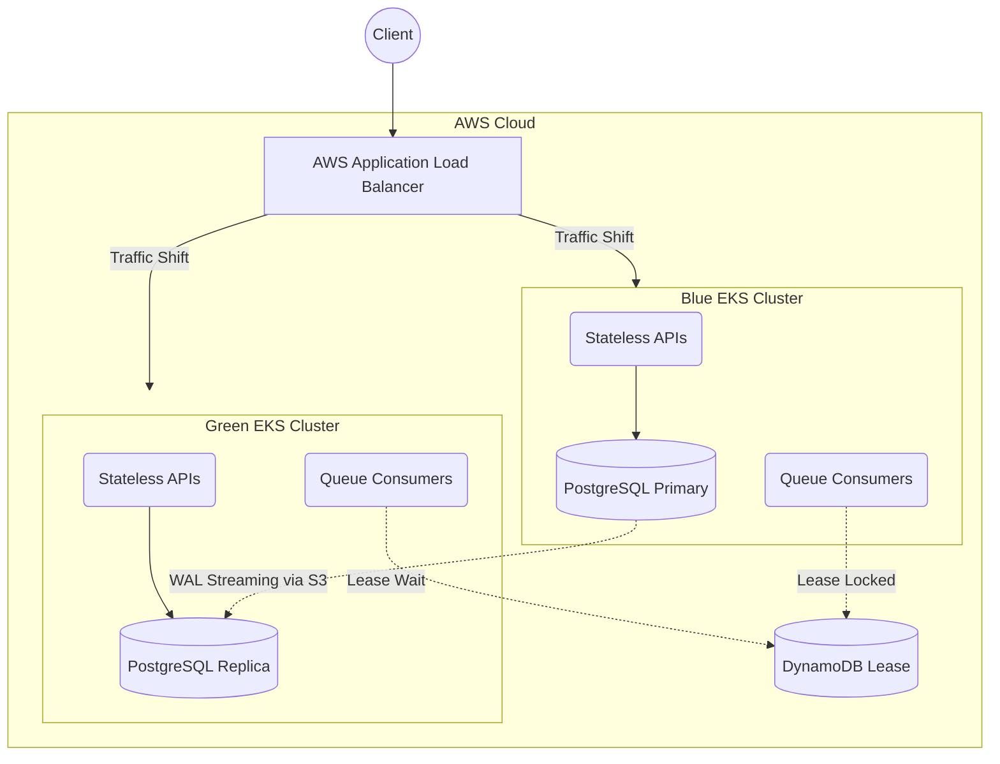
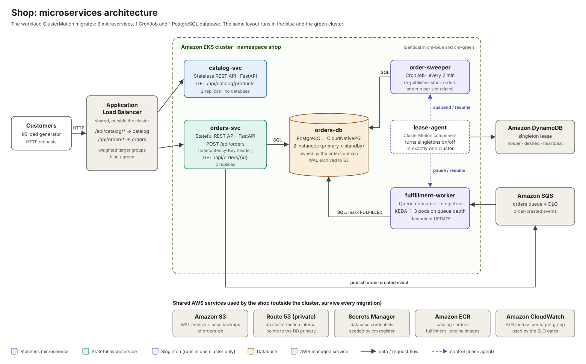
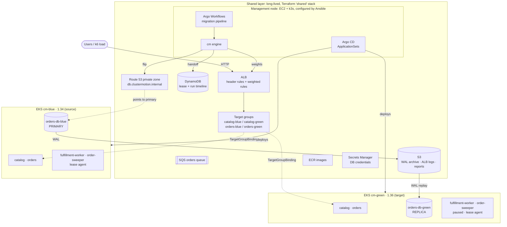
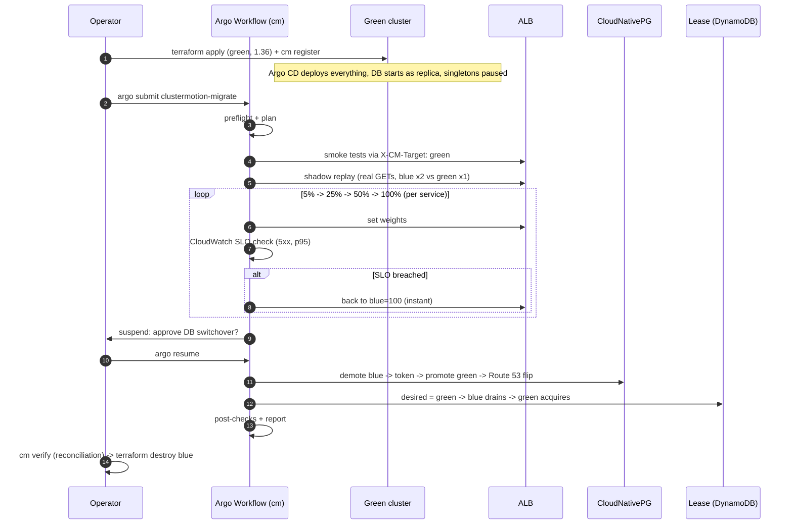

# ClusterMotion

**Live migration for Kubernetes clusters, including databases, background workers and scheduled jobs, with zero downtime and proof that no data was lost.**

> Status: Complete. The core migration engine, AWS deployment automation, and services are fully implemented and tested.

---

## 1. Project definition

ClusterMotion moves an entire running platform from one Amazon EKS cluster to another:

- stateless APIs
- a PostgreSQL database
- queue consumers
- CronJobs

Users see no downtime, and no write is lost or duplicated. Correctness is **proved with data**, not just claimed.

It works like VMware vMotion (moving a running VM between hosts), but for a whole Kubernetes cluster. Upgrading Kubernetes is the headline use case. The same engine also handles any change that EKS cannot make in place.

One migration run does this:

1. **Plans**: classifies every workload and decides how each one must move.
2. **Builds** the target cluster with Terraform. GitOps (Argo CD) then deploys everything onto it automatically.
3. **Shadow-tests** the target with real production requests before any user reaches it.
4. **Shifts traffic** per request through ALB weighted target groups, with SLO gates and instant rollback.
5. **Switches the database primary** with zero data loss (CloudNativePG demotion/promotion tokens).
6. **Hands over singleton work** (CronJobs, queue consumers) through a lease, so it runs on exactly one cluster.
7. **Reconciles**: proves every confirmed write exists exactly once and every job ran exactly once.

### 1.1 What application is deployed: a microservices backend
## 2. Architecture Diagram



The workload that ClusterMotion migrates is **"Shop"**, a small **outdoor-gear e-commerce backend** built for this project. It uses a **microservices architecture, not a monolith**.

It is API-only (no UI). Traffic comes from a k6 load generator that simulates customers browsing products and placing orders.

| # | Service | Type | What it does | Tech | Data / messaging | How it is exposed | Scaling |
|---|---|---|---|---|---|---|---|
| 1 | **catalog-svc** | Microservice, **stateless** | Product catalog: list products, get one product by SKU | Python 3.13, FastAPI | None (in-memory product list) | ALB path `/api/catalog/*` | 2 replicas |
| 2 | **orders-svc** | Microservice, **stateful** | Creates orders (idempotent `POST /api/orders`), returns order status, publishes an "order created" event | Python 3.13, FastAPI, psycopg 3 | **PostgreSQL** (`orders-db`, owned by this service); **SQS** producer | ALB path `/api/orders*` | 2 replicas |
| 3 | **fulfillment-worker** | Microservice, **background worker** (no HTTP) | Consumes order events from SQS and marks orders FULFILLED | Python 3.13, boto3, psycopg 3 | SQS consumer; updates `orders-db` | Not exposed | KEDA 1–3 replicas on queue depth, in **one** cluster only |
| 4 | **order-sweeper** | **Scheduled job** (Kubernetes CronJob) | Every 2 minutes, re-publishes orders stuck in PENDING (safety net for failed publishes) | Same image as orders-svc (`python -m app.sweeper`) | Reads `orders-db`, writes SQS | Not exposed | 1 run per slot, in **one** cluster only |
| 5 | **orders-db** | **Database** | PostgreSQL for the orders domain | CloudNativePG operator, 2 instances | WAL archived to S3 | Internal NLB via `db.clustermotion.internal` | Primary in one cluster, replica in the other |

**How the services talk to each other**

- **Synchronous:** clients call `catalog-svc` and `orders-svc` over HTTP through the shared ALB. The services never call each other directly.
- **Asynchronous:** `orders-svc` -> **SQS** -> `fulfillment-worker`, which is event-driven.
- **Data ownership:** *database per service*. `catalog-svc` has no database. `orders-db` belongs to the orders domain: the worker and sweeper are part of the same bounded context, so they share it.



**Why microservices and not a monolith?** The migration engine needs one workload of **each kind** that is hard to move between clusters:

- a stateless API
- a stateful API
- a database
- a queue consumer
- a scheduled job

With separate microservices, each one is migrated with a different strategy (traffic shift, database switchover, lease handoff), and each strategy can be tested on its own. A monolith would hide all of these inside one process.

**Why build our own instead of using a demo app?** Ready-made demo apps (Google Online Boutique, AWS Retail Store Sample App, OpenTelemetry Demo, podinfo) don't record the evidence ClusterMotion needs:

- idempotency keys
- which cluster created or processed each row
- fencing checks
- fault-injection switches

The full comparison, and the full source code of all services, are in [docs/02-services.md](docs/02-services.md).

## 2. The problem it solves

### 2.1 Kubernetes upgrades are expensive, slow and risky

- **Cost.** EKS gives each version 14 months of standard support. After that, clusters are enrolled in extended support automatically, at **$0.60/hr instead of $0.10/hr**. That is 6x the price, about $4,380 more per cluster per year ([AWS](https://aws.amazon.com/blogs/containers/amazon-eks-extended-support-for-kubernetes-versions-pricing/)). For example, EKS 1.34 leaves standard support on **Dec 2, 2026** ([endoflife.date](https://endoflife.date/amazon-eks)).
- **Effort.** In-place upgrades go **one minor version at a time**. One industry estimate puts each minor upgrade of a mid-size EKS setup at 4–6 weeks of engineering work ([bex.co](https://bex.co/blog/2026/07/10/eks-133-extended-support-cluster-api-upgrade)).
- **Limited rollback.** EKS rollback (July 2026) is limited to 7 days, one version back, in-place upgrades only, and no Fargate ([AWS](https://aws.amazon.com/blogs/containers/announcing-amazon-eks-rollback-for-safe-and-reliable-management-of-cluster-upgrades/)).
- **Settings that can't change in place.** Some cluster settings can never be changed in place, such as the IP family (IPv4 -> IPv6) ([AWS docs](https://docs.aws.amazon.com/eks/latest/userguide/cni-ipv6.html)). Changing them requires a new cluster.

### 2.2 Blue/green cluster migration exists, but skips the hard parts

Blue/green cluster upgrades are a known pattern. They are described by [Fairwinds](https://www.fairwinds.com/blog/guide-securely-upgrading-eks-clusters), [AWS](https://aws.amazon.com/blogs/containers/kubernetes-cluster-upgrade-the-blue-green-deployment-strategy/), [aws-samples](https://github.com/aws-samples/eks-cluster-upgrade-with-a-blue-green-strategy) and [EKS Blueprints](https://aws-ia.github.io/terraform-aws-eks-blueprints/patterns/blue-green-upgrade/). But they all leave out the same things:

| Gap in existing guides | Evidence | What ClusterMotion does |
|---|---|---|
| Stateful workloads | AWS: *"no magic formula"*, a custom plan per app; EKS Blueprints: stateless only | Automated zero-data-loss database switchover |
| CronJobs and queue consumers | Not mentioned: during migration they run in **both** clusters, which means double processing | Lease + fencing + idempotent claim, so work runs on exactly one cluster |
| Validation before users arrive | Synthetic tests, or watching errors *after* users arrive | Replays real production GET traffic from ALB logs and diffs responses (Diffy technique) |
| Traffic shift and rollback | Weights edited by hand, DNS-based (rollback waits for DNS caches to expire) | Per-request ALB weights, automatic SLO gates, instant rollback |
| Planning | None | Automatic plan for every workload, with downtime estimates |
| Proof | None | Reconciliation report: 0 lost, 0 duplicated, 0 double-processed |

AWS's own blog says blue/green upgrades take **1–2 months, compared with 2–4 weeks** for in-place upgrades. That extra time goes into exactly these manual, per-application steps. ClusterMotion automates them.

> **What is actually new:** each building block already exists on its own (CloudNativePG switchover, ALB weighted target groups, Diffy, DynamoDB locks). What is new is **combining them into one planned, automated, reversible migration of a whole platform including state**, with measured proof.

## 3. Architecture

### 3.1 AWS topology



**Design principle:** everything that must survive a migration lives in the **shared layer**. That covers the load balancer, queue, lease, WAL archive, DNS name and secrets. The clusters therefore become disposable.

### 3.2 Components

| Component | Technology | Role |
|---|---|---|
| Shared infrastructure | Terraform (`infra/terraform/shared`) | VPC, ALB + rules, target groups, SQS, DynamoDB, S3, Route 53, ECR, Secrets Manager, management EC2, GitHub OIDC role |
| Workload clusters | Terraform (`infra/terraform/cluster`, one workspace per colour) | EKS, node group, add-ons, Pod Identity roles, access entries, `support_type = STANDARD` |
| Management node | Ansible (`infra/ansible`) | k3s, ECR credential provider, Argo CD, Argo Workflows, `cm`, k6 |
| GitOps | Argo CD ApplicationSets (`gitops/`) | A newly registered cluster automatically receives cert-manager, AWS LB Controller, CloudNativePG + Barman plugin, KEDA, storage and the shop |
| Workload | Own services, Python/FastAPI (`services/`) | `catalog` (stateless), `orders` (stateful, idempotent), `fulfillment-worker` (SQS consumer), `order-sweeper` (CronJob) |
| Database | CloudNativePG, distributed topology | Primary in the source cluster, replica in the target (via S3 WAL); switchover with demotion/promotion token |
| Migration engine | Python CLI `cm` (`engine/`) | plan, preflight, smoke, shadow, traffic, db, lease, verify, report |
| Orchestration | Argo WorkflowTemplate | Runs the `cm` steps in order; pauses for human approval before the DB switchover |
| Lease agent | `cm lease agent` in each cluster | Switches singleton workloads on or off according to the DynamoDB lease |
| CI | GitHub Actions + OIDC | Tests, builds images, pushes to ECR, bumps the image tag in Git |

### 3.3 Workload classes and how each one moves

| Class | Example | Strategy | Downtime |
|---|---|---|---|
| Stateless HTTP | `catalog` | traffic-shift (ALB weights) | none |
| Stateful HTTP | `orders` | traffic-shift; writes are idempotent (`Idempotency-Key`) | none (clients retry briefly during the DB switchover) |
| Database | `orders-db` | db-switchover (replica -> demote -> promote -> DNS flip) | a few seconds of write pause, measured |
| Queue consumer | `fulfillment-worker` | lease-handoff (KEDA paused outside the lease holder) | none |
| Scheduled job | `order-sweeper` | lease-handoff (CronJob suspended outside the lease holder) | none |
| PVC without replication | any legacy StatefulSet | snapshot-restore, **needs approval** | estimated by the planner |

### 3.4 Migration flow



### 3.5 Safety and rollback

| Phase | If something goes wrong | Rollback |
|---|---|---|
| Build green | Argo CD apps don't reach Healthy | Nothing to undo: users are still 100% on blue |
| Shadow replay | Mismatch ratio above threshold | Stop; fix green; nothing reached users |
| Traffic shift | SLO breach | Automatic: weights back to blue=100, no DNS wait |
| DB switchover | Promotion fails or times out | `cm db switchover --to blue` (CloudNativePG switchback) |
| Lease handoff | Agent crash | Fencing check in every job; the lease expires after its TTL |
| After migration | Problems found later | Migrate back: the same engine, colours reversed |

**Exactly-once work** is enforced by three layers:
1. The **lease** prevents concurrent execution.
2. **Fencing** means every job re-checks the lease before starting.
3. The **idempotent claim** (unique index / conditional update) means a duplicate attempt has no effect and is recorded as evidence.

### 3.6 How the result is proved

A k6 load test runs during the **entire** migration and logs every order the API confirmed. Afterwards, `cm verify` compares the client's log with the database:

| Check | Must be |
|---|---|
| Confirmed writes missing from the DB | 0 |
| Duplicate orders | 0 |
| Orders fulfilled more than once | 0 |
| Seconds both clusters were consuming at the same time | 0 |
| Sweeper slots missed / run twice | 0 / 0 |
| Longest write pause (client-measured) | reported |

## 4. Technology stack

AWS (EKS, ALB, SQS, DynamoDB, S3, Route 53, ECR, Secrets Manager, CloudWatch) · Terraform (AWS provider 6, EKS module 21) · Ansible · k3s · Argo CD 3.5 · Argo Workflows 4.1 · Kubernetes 1.34 -> 1.36 · CloudNativePG 1.30 + Barman Cloud plugin · KEDA 2.20 · AWS Load Balancer Controller 3.5 · cert-manager 1.21 · Docker · Python 3.13 (FastAPI, psycopg 3, boto3, kubernetes client) · k6 · GitHub Actions (OIDC).

## 5. Repository layout

```
clustermotion/
├── README.md                   # this file: definition, problem, architecture
├── docs/
│   ├── PROJECT-STATUS.md       # task tracker: done / remaining
│   ├── 02-services.md          # the workload: where to obtain services, why we build our own, full code
│   ├── 03-infrastructure.md    # Terraform + Ansible, full code
│   ├── 04-gitops.md            # Argo CD ApplicationSets + shop Helm chart, full code
│   └── 05-migration-engine.md  # the cm engine + Argo Workflow, full code
├── services/                   # catalog, orders (+ sweeper), fulfillment, shared lease guard
├── engine/                     # cm CLI (planner, traffic, shadow, db, lease, verify)
├── infra/terraform/            # bootstrap, shared, cluster stacks
├── infra/ansible/              # management node
├── gitops/                     # appsets, workflows, platform, shop chart
├── local/                      # docker compose stack for laptop testing
└── scripts/docs_to_code.py     # docs are the source of truth for the code
```

> **Docs are the source of truth.** Every code block in `docs/*.md` marked `**File:** \`path\`` is written to the repository by `python3 scripts/docs_to_code.py`. Run `--check` in CI to make sure docs and code never drift apart.

## 6. Implementation Guide & Required Commands

```bash
# Unit tests for the services and the engine
for s in catalog orders fulfillment; do (cd services/$s && pip install -r requirements.txt pytest httpx && pytest -q); done
(cd engine && pip install -e '.[test]' && pytest -q)

# Try the planner on the test fixture
cm plan --manifests engine/tests/fixtures/shop-rendered.yaml

# Run the shop locally (needs Docker)
docker compose -f local/compose.yaml up --build -d
```

The full AWS run (runbook) is listed as remaining work in [PROJECT-STATUS.md](docs/PROJECT-STATUS.md).

