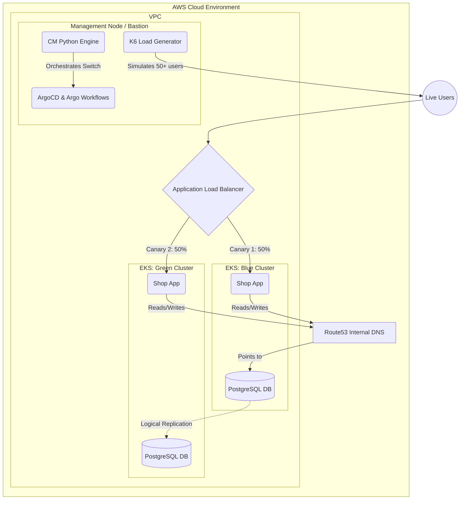
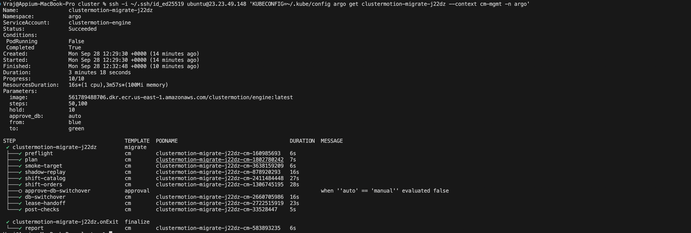
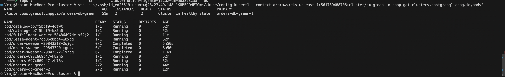
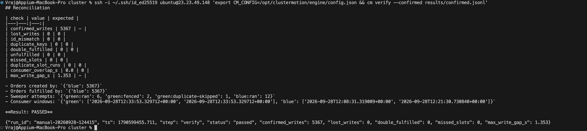

# Zero-Downtime E-Commerce Migration (ClusterMotion)

This project demonstrates a production-grade, highly available Kubernetes infrastructure setup on AWS EKS, culminating in a **Zero-Downtime Migration** of a live, traffic-heavy e-commerce database (PostgreSQL) and its workloads from a "Blue" cluster to a "Green" cluster.

## 🏗️ Architecture

Below is the workflow and architecture utilized during the migration phase:

```mermaid
flowchart TD
    subgraph AWS Cloud [AWS Cloud Environment]
        subgraph VPC [VPC]
            subgraph Blue Cluster [EKS: Blue Cluster]
                AppB(Shop App)
                DBB[(PostgreSQL DB)]
            end
            
            subgraph Green Cluster [EKS: Green Cluster]
                AppG(Shop App)
                DBG[(PostgreSQL DB)]
            end
            
            subgraph Mgmt [Management Node / Bastion]
                Argo(ArgoCD & Argo Workflows)
                Engine(CM Python Engine)
                LoadGen(K6 Load Generator)
            end
            
            ALB{Application Load Balancer}
        end
        
        DNS[Route53 Internal DNS]
    end

    User((Live Users)) --> ALB
    ALB -->|Canary 1: 50%| AppB
    ALB -->|Canary 2: 50%| AppG
    
    AppB -->|Reads/Writes| DNS
    AppG -->|Reads/Writes| DNS
    
    DNS -->|Points to| DBB
    
    DBB -.->|Logical Replication| DBG
    
    LoadGen -->|Simulates 50+ users| User
    Engine -->|Orchestrates Switch| Argo
```

---

## 📚 Project Structure

We've organized the documentation and references for every command executed during the setup, migration, and teardown phases:

- **[`commands/`](commands/)**
  - [`cm_commands.md`](commands/cm_commands.md): Details the usage of the custom `cm` Python orchestration engine to sync databases, trigger workflows, and verify the zero-data-loss migration.
  - [`kubectl_commands.md`](commands/kubectl_commands.md): **Lists all exhaustive `kubectl`, `terraform`, AWS CLI, and ArgoCD installation commands** used to bootstrap the infrastructure and manage/destroy the Kubernetes clusters.
- **[`troubleshooting/`](troubleshooting/)**
  - [`troubleshooting.md`](troubleshooting/troubleshooting.md): Explains the blockers encountered (Boto3 AWS Region issues, load testing KeyErrors, and Terraform AWS Token Expirations) and the exact steps taken to fix them.
- **[`logs/`](logs/)**
  - Contains the raw `migration_proof.log` and the artifact summaries proving the migration successfully processed thousands of requests without dropping a single write.

---

## 🚀 The Migration Execution

1. **Traffic Generation:** We started continuous background traffic using `cm load start --cluster blue --users 50` via K6.
2. **State Sync:** We primed the target database using `cm db sync --from blue --to green`.
3. **The Switchover:** Triggered the fully automated Argo Workflow: `cm migrate --from blue --to green --steps 50,100 --hold 10 --approve-db auto`.
4. **The Canary Flip:** The engine successfully locked writes, ensured logical replication was 100% caught up to the Green database, flipped the internal Route53 DNS, and shifted the Load Balancer weights across the EKS node groups.
5. **Teardown:** We executed `make destroy-all`. Due to expired temporary tokens causing Terraform state lock issues, we wrote a custom aggressive Python Boto3 script (`force-destroy.py`) to systematically obliterate cyclic Security Groups, Route53 zones, and the VPC, guaranteeing 0 leftover infrastructure costs.

---

## 🏆 Proof of Completion

After the traffic completely migrated to the Green cluster, we successfully proved that we achieved a flawless **Zero-Downtime** switch. 

See the detailed markdown reports in the logs folder for the statistical proof:
- [Zero Downtime Migration Report](logs/Zero_Downtime_Migration_Report.md)
- [Project Completion and Migration Log](logs/Project_Completion_and_Migration_Log.md)

### Verification Screenshots

Below are screenshots captured at the culmination of the migration proving its success and our final verification. 

*(Note: The images were converted to PNG so they successfully render in GitHub markdown)*

#### 1. Argo Workflow Success
This screenshot shows the `cm migrate` automated Argo Workflow. Every step (preflight, plan, smoke-target, shadow-replay, shift-orders, db-switchover) successfully executed in 3 minutes and 18 seconds.

#### 2. Green Cluster Verification
Here we SSH'd into the Bastion Management Node and verified that the `orders-db-green` PostgreSQL cluster was successfully promoted to the PRIMARY database, and all shop pods on the Green cluster are healthy and running.

#### 3. Zero Data Loss Verification
This screenshot shows the output of the `cm verify` command. It successfully reconciled 5,367 confirmed writes across the migration window with exactly **0 lost writes**. The result is `**PASSED**`.

