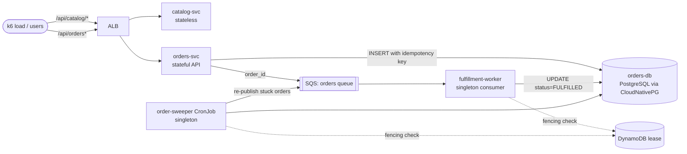

# 02 · Backend services (the workload we migrate)

ClusterMotion is a platform project, but a platform is only as convincing as
the workload it moves. This chapter explains **what kind of workload the
migration engine needs**, **where you can obtain ready-made services**, **why
this project builds its own**, and then gives the full source of every
service.

---

## 2.0 What we deploy, in one paragraph

We deploy **"Shop"**, a small **outdoor-gear e-commerce backend** built as **microservices (not a monolith)**. It is API-only and written in Python 3.13. It has:

- **3 microservices:**
  - `catalog-svc`: stateless REST API, product catalog.
  - `orders-svc`: stateful REST API that owns the PostgreSQL `orders-db`.
  - `fulfillment-worker`: background SQS consumer.
- **1 scheduled job:** `order-sweeper`, a Kubernetes CronJob using the orders image.
- **1 database:** `orders-db`, PostgreSQL managed by CloudNativePG.

Clients reach the two APIs through the shared ALB. The services communicate asynchronously through SQS (orders → fulfillment) and never call each other directly. The README section *"What application is deployed"* has the full table with type, tech, data store, exposure and scaling for each service.

| Service | Microservice type | Stateful? | Image |
|---|---|---|---|
| catalog-svc | HTTP API | No | `clustermotion/catalog` |
| orders-svc | HTTP API | **Yes** (PostgreSQL) | `clustermotion/orders` |
| fulfillment-worker | Queue consumer | Writes to PostgreSQL | `clustermotion/fulfillment` |
| order-sweeper | CronJob | Writes to PostgreSQL | `clustermotion/orders` (different command) |
| orders-db | Database (CloudNativePG) | **Yes** | CloudNativePG operand image |


## 2.1 What the workload must contain

The whole point of ClusterMotion is to migrate the things other blue/green
guides skip. So the demo application must contain one of each workload class:

| Workload class | Why it is hard to migrate | Our service |
|---|---|---|
| Stateless HTTP API | Easy: shift traffic. Used as the baseline and for shadow replay. | `catalog-svc` |
| Stateful HTTP API | Writes must not be lost or duplicated while traffic moves. | `orders-svc` |
| Operator-managed database | Only one primary may accept writes; switching it must lose nothing. | `orders-db` (CloudNativePG) |
| Background queue consumer | Must run in exactly **one** cluster, or messages get processed twice. | `fulfillment-worker` |
| Scheduled job (CronJob) | Must fire exactly **once** per schedule slot, not once per cluster. | `order-sweeper` |

## 2.2 Where to obtain services: options

You do not have to write an application to learn Kubernetes. These are the
well-known open-source demo applications and what they would give you:

| Option | What you get | What is missing for ClusterMotion |
|---|---|---|
| [podinfo](https://github.com/stefanprodan/podinfo) (Stefan Prodan) | One tiny stateless Go service, Helm chart, great for smoke tests | No database, no queue, no CronJob |
| [Istio Bookinfo](https://istio.io/latest/docs/examples/bookinfo/) | 4 small polyglot services | Stateless only |
| [Google Online Boutique](https://github.com/GoogleCloudPlatform/microservices-demo) | 11 gRPC microservices (Go, C#, Node.js, Python, Java), Redis cart, load generator, Helm/Kustomize | No relational DB, no queue consumer, no CronJob |
| [AWS Retail Store Sample App](https://github.com/aws-containers/retail-store-sample-app) | UI (Java), Catalog (Go), Cart (Java), Orders (Java), Checkout (Node); MySQL/DynamoDB/Redis options; Helm + Terraform for EKS | Close, but no per-cluster attribution, no idempotency keys, no fencing hooks |
| [OpenTelemetry Astronomy Shop](https://github.com/open-telemetry/opentelemetry-demo) | Large polyglot shop with Kafka and Valkey; great observability | Heavy (>15 services); hard to reason about exactly-once |

### Why this project builds its own services

To **prove** "zero lost writes, zero duplicates, singleton work ran on exactly
one cluster", the application must record evidence that no demo app records:

1. **Idempotency keys** on every write, so a client can safely retry during
   the database switchover, and duplicates are impossible by construction.
2. **Per-cluster attribution**: every row records which cluster
   (`blue`/`green`) created or processed it. This is what the reconciliation
   report reads.
3. **Fencing checks**: singleton workloads ask the lease table *before* doing
   work, so even a crashed lease agent can never cause double execution.
4. **Fault-injection switches** (`FAULT_ERROR_RATE`, `FAULT_PRICE_BUG`) so you
   can demonstrate automatic rollback and shadow-diff detection on demand.
5. **Small enough to explain in an interview**: ~400 lines of Python in
   total, all in this document.

> **Recommendation.** Build these three services yourself (they are given in
> full below), because writing the service code is part of the story you tell
> in interviews: *"I designed the workload to make correctness measurable."*
> Then, as a stretch goal, deploy the AWS Retail Store Sample App into a
> separate namespace and run `cm plan` against it. That shows the planner
> classifies an application **you did not write**.

## 2.3 The shop at a glance



Request flow for one order:

1. The client sends `POST /api/orders` with an `Idempotency-Key` header.
2. `orders-svc` inserts the row (`status = PENDING`, `created_by = <cluster>`).
   A retry with the same key returns the same order (HTTP 200) instead of
   creating a new one.
3. After the commit, `orders-svc` publishes `{"order_id": ...}` to SQS. If
   publishing fails, the order stays `PENDING` and the sweeper re-publishes it
   later (a lightweight outbox pattern).
4. `fulfillment-worker` (running in **one** cluster only) consumes the
   message and runs `UPDATE ... WHERE status = 'PENDING'`, which is idempotent,
   and logs the attempt in `fulfillment_log`.
5. Every 2 minutes `order-sweeper` claims its schedule slot in
   `sweeper_runs`. The reconciliation checks that each 2-minute slot was
   executed **exactly once** and that no slot was missed during the handoff.

> **How "exactly once" is achieved.** Distributed systems cannot guarantee
> exactly-once *delivery*; they achieve exactly-once *effect* with three
> layers, and this project implements all three:
> 1. **Lease** (chapter 05): only one cluster runs singleton workloads, so
>    concurrent execution is prevented in normal operation.
> 2. **Fencing**: every unit of work re-checks the lease, so a crashed or slow
>    agent cannot cause concurrent execution.
> 3. **Idempotent claim**: the sweeper claims its slot with a unique index,
>    and the worker uses `UPDATE ... WHERE status = 'PENDING'`. So even if
>    Kubernetes schedules a catch-up run, or SQS re-delivers a message, the
>    effect happens once. The duplicate is recorded as evidence.

## 2.4 Repository layout for services

```
services/
├── shared/lease_guard.py        # fencing check used by all singleton workloads
├── catalog/                     # stateless API
├── orders/                      # stateful API + order-sweeper CronJob entrypoint
└── fulfillment/                 # SQS consumer
local/                           # docker compose stack for laptop testing
```

Images are built with `services/` as the Docker build context so that every
image can include `shared/`.

## 2.5 Data model

**File:** `services/orders/app/schema.sql`
```sql
-- Applied at startup by orders-svc under an advisory lock (idempotent).
CREATE TABLE IF NOT EXISTS orders (
    id               UUID PRIMARY KEY,
    idempotency_key  TEXT        NOT NULL UNIQUE,
    sku              TEXT        NOT NULL,
    qty              INTEGER     NOT NULL CHECK (qty > 0),
    status           TEXT        NOT NULL DEFAULT 'PENDING',
    created_at       TIMESTAMPTZ NOT NULL DEFAULT now(),
    created_by       TEXT        NOT NULL,          -- cluster that accepted the write
    fulfilled_at     TIMESTAMPTZ,
    fulfilled_by     TEXT                           -- cluster whose worker fulfilled it
);

CREATE INDEX IF NOT EXISTS orders_pending_idx
    ON orders (created_at) WHERE status = 'PENDING';

-- One row per message processed. applied = false means the message was a
-- duplicate delivery and the idempotent UPDATE changed nothing.
CREATE TABLE IF NOT EXISTS fulfillment_log (
    id           BIGSERIAL PRIMARY KEY,
    order_id     UUID        NOT NULL,
    cluster      TEXT        NOT NULL,
    applied      BOOLEAN     NOT NULL,
    processed_at TIMESTAMPTZ NOT NULL DEFAULT now()
);

-- One row per sweeper *attempt*. outcome is one of:
--   ran                the attempt that did the work for this slot
--   duplicate-skipped  another attempt already ran this slot (idempotent claim)
--   fenced             this cluster did not hold the singleton lease
-- Reconciliation expects exactly one 'ran' row per slot and no missing slots.
CREATE TABLE IF NOT EXISTS sweeper_runs (
    id          BIGSERIAL PRIMARY KEY,
    slot        TIMESTAMPTZ NOT NULL,
    cluster     TEXT        NOT NULL,
    outcome     TEXT        NOT NULL,
    republished INTEGER     NOT NULL DEFAULT 0,
    ran_at      TIMESTAMPTZ NOT NULL DEFAULT now()
);

CREATE UNIQUE INDEX IF NOT EXISTS sweeper_one_run_per_slot
    ON sweeper_runs (slot) WHERE outcome = 'ran';
```

## 2.6 Shared fencing check

Every singleton workload (the queue consumer and the CronJob) imports this
module. It is the **second line of defence**: the lease agent (chapter 05)
switches singleton workloads on/off per cluster, and this check makes sure a
unit of work never starts in a cluster that does not hold the lease, even if
the agent crashed.

**File:** `services/shared/lease_guard.py`
```python
"""Fencing check shared by every singleton workload.

The ClusterMotion lease agent turns singleton workloads on in exactly one
cluster. Agents can crash or lag, so every unit of singleton work also asks
DynamoDB "does my cluster hold the lease right now?" before it starts.
Fail closed: if DynamoDB cannot be read, the answer is "no".
"""
from __future__ import annotations

import logging
import os
import time

import boto3

log = logging.getLogger("lease_guard")


class LeaseGuard:
    def __init__(self, table: str | None = None, lease_id: str | None = None,
                 cluster: str | None = None, cache_seconds: float = 5.0, client=None):
        self.table = table if table is not None else os.getenv("LEASE_TABLE", "")
        self.lease_id = lease_id or os.getenv("LEASE_ID", "singletons")
        self.cluster = cluster or os.getenv("CLUSTER_NAME", "local")
        self.cache_seconds = cache_seconds
        self._client = client
        self._checked_at = float("-inf")
        self._value = False

    @property
    def client(self):
        if self._client is None:
            self._client = boto3.client("dynamodb")
        return self._client

    def holder(self) -> str:
        item = self.client.get_item(
            TableName=self.table,
            Key={"lease_id": {"S": self.lease_id}},
            ConsistentRead=True,
        ).get("Item")
        return item.get("holder", {}).get("S", "") if item else ""

    def holds_lease(self) -> bool:
        if not self.table:  # no lease table configured (unit tests): always allowed
            return True
        if time.monotonic() - self._checked_at < self.cache_seconds:
            return self._value
        try:
            self._value = self.holder() == self.cluster
        except Exception as exc:  # fail closed
            log.warning("lease check failed, assuming not holder: %s", exc)
            self._value = False
        self._checked_at = time.monotonic()
        return self._value
```

## 2.7 catalog-svc (stateless)

**File:** `services/catalog/app/main.py`
```python
"""catalog-svc: stateless, read-only product catalog.

Role in ClusterMotion: the "easy" workload. It is migrated purely by shifting
traffic, and its GET endpoints are what the shadow-replay step compares
between blue and green. `generated_at` changes on every call on purpose: it
proves the Diffy-style noise filter works.
"""
import os
import random
import time
from datetime import datetime, timezone

from fastapi import FastAPI, HTTPException, Request
from fastapi.responses import JSONResponse
from prometheus_client import Counter, Histogram, make_asgi_app

CLUSTER = os.getenv("CLUSTER_NAME", "local")
# Fault-injection switches used by the failure tests (docs/07-testing.md).
FAULT_ERROR_RATE = float(os.getenv("FAULT_ERROR_RATE", "0"))
FAULT_PRICE_BUG = os.getenv("FAULT_PRICE_BUG", "false").lower() == "true"

PRODUCTS = {
    "sku-100": {"name": "Trail Running Shoes", "price_cents": 12999},
    "sku-101": {"name": "Merino Hiking Socks", "price_cents": 1999},
    "sku-102": {"name": "Waterproof Jacket", "price_cents": 18950},
    "sku-103": {"name": "Insulated Water Bottle", "price_cents": 3450},
    "sku-104": {"name": "Headlamp 400lm", "price_cents": 4225},
    "sku-105": {"name": "Trekking Poles", "price_cents": 8900},
    "sku-106": {"name": "Ultralight Tent", "price_cents": 34900},
    "sku-107": {"name": "Sleeping Bag -5C", "price_cents": 22900},
}

REQUESTS = Counter("catalog_requests_total", "HTTP requests", ["route", "status"])
LATENCY = Histogram("catalog_request_seconds", "Request latency", ["route"])

app = FastAPI(title="catalog-svc")
app.mount("/metrics", make_asgi_app())


def _route(path: str) -> str:
    return "/api/catalog/products/{sku}" if path.startswith("/api/catalog/products/") else path


@app.middleware("http")
async def observe(request: Request, call_next):
    route = _route(request.url.path)
    start = time.perf_counter()
    if FAULT_ERROR_RATE and not route.endswith("/healthz") and random.random() < FAULT_ERROR_RATE:
        response = JSONResponse({"error": "injected fault"}, status_code=500)
    else:
        response = await call_next(request)
    LATENCY.labels(route).observe(time.perf_counter() - start)
    REQUESTS.labels(route, str(response.status_code)).inc()
    response.headers["X-Served-By"] = CLUSTER  # header, not body: body must be comparable
    return response


def _product(sku: str) -> dict:
    item = PRODUCTS[sku]
    price = item["price_cents"] + (1 if FAULT_PRICE_BUG else 0)
    return {"sku": sku, "name": item["name"], "price_cents": price, "currency": "USD"}


@app.get("/api/catalog/healthz")
def healthz():
    return {"status": "ok"}


@app.get("/api/catalog/products")
def list_products():
    return {
        "generated_at": datetime.now(timezone.utc).isoformat(),
        "items": [_product(sku) for sku in sorted(PRODUCTS)],
    }


@app.get("/api/catalog/products/{sku}")
def get_product(sku: str):
    if sku not in PRODUCTS:
        raise HTTPException(status_code=404, detail="unknown sku")
    return _product(sku)
```

**File:** `services/catalog/requirements.txt`
```text
fastapi>=0.115,<1.0
uvicorn[standard]>=0.30,<1.0
prometheus-client>=0.20,<1.0
```

**File:** `services/catalog/Dockerfile`
```dockerfile
# Build context: services/   (docker build -f catalog/Dockerfile services/)
FROM python:3.13-slim
ENV PYTHONDONTWRITEBYTECODE=1 PYTHONUNBUFFERED=1
WORKDIR /srv
COPY catalog/requirements.txt .
RUN pip install --no-cache-dir -r requirements.txt
COPY catalog/app ./app
RUN useradd --uid 10001 --no-create-home app
USER 10001
EXPOSE 8000
CMD ["uvicorn", "app.main:app", "--host", "0.0.0.0", "--port", "8000", "--no-access-log"]
```

## 2.8 orders-svc (stateful API + sweeper)

Design notes (these are good interview talking points):

- **Idempotency**: `INSERT ... ON CONFLICT (idempotency_key) DO NOTHING`
  makes retries safe. The client keeps the same key across retries.
- **Database switchover handling**: when the old primary is demoted it becomes
  read-only. Postgres then raises `ReadOnlySqlTransaction`. The service
  **closes that pooled connection** (so the next one re-resolves
  `db.clustermotion.internal` and reaches the new primary) and answers
  `503 Retry-After: 1`. The client retries with the same key.
- **Health vs readiness**: `/healthz` only says "the process is alive" and is
  used by the load-balancer target group. `/readyz` checks the database and
  is used by smoke tests. Coupling LB health to the DB would mark every pod
  unhealthy during the switchover window.

**File:** `services/orders/app/db.py`
```python
"""Database helpers for orders-svc and order-sweeper."""
import os
import time
from pathlib import Path

import psycopg
from psycopg.conninfo import make_conninfo
from psycopg_pool import ConnectionPool

SCHEMA = Path(__file__).with_name("schema.sql").read_text()
SCHEMA_LOCK_ID = 4242


def dsn() -> str:
    return make_conninfo(
        host=os.getenv("DB_HOST", "localhost"),
        port=os.getenv("DB_PORT", "5432"),
        dbname=os.getenv("DB_NAME", "shop"),
        user=os.getenv("DB_USER", "shop"),
        password=os.getenv("DB_PASSWORD", "shop"),
        connect_timeout=3,
        application_name=f"orders-{os.getenv('CLUSTER_NAME', 'local')}",
    )


def make_pool() -> ConnectionPool:
    # max_lifetime keeps connections short-lived so DNS changes are picked up
    # even if no error forces a reconnect.
    return ConnectionPool(
        conninfo=dsn(),
        min_size=1,
        max_size=int(os.getenv("DB_POOL_SIZE", "10")),
        timeout=5,
        max_lifetime=60,
        check=ConnectionPool.check_connection,
        open=False,
    )


def ensure_schema() -> None:
    """Create tables if missing. The advisory lock serialises concurrent pods."""
    with psycopg.connect(dsn()) as conn:
        conn.execute("SELECT pg_advisory_xact_lock(%s)", (SCHEMA_LOCK_ID,))
        conn.execute(SCHEMA)


def wait_for_schema(retries: int = 60, delay: float = 3.0) -> None:
    for _ in range(retries):
        try:
            ensure_schema()
            return
        except (psycopg.OperationalError, psycopg.errors.ReadOnlySqlTransaction):
            time.sleep(delay)
    raise RuntimeError("database not reachable")
```

**File:** `services/orders/app/main.py`
```python
"""orders-svc: the stateful write path of the shop.

POST /api/orders   create an order (requires Idempotency-Key header)
GET  /api/orders/{order_id}
GET  /api/orders/healthz   liveness, used by the ALB target group
GET  /api/orders/readyz    checks the database is writable
"""
import json
import logging
import os
import threading
import time
import uuid
from contextlib import asynccontextmanager

import boto3
import psycopg
from fastapi import FastAPI, Header, HTTPException, Response
from prometheus_client import Counter, make_asgi_app
from psycopg_pool import PoolTimeout
from pydantic import BaseModel, Field

from app import db

logging.basicConfig(level=logging.INFO, format="%(asctime)s %(levelname)s %(name)s %(message)s")
log = logging.getLogger("orders")

CLUSTER = os.getenv("CLUSTER_NAME", "local")
QUEUE_URL = os.getenv("QUEUE_URL", "")

pool = db.make_pool()
schema_ready = threading.Event()
sqs = boto3.client("sqs") if QUEUE_URL else None

WRITES = Counter("orders_writes_total", "Order write attempts", ["result"])


def _init_schema() -> None:
    while not schema_ready.is_set():
        try:
            db.ensure_schema()
            schema_ready.set()
            log.info("schema ready")
        except Exception as exc:  # DB not up yet, or currently read-only
            log.warning("schema init failed (%s); retrying", type(exc).__name__)
            time.sleep(3)


@asynccontextmanager
async def lifespan(_app: FastAPI):
    pool.open(wait=False)
    threading.Thread(target=_init_schema, daemon=True).start()
    yield
    pool.close()


app = FastAPI(title="orders-svc", lifespan=lifespan)
app.mount("/metrics", make_asgi_app())


@app.middleware("http")
async def served_by(request, call_next):
    response = await call_next(request)
    response.headers["X-Served-By"] = CLUSTER  # lets smoke tests prove which cluster answered
    return response


class OrderIn(BaseModel):
    sku: str = Field(min_length=1, max_length=64)
    qty: int = Field(gt=0, le=100)


def _unavailable(reason: str):
    WRITES.labels("unavailable").inc()
    raise HTTPException(status_code=503, detail=reason, headers={"Retry-After": "1"})


def _publish(order_id: str) -> None:
    if sqs is None:
        return
    try:
        sqs.send_message(QueueUrl=QUEUE_URL, MessageBody=json.dumps({"order_id": order_id}))
    except Exception as exc:  # the sweeper re-publishes PENDING orders later
        log.warning("publish failed for %s: %s", order_id, exc)


@app.get("/api/orders/healthz")
def healthz():
    return {"status": "ok"}


@app.get("/api/orders/readyz")
def readyz():
    try:
        with pool.connection() as conn:
            in_recovery = conn.execute("SELECT pg_is_in_recovery()").fetchone()[0]
    except Exception as exc:
        raise HTTPException(status_code=503, detail=f"db unreachable: {type(exc).__name__}")
    if in_recovery:
        raise HTTPException(status_code=503, detail="db is read-only (replica)")
    return {"status": "ready", "schema": schema_ready.is_set(), "cluster": CLUSTER}


@app.post("/api/orders", status_code=201)
def create_order(
    body: OrderIn,
    response: Response,
    idempotency_key: str = Header(min_length=8, max_length=128),
):
    if not schema_ready.is_set():
        _unavailable("schema not ready")
    new_id = str(uuid.uuid4())
    try:
        with pool.connection() as conn:
            try:
                row = conn.execute(
                    """INSERT INTO orders (id, idempotency_key, sku, qty, created_by)
                       VALUES (%s, %s, %s, %s, %s)
                       ON CONFLICT (idempotency_key) DO NOTHING
                       RETURNING id""",
                    (new_id, idempotency_key, body.sku, body.qty, CLUSTER),
                ).fetchone()
                created = row is not None
                if not created:
                    row = conn.execute(
                        "SELECT id FROM orders WHERE idempotency_key = %s", (idempotency_key,)
                    ).fetchone()
            except psycopg.errors.ReadOnlySqlTransaction:
                conn.close()  # connected to a demoted primary: drop it, reconnect via DNS
                raise
    except psycopg.errors.ReadOnlySqlTransaction:
        _unavailable("database primary is switching")
    except (psycopg.OperationalError, PoolTimeout) as exc:
        _unavailable(f"database unavailable: {type(exc).__name__}")

    order_id = str(row[0])
    if created:
        WRITES.labels("created").inc()
        _publish(order_id)
    else:
        WRITES.labels("replayed").inc()
        response.status_code = 200
    return {"order_id": order_id, "idempotent_replay": not created}


@app.get("/api/orders/{order_id}")
def get_order(order_id: uuid.UUID):
    try:
        with pool.connection() as conn:
            row = conn.execute(
                """SELECT id, sku, qty, status, created_by, fulfilled_by
                   FROM orders WHERE id = %s""",
                (order_id,),
            ).fetchone()
    except (psycopg.OperationalError, PoolTimeout) as exc:
        raise HTTPException(status_code=503, detail=type(exc).__name__, headers={"Retry-After": "1"})
    if row is None:
        raise HTTPException(status_code=404, detail="order not found")
    keys = ("order_id", "sku", "qty", "status", "created_by", "fulfilled_by")
    return {k: (str(v) if k == "order_id" else v) for k, v in zip(keys, row)}
```

The CronJob entrypoint lives in the same image (`python -m app.sweeper`):

**File:** `services/orders/app/sweeper.py`
```python
"""order-sweeper: CronJob entrypoint (a singleton workload).

1. Fencing: record 'fenced' and exit unless this cluster holds the lease.
2. Idempotent claim: insert the 'ran' row for this schedule slot. A unique
   index allows only one per slot; a second attempt records
   'duplicate-skipped' and exits.
3. Re-publish orders stuck in PENDING (their SQS publish failed).
"""
import json
import logging
import os
import sys
import time

import boto3
import psycopg

from app import db
from shared.lease_guard import LeaseGuard

logging.basicConfig(level=logging.INFO, format="%(asctime)s %(levelname)s %(name)s %(message)s")
log = logging.getLogger("sweeper")

CLUSTER = os.getenv("CLUSTER_NAME", "local")
QUEUE_URL = os.getenv("QUEUE_URL", "")
SLOT_SECONDS = int(os.getenv("SWEEPER_SLOT_SECONDS", "120"))
STALE_SECONDS = int(os.getenv("SWEEPER_STALE_SECONDS", "60"))

CLAIM_SQL = """
INSERT INTO sweeper_runs (slot, cluster, outcome) VALUES (to_timestamp(%s), %s, 'ran')
ON CONFLICT (slot) WHERE outcome = 'ran' DO NOTHING
RETURNING id
"""


def current_slot(now: float | None = None) -> int:
    now = time.time() if now is None else now
    return int(now // SLOT_SECONDS * SLOT_SECONDS)


def record(conn: psycopg.Connection, slot: int, outcome: str) -> None:
    conn.execute(
        "INSERT INTO sweeper_runs (slot, cluster, outcome) VALUES (to_timestamp(%s), %s, %s)",
        (slot, CLUSTER, outcome),
    )


def main() -> int:
    slot = current_slot()
    holds_lease = LeaseGuard().holds_lease()
    with psycopg.connect(db.dsn()) as conn:
        if not holds_lease:
            record(conn, slot, "fenced")
            log.info("slot %s: cluster %s does not hold the lease; fenced", slot, CLUSTER)
            return 0
        claim = conn.execute(CLAIM_SQL, (slot, CLUSTER)).fetchone()
        if claim is None:
            record(conn, slot, "duplicate-skipped")
            log.info("slot %s already executed; duplicate attempt skipped", slot)
            return 0
        stuck = conn.execute(
            """SELECT id FROM orders
               WHERE status = 'PENDING' AND created_at < now() - make_interval(secs => %s)
               ORDER BY created_at LIMIT 500""",
            (STALE_SECONDS,),
        ).fetchall()
        sqs = boto3.client("sqs") if QUEUE_URL else None
        for (order_id,) in stuck:
            if sqs:
                sqs.send_message(QueueUrl=QUEUE_URL, MessageBody=json.dumps({"order_id": str(order_id)}))
        conn.execute("UPDATE sweeper_runs SET republished = %s WHERE id = %s", (len(stuck), claim[0]))
    log.info("slot %s: re-published %d stuck orders", slot, len(stuck))
    return 0


if __name__ == "__main__":
    sys.exit(main())
```

**File:** `services/orders/requirements.txt`
```text
fastapi>=0.115,<1.0
uvicorn[standard]>=0.30,<1.0
prometheus-client>=0.20,<1.0
psycopg[binary]>=3.2,<4.0
psycopg-pool>=3.2,<4.0
boto3>=1.34,<2.0
```

**File:** `services/orders/Dockerfile`
```dockerfile
# Build context: services/   (docker build -f orders/Dockerfile services/)
FROM python:3.13-slim
ENV PYTHONDONTWRITEBYTECODE=1 PYTHONUNBUFFERED=1
WORKDIR /srv
COPY orders/requirements.txt .
RUN pip install --no-cache-dir -r requirements.txt
COPY shared ./shared
COPY orders/app ./app
RUN useradd --uid 10001 --no-create-home app
USER 10001
EXPOSE 8000
# The same image runs the CronJob with: python -m app.sweeper
CMD ["uvicorn", "app.main:app", "--host", "0.0.0.0", "--port", "8000", "--no-access-log"]
```

## 2.9 fulfillment-worker (singleton queue consumer)

KEDA scales this Deployment on SQS queue depth, but **only in the cluster
that holds the lease**. In the other cluster the lease agent pauses the
ScaledObject at 0 replicas.

Graceful shutdown matters for the handoff: on `SIGTERM` the worker finishes
the messages it already received, then exits. Without this, a half-processed
message would reappear after the visibility timeout and be processed by the
other cluster.

**File:** `services/fulfillment/worker/main.py`
```python
"""fulfillment-worker: consumes order events from SQS and fulfils orders."""
import json
import logging
import os
import signal
import time

import boto3
import psycopg
from psycopg.conninfo import make_conninfo

from shared.lease_guard import LeaseGuard

logging.basicConfig(level=logging.INFO, format="%(asctime)s %(levelname)s %(name)s %(message)s")
log = logging.getLogger("fulfillment")

CLUSTER = os.getenv("CLUSTER_NAME", "local")
QUEUE_URL = os.getenv("QUEUE_URL", "")
WORK_SECONDS = float(os.getenv("WORK_SECONDS", "0.05"))  # simulated work per order

_stopping = False


def _request_stop(signum, _frame):
    global _stopping
    _stopping = True
    log.info("signal %s received: finishing in-flight messages, then exiting", signum)


def dsn() -> str:
    return make_conninfo(
        host=os.getenv("DB_HOST", "localhost"),
        port=os.getenv("DB_PORT", "5432"),
        dbname=os.getenv("DB_NAME", "shop"),
        user=os.getenv("DB_USER", "shop"),
        password=os.getenv("DB_PASSWORD", "shop"),
        connect_timeout=3,
        application_name=f"fulfillment-{CLUSTER}",
    )


def parse_order_id(body: str) -> str | None:
    try:
        return str(json.loads(body)["order_id"])
    except (ValueError, KeyError, TypeError):
        return None


def fulfil(conn: psycopg.Connection, order_id: str) -> bool:
    """Idempotent: a duplicate delivery changes nothing (applied = False)."""
    with conn.transaction():
        row = conn.execute(
            """UPDATE orders SET status = 'FULFILLED', fulfilled_at = now(), fulfilled_by = %s
               WHERE id = %s AND status = 'PENDING' RETURNING id""",
            (CLUSTER, order_id),
        ).fetchone()
        applied = row is not None
        conn.execute(
            "INSERT INTO fulfillment_log (order_id, cluster, applied) VALUES (%s, %s, %s)",
            (order_id, CLUSTER, applied),
        )
    return applied


def main() -> None:
    signal.signal(signal.SIGTERM, _request_stop)
    signal.signal(signal.SIGINT, _request_stop)
    sqs = boto3.client("sqs")
    guard = LeaseGuard()
    conn = None
    log.info("worker started in cluster %s", CLUSTER)
    while not _stopping:
        if not guard.holds_lease():
            time.sleep(2)
            continue
        messages = sqs.receive_message(
            QueueUrl=QUEUE_URL, MaxNumberOfMessages=10, WaitTimeSeconds=5, VisibilityTimeout=60
        ).get("Messages", [])
        for msg in messages:
            order_id = parse_order_id(msg["Body"])
            if order_id is None:
                log.error("dropping malformed message: %r", msg["Body"][:200])
                sqs.delete_message(QueueUrl=QUEUE_URL, ReceiptHandle=msg["ReceiptHandle"])
                continue
            try:
                if conn is None or conn.closed:
                    conn = psycopg.connect(dsn(), autocommit=True)
                time.sleep(WORK_SECONDS)
                applied = fulfil(conn, order_id)
                sqs.delete_message(QueueUrl=QUEUE_URL, ReceiptHandle=msg["ReceiptHandle"])
                log.debug("order %s applied=%s", order_id, applied)
            except (psycopg.errors.ReadOnlySqlTransaction, psycopg.OperationalError) as exc:
                # Not deleted: SQS re-delivers it after the visibility timeout.
                log.warning("db unavailable (%s); will retry order %s", type(exc).__name__, order_id)
                if conn is not None:
                    conn.close()
                conn = None
                time.sleep(1)
    log.info("worker stopped cleanly")


if __name__ == "__main__":
    main()
```

**File:** `services/fulfillment/requirements.txt`
```text
psycopg[binary]>=3.2,<4.0
boto3>=1.34,<2.0
```

**File:** `services/fulfillment/Dockerfile`
```dockerfile
# Build context: services/   (docker build -f fulfillment/Dockerfile services/)
FROM python:3.13-slim
ENV PYTHONDONTWRITEBYTECODE=1 PYTHONUNBUFFERED=1
WORKDIR /srv
COPY fulfillment/requirements.txt .
RUN pip install --no-cache-dir -r requirements.txt
COPY shared ./shared
COPY fulfillment/worker ./worker
RUN useradd --uid 10001 --no-create-home app
USER 10001
CMD ["python", "-m", "worker.main"]
```

## 2.10 Run the whole shop on your laptop

The local stack replaces AWS services with local stand-ins:

| AWS service | Local stand-in |
|---|---|
| RDS / CloudNativePG PostgreSQL | `postgres:17` |
| SQS | [ElasticMQ](https://github.com/softwaremill/elasticmq) (SQS-compatible) |
| DynamoDB lease table | `amazon/dynamodb-local` |

**File:** `local/compose.yaml`
```yaml
name: clustermotion-local

x-aws-env: &aws-env
  AWS_REGION: us-east-1
  AWS_DEFAULT_REGION: us-east-1
  AWS_ACCESS_KEY_ID: local
  AWS_SECRET_ACCESS_KEY: local
  AWS_ENDPOINT_URL_SQS: http://sqs:9324
  AWS_ENDPOINT_URL_DYNAMODB: http://dynamodb:8000

x-db-env: &db-env
  DB_HOST: postgres
  DB_NAME: shop
  DB_USER: shop
  DB_PASSWORD: shop

services:
  postgres:
    image: postgres:17
    environment:
      POSTGRES_DB: shop
      POSTGRES_USER: shop
      POSTGRES_PASSWORD: shop
    ports: ["5432:5432"]
    healthcheck:
      test: ["CMD-SHELL", "pg_isready -U shop -d shop"]
      interval: 2s
      retries: 30

  sqs:
    image: softwaremill/elasticmq-native:1.7.1
    volumes: ["./elasticmq.conf:/opt/elasticmq.conf:ro"]
    ports: ["9324:9324"]

  dynamodb:
    image: amazon/dynamodb-local:latest
    command: ["-jar", "DynamoDBLocal.jar", "-inMemory", "-sharedDb"]
    ports: ["8001:8000"]

  lease-init:
    build: { context: ../services, dockerfile: orders/Dockerfile }
    environment:
      <<: *aws-env
      LEASE_TABLE: clustermotion-leases
      LEASE_HOLDER: local
    volumes: ["./init_lease.py:/srv/init_lease.py:ro"]
    command: ["python", "/srv/init_lease.py"]
    depends_on: [dynamodb]

  catalog:
    build: { context: ../services, dockerfile: catalog/Dockerfile }
    environment: { CLUSTER_NAME: local }
    ports: ["8081:8000"]

  orders:
    build: { context: ../services, dockerfile: orders/Dockerfile }
    environment:
      <<: [*aws-env, *db-env]
      CLUSTER_NAME: local
      QUEUE_URL: http://sqs:9324/000000000000/orders
    ports: ["8082:8000"]
    depends_on:
      postgres: { condition: service_healthy }
      sqs: { condition: service_started }

  fulfillment:
    build: { context: ../services, dockerfile: fulfillment/Dockerfile }
    environment:
      <<: [*aws-env, *db-env]
      CLUSTER_NAME: local
      QUEUE_URL: http://sqs:9324/000000000000/orders
      LEASE_TABLE: clustermotion-leases
    depends_on:
      orders: { condition: service_started }
      lease-init: { condition: service_completed_successfully }

  sweeper:  # run on demand: docker compose run --rm sweeper
    build: { context: ../services, dockerfile: orders/Dockerfile }
    profiles: ["jobs"]
    environment:
      <<: [*aws-env, *db-env]
      CLUSTER_NAME: local
      QUEUE_URL: http://sqs:9324/000000000000/orders
      LEASE_TABLE: clustermotion-leases
      SWEEPER_STALE_SECONDS: "5"
    command: ["python", "-m", "app.sweeper"]
```

**File:** `local/elasticmq.conf`
```text
include classpath("application.conf")

node-address {
  protocol = http
  host = sqs
  port = 9324
  context-path = ""
}

rest-sqs {
  enabled = true
  bind-port = 9324
  bind-hostname = "0.0.0.0"
  sqs-limits = strict
}

queues {
  orders {
    defaultVisibilityTimeout = 60 seconds
    receiveMessageWait = 0 seconds
  }
}
```

**File:** `local/init_lease.py`
```python
"""Create the local lease table and give the lease to LEASE_HOLDER."""
import os
import time

import boto3

TABLE = os.environ["LEASE_TABLE"]
HOLDER = os.environ.get("LEASE_HOLDER", "local")
ddb = boto3.client("dynamodb", region_name="us-east-1")

for _ in range(60):
    try:
        ddb.list_tables()
        break
    except Exception:
        time.sleep(1)

try:
    ddb.create_table(
        TableName=TABLE,
        KeySchema=[{"AttributeName": "lease_id", "KeyType": "HASH"}],
        AttributeDefinitions=[{"AttributeName": "lease_id", "AttributeType": "S"}],
        BillingMode="PAY_PER_REQUEST",
    )
except ddb.exceptions.ResourceInUseException:
    pass

ddb.put_item(
    TableName=TABLE,
    Item={
        "lease_id": {"S": "singletons"},
        "holder": {"S": HOLDER},
        "desired": {"S": HOLDER},
        "renewed_at": {"N": str(int(time.time()))},
    },
)
print(f"lease 'singletons' held by {HOLDER}")
```

Start it:

```bash
docker compose -f local/compose.yaml up --build -d
curl -s localhost:8081/api/catalog/products | jq '.items[0]'
curl -s -X POST localhost:8082/api/orders \
  -H 'Content-Type: application/json' -H 'Idempotency-Key: demo-key-0001' \
  -d '{"sku":"sku-100","qty":1}'
```

The integration tests for this stack are in
[07-testing.md](07-testing.md#3-local-integration-tests).

## 2.11 Unit tests for the services

**File:** `services/catalog/pytest.ini`
```ini
[pytest]
pythonpath = .
testpaths = tests
```

**File:** `services/catalog/tests/test_catalog.py`
```python
from fastapi.testclient import TestClient

from app import main

client = TestClient(main.app)


def test_healthz():
    assert client.get("/api/catalog/healthz").json() == {"status": "ok"}


def test_list_is_sorted_and_stamped():
    body = client.get("/api/catalog/products").json()
    skus = [item["sku"] for item in body["items"]]
    assert skus == sorted(skus)
    assert "generated_at" in body


def test_unknown_sku_is_404():
    assert client.get("/api/catalog/products/nope").status_code == 404


def test_served_by_header_not_in_body():
    resp = client.get("/api/catalog/products/sku-100")
    assert resp.headers["X-Served-By"] == main.CLUSTER
    assert "cluster" not in resp.json()


def test_price_bug_switch(monkeypatch):
    monkeypatch.setattr(main, "FAULT_PRICE_BUG", True)
    assert client.get("/api/catalog/products/sku-100").json()["price_cents"] == 13000


def test_error_injection(monkeypatch):
    monkeypatch.setattr(main, "FAULT_ERROR_RATE", 1.0)
    assert client.get("/api/catalog/products").status_code == 500
    assert client.get("/api/catalog/healthz").status_code == 200  # health never faulted
```

**File:** `services/orders/pytest.ini`
```ini
[pytest]
pythonpath = . ..
testpaths = tests
```

**File:** `services/orders/tests/test_orders_unit.py`
```python
"""Unit tests that need no database (lifespan is not started)."""
from fastapi.testclient import TestClient

from app import main, sweeper
from shared.lease_guard import LeaseGuard

client = TestClient(main.app)


def test_idempotency_key_is_required():
    resp = client.post("/api/orders", json={"sku": "sku-100", "qty": 1})
    assert resp.status_code == 422


def test_payload_validation():
    resp = client.post("/api/orders", json={"sku": "", "qty": 0},
                       headers={"Idempotency-Key": "abcdefgh"})
    assert resp.status_code == 422


def test_returns_503_until_schema_ready():
    main.schema_ready.clear()
    resp = client.post("/api/orders", json={"sku": "sku-100", "qty": 1},
                       headers={"Idempotency-Key": "abcdefgh"})
    assert resp.status_code == 503
    assert resp.headers["Retry-After"] == "1"


def test_slot_is_aligned():
    assert sweeper.current_slot(1_000_000_123) % sweeper.SLOT_SECONDS == 0


class FakeDynamo:
    def __init__(self, holder):
        self.holder = holder
        self.calls = 0

    def get_item(self, **_):
        self.calls += 1
        if self.holder is None:
            raise RuntimeError("dynamodb down")
        return {"Item": {"lease_id": {"S": "singletons"}, "holder": {"S": self.holder}}}


def test_lease_guard_holder_and_cache():
    fake = FakeDynamo("blue")
    guard = LeaseGuard(table="t", cluster="blue", cache_seconds=60, client=fake)
    assert guard.holds_lease() and guard.holds_lease()
    assert fake.calls == 1  # second answer came from the cache


def test_lease_guard_other_holder():
    guard = LeaseGuard(table="t", cluster="green", client=FakeDynamo("blue"))
    assert guard.holds_lease() is False


def test_lease_guard_fails_closed():
    guard = LeaseGuard(table="t", cluster="blue", client=FakeDynamo(None))
    assert guard.holds_lease() is False
```

**File:** `services/fulfillment/pytest.ini`
```ini
[pytest]
pythonpath = . ..
testpaths = tests
```

**File:** `services/fulfillment/tests/test_worker_unit.py`
```python
from worker.main import parse_order_id


def test_parse_valid_message():
    assert parse_order_id('{"order_id": "abc"}') == "abc"


def test_parse_malformed_messages():
    assert parse_order_id("not json") is None
    assert parse_order_id('{"other": 1}') is None
    assert parse_order_id("[1, 2]") is None
```

Run all service unit tests:

```bash
for svc in catalog orders fulfillment; do
  (cd services/$svc && pip install -q -r requirements.txt pytest httpx && pytest -q)
done
```

Next: [03 · Infrastructure](03-infrastructure.md)
