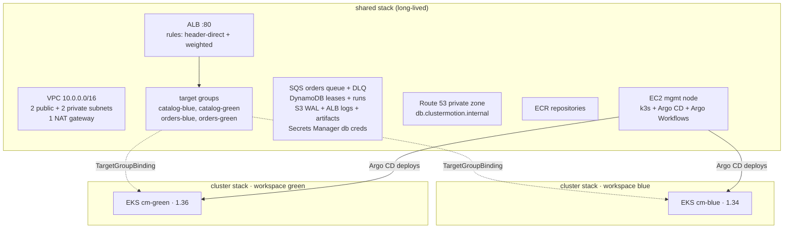

# 03 · Infrastructure (Terraform + Ansible)

Everything in AWS is created by Terraform. The one long-lived machine (the
management node) is configured by Ansible. There are three Terraform stacks:

| Stack | Lifetime | Creates |
|---|---|---|
| `infra/terraform/bootstrap` (script) | once | S3 bucket for Terraform state |
| `infra/terraform/shared` | whole project | VPC, ALB + target groups + rules, SQS, DynamoDB, S3 buckets, Route 53 private zone, ECR, Secrets Manager, management EC2, CI role |
| `infra/terraform/cluster` | **one per colour** (workspaces `blue`, `green`) | EKS cluster, node group, add-ons, Pod Identity roles, access entries |

The shared stack owns everything **both** clusters use. This is the core
idea of the design: clusters become disposable because nothing that must
survive a migration lives inside one cluster's Terraform state.



## 3.1 Prerequisites

| Tool | Version used | Purpose |
|---|---|---|
| AWS account + admin IAM user/role | - | everything |
| Terraform | ≥ 1.10 (tested 1.15) | S3 native state locking needs ≥ 1.10 |
| AWS CLI | v2 | auth, ECR login |
| Ansible | ≥ 2.16 (tested core 2.21) | management node |
| Docker with buildx | any recent | build images |
| kubectl, helm | kubectl ≥ 1.34, helm ≥ 3.14 | debugging, chart rendering |
| An SSH key pair | ed25519 | access to the management node |

Pick a region (examples use `us-east-1`) and export:

```bash
export AWS_REGION=us-east-1
export TF_STATE_BUCKET=clustermotion-tfstate-$(aws sts get-caller-identity --query Account --output text)
export MY_IP=$(curl -s https://checkip.amazonaws.com)/32
```

## 3.2 State bucket (once)

**File:** `infra/terraform/bootstrap/create-state-bucket.sh`
```bash
#!/usr/bin/env bash
# Creates the S3 bucket that stores Terraform state (versioned, encrypted, private).
set -euo pipefail
: "${TF_STATE_BUCKET:?set TF_STATE_BUCKET}"
: "${AWS_REGION:?set AWS_REGION}"

if aws s3api head-bucket --bucket "$TF_STATE_BUCKET" 2>/dev/null; then
  echo "bucket $TF_STATE_BUCKET already exists"; exit 0
fi
if [ "$AWS_REGION" = "us-east-1" ]; then
  aws s3api create-bucket --bucket "$TF_STATE_BUCKET" --region "$AWS_REGION"
else
  aws s3api create-bucket --bucket "$TF_STATE_BUCKET" --region "$AWS_REGION" \
    --create-bucket-configuration LocationConstraint="$AWS_REGION"
fi
aws s3api put-bucket-versioning --bucket "$TF_STATE_BUCKET" --versioning-configuration Status=Enabled
aws s3api put-bucket-encryption --bucket "$TF_STATE_BUCKET" \
  --server-side-encryption-configuration '{"Rules":[{"ApplyServerSideEncryptionByDefault":{"SSEAlgorithm":"AES256"}}]}'
aws s3api put-public-access-block --bucket "$TF_STATE_BUCKET" \
  --public-access-block-configuration BlockPublicAcls=true,IgnorePublicAcls=true,BlockPublicPolicy=true,RestrictPublicBuckets=true
echo "created $TF_STATE_BUCKET"
```

## 3.3 Shared stack

### Providers and backend

**File:** `infra/terraform/shared/versions.tf`
```hcl
terraform {
  required_version = ">= 1.10"

  required_providers {
    aws = {
      source  = "hashicorp/aws"
      version = "~> 6.0"
    }
    random = {
      source  = "hashicorp/random"
      version = "~> 3.6"
    }
  }

  # bucket and region come from -backend-config (see Makefile)
  backend "s3" {
    key          = "shared/terraform.tfstate"
    use_lockfile = true
    encrypt      = true
  }
}

provider "aws" {
  region = var.region

  default_tags {
    tags = {
      Project   = var.project
      ManagedBy = "terraform"
      Stack     = "shared"
    }
  }
}
```

**File:** `infra/terraform/shared/variables.tf`
```hcl
variable "project" {
  description = "Name prefix for every resource"
  type        = string
  default     = "clustermotion"
}

variable "region" {
  type    = string
  default = "us-east-1"
}

variable "vpc_cidr" {
  type    = string
  default = "10.0.0.0/16"
}

variable "admin_cidr" {
  description = "Your public IP in CIDR form (x.x.x.x/32): SSH, k3s API and ALB access"
  type        = string
}

variable "ssh_public_key" {
  description = "Contents of your SSH public key for the management node"
  type        = string
}

variable "mgmt_instance_type" {
  type    = string
  default = "t3.medium"
}

variable "github_repository" {
  description = "owner/repo allowed to push images from GitHub Actions (empty = no CI role)"
  type        = string
  default     = ""
}

variable "services" {
  description = "Services exposed through the shared ALB"
  type = map(object({
    path_patterns = list(string)
    health_path   = string
    priority      = number
  }))
  default = {
    catalog = { path_patterns = ["/api/catalog/*"], health_path = "/api/catalog/healthz", priority = 100 }
    orders  = { path_patterns = ["/api/orders", "/api/orders/*"], health_path = "/api/orders/healthz", priority = 110 }
  }
}
```

### Network

Two AZs keep the cost down (EKS needs at least two). One NAT gateway is a
deliberate cost trade-off for a demo; production would use one per AZ.

**File:** `infra/terraform/shared/network.tf`
```hcl
data "aws_availability_zones" "available" {
  state = "available"
}

locals {
  azs = slice(data.aws_availability_zones.available.names, 0, 2)
}

module "vpc" {
  source  = "terraform-aws-modules/vpc/aws"
  version = "~> 6.0"

  name = var.project
  cidr = var.vpc_cidr
  azs  = local.azs

  public_subnets  = [for i, _ in local.azs : cidrsubnet(var.vpc_cidr, 8, i)]
  private_subnets = [for i, _ in local.azs : cidrsubnet(var.vpc_cidr, 4, i + 1)]

  enable_nat_gateway   = true
  single_nat_gateway   = true
  enable_dns_hostnames = true
  enable_dns_support   = true

  # Tags used by the AWS Load Balancer Controller for NLB subnet discovery
  public_subnet_tags  = { "kubernetes.io/role/elb" = "1" }
  private_subnet_tags = { "kubernetes.io/role/internal-elb" = "1" }
}
```

### Data plane shared by both clusters

**File:** `infra/terraform/shared/data.tf`
```hcl
data "aws_caller_identity" "current" {}

locals {
  account_id = data.aws_caller_identity.current.account_id
}

# --- SQS: order events -------------------------------------------------------
resource "aws_sqs_queue" "orders_dlq" {
  name                      = "${var.project}-orders-dlq"
  message_retention_seconds = 1209600
}

resource "aws_sqs_queue" "orders" {
  name                       = "${var.project}-orders"
  visibility_timeout_seconds = 60
  receive_wait_time_seconds  = 5
  redrive_policy = jsonencode({
    deadLetterTargetArn = aws_sqs_queue.orders_dlq.arn
    maxReceiveCount     = 10
  })
}

# --- DynamoDB: singleton lease + migration run timeline ----------------------
resource "aws_dynamodb_table" "leases" {
  name         = "${var.project}-leases"
  billing_mode = "PAY_PER_REQUEST"
  hash_key     = "lease_id"

  attribute {
    name = "lease_id"
    type = "S"
  }
}

resource "aws_dynamodb_table" "runs" {
  name         = "${var.project}-runs"
  billing_mode = "PAY_PER_REQUEST"
  hash_key     = "run_id"
  range_key    = "ts"

  attribute {
    name = "run_id"
    type = "S"
  }

  attribute {
    name = "ts"
    type = "N"
  }
}

# --- S3: PostgreSQL WAL archive (both clusters), run artifacts ---------------
resource "aws_s3_bucket" "wal" {
  bucket        = "${var.project}-wal-${local.account_id}"
  force_destroy = true
}

resource "aws_s3_bucket" "artifacts" {
  bucket        = "${var.project}-artifacts-${local.account_id}"
  force_destroy = true
}

resource "aws_s3_bucket_public_access_block" "private" {
  for_each = {
    wal       = aws_s3_bucket.wal.id
    artifacts = aws_s3_bucket.artifacts.id
    alb_logs  = aws_s3_bucket.alb_logs.id
  }
  bucket                  = each.value
  block_public_acls       = true
  block_public_policy     = true
  ignore_public_acls      = true
  restrict_public_buckets = true
}

# --- Database credentials (seeded into clusters by `cm register`) ------------
resource "random_password" "db" {
  length  = 32
  special = false
}

resource "aws_secretsmanager_secret" "db" {
  name                    = "${var.project}/orders-db"
  recovery_window_in_days = 0
}

resource "aws_secretsmanager_secret_version" "db" {
  secret_id     = aws_secretsmanager_secret.db.id
  secret_string = jsonencode({ username = "shop", password = random_password.db.result })
}

# --- Private DNS: the stable database name ----------------------------------
resource "aws_route53_zone" "internal" {
  name = "clustermotion.internal"
  vpc {
    vpc_id = module.vpc.vpc_id
  }
}

# --- ECR ---------------------------------------------------------------------
resource "aws_ecr_repository" "images" {
  for_each             = toset(["catalog", "orders", "fulfillment", "engine"])
  name                 = "${var.project}/${each.key}"
  image_tag_mutability = "MUTABLE" # "latest" is moved by CI; git-SHA tags are never reused
  force_delete         = true

  image_scanning_configuration {
    scan_on_push = true
  }
}

resource "aws_ecr_lifecycle_policy" "images" {
  for_each   = aws_ecr_repository.images
  repository = each.value.name
  policy = jsonencode({
    rules = [{
      rulePriority = 1
      description  = "keep the last 30 images"
      selection    = { tagStatus = "any", countType = "imageCountMoreThan", countNumber = 30 }
      action       = { type = "expire" }
    }]
  })
}
```

### The ALB: header routing + weighted routing

Each service has **three** rules:

- `X-CM-Target: blue` → blue target group only (smoke tests, shadow replay),
- `X-CM-Target: green` → green target group only (priorities 10–25),
- priority `100+`: the **weighted** rule used by real traffic. Terraform
  creates it at blue=100/green=0 and then **ignores its action**, because the
  engine owns the weights during a migration.

**File:** `infra/terraform/shared/alb.tf`
```hcl
data "aws_elb_service_account" "this" {}

resource "aws_s3_bucket" "alb_logs" {
  bucket        = "${var.project}-alb-logs-${local.account_id}"
  force_destroy = true
}

resource "aws_s3_bucket_lifecycle_configuration" "alb_logs" {
  bucket = aws_s3_bucket.alb_logs.id
  rule {
    id     = "expire"
    status = "Enabled"
    filter {}
    expiration {
      days = 7
    }
  }
}

resource "aws_s3_bucket_policy" "alb_logs" {
  bucket = aws_s3_bucket.alb_logs.id
  policy = jsonencode({
    Version = "2012-10-17"
    Statement = [{
      Effect    = "Allow"
      Principal = { AWS = data.aws_elb_service_account.this.arn }
      Action    = "s3:PutObject"
      Resource  = "${aws_s3_bucket.alb_logs.arn}/alb/AWSLogs/${local.account_id}/*"
    }]
  })
}

resource "aws_security_group" "alb" {
  name        = "${var.project}-alb"
  description = "Public HTTP entrypoint of the shop"
  vpc_id      = module.vpc.vpc_id

  ingress {
    description = "HTTP from the admin and the management node (load generator)"
    from_port   = 80
    to_port     = 80
    protocol    = "tcp"
    cidr_blocks = [var.admin_cidr, "${aws_eip.mgmt.public_ip}/32"]
  }

  egress {
    from_port   = 0
    to_port     = 0
    protocol    = "-1"
    cidr_blocks = [var.vpc_cidr]
  }
}

resource "aws_lb" "shop" {
  name               = var.project
  load_balancer_type = "application"
  security_groups    = [aws_security_group.alb.id]
  subnets            = module.vpc.public_subnets
  idle_timeout       = 30

  access_logs {
    bucket  = aws_s3_bucket.alb_logs.id
    prefix  = "alb"
    enabled = true
  }

  depends_on = [aws_s3_bucket_policy.alb_logs]
}

locals {
  colors = ["blue", "green"]
  service_colors = {
    for pair in setproduct(keys(var.services), local.colors) :
    "${pair[0]}-${pair[1]}" => { service = pair[0], color = pair[1] }
  }
}

resource "aws_lb_target_group" "svc" {
  for_each             = local.service_colors
  name                 = "cm-${each.key}"
  port                 = 8000
  protocol             = "HTTP"
  target_type          = "ip"
  vpc_id               = module.vpc.vpc_id
  deregistration_delay = 15

  health_check {
    path                = var.services[each.value.service].health_path
    interval            = 10
    healthy_threshold   = 2
    unhealthy_threshold = 2
    timeout             = 5
    matcher             = "200"
  }
}

resource "aws_lb_listener" "http" {
  load_balancer_arn = aws_lb.shop.arn
  port              = 80
  protocol          = "HTTP"

  default_action {
    type = "fixed-response"
    fixed_response {
      content_type = "application/json"
      message_body = "{\"error\":\"no route\"}"
      status_code  = "404"
    }
  }
}

# Direct routes: X-CM-Target header pins a request to one colour.
resource "aws_lb_listener_rule" "direct" {
  for_each     = local.service_colors
  listener_arn = aws_lb_listener.http.arn
  # catalog: blue 10, green 15 · orders: blue 20, green 25 (below the weighted rules at 100+)
  priority = var.services[each.value.service].priority - 90 + (each.value.color == "blue" ? 0 : 5)

  condition {
    path_pattern {
      values = var.services[each.value.service].path_patterns
    }
  }
  condition {
    http_header {
      http_header_name = "X-CM-Target"
      values           = [each.value.color]
    }
  }

  action {
    type             = "forward"
    target_group_arn = aws_lb_target_group.svc[each.key].arn
  }
}

# Weighted routes: what real users hit. The engine owns the weights.
resource "aws_lb_listener_rule" "weighted" {
  for_each     = var.services
  listener_arn = aws_lb_listener.http.arn
  priority     = each.value.priority

  condition {
    path_pattern {
      values = each.value.path_patterns
    }
  }

  action {
    type = "forward"
    forward {
      target_group {
        arn    = aws_lb_target_group.svc["${each.key}-blue"].arn
        weight = 100
      }
      target_group {
        arn    = aws_lb_target_group.svc["${each.key}-green"].arn
        weight = 0
      }
    }
  }

  lifecycle {
    ignore_changes = [action]
  }
}
```

### The management node

A small EC2 instance runs k3s with Argo CD and Argo Workflows. It sits
**outside** both workload clusters, so the orchestrator keeps working while
either cluster is being replaced. It uses an instance profile, so no AWS
keys ever exist on disk.

**File:** `infra/terraform/shared/mgmt.tf`
```hcl
data "aws_ssm_parameter" "ubuntu" {
  name = "/aws/service/canonical/ubuntu/server/24.04/stable/current/amd64/hvm/ebs-gp3/ami-id"
}

resource "aws_key_pair" "mgmt" {
  key_name   = "${var.project}-mgmt"
  public_key = var.ssh_public_key
}

resource "aws_security_group" "mgmt" {
  name        = "${var.project}-mgmt"
  description = "Management node: k3s, Argo CD, Argo Workflows"
  vpc_id      = module.vpc.vpc_id

  ingress {
    description = "SSH from admin"
    from_port   = 22
    to_port     = 22
    protocol    = "tcp"
    cidr_blocks = [var.admin_cidr]
  }

  ingress {
    description = "k3s API from admin (kubectl)"
    from_port   = 6443
    to_port     = 6443
    protocol    = "tcp"
    cidr_blocks = [var.admin_cidr]
  }

  egress {
    from_port   = 0
    to_port     = 0
    protocol    = "-1"
    cidr_blocks = ["0.0.0.0/0"]
  }
}

resource "aws_iam_role" "mgmt" {
  name = "${var.project}-mgmt"
  assume_role_policy = jsonencode({
    Version = "2012-10-17"
    Statement = [{
      Effect    = "Allow"
      Principal = { Service = "ec2.amazonaws.com" }
      Action    = "sts:AssumeRole"
    }]
  })
}

resource "aws_iam_role_policy_attachment" "mgmt_ssm" {
  role       = aws_iam_role.mgmt.name
  policy_arn = "arn:aws:iam::aws:policy/AmazonSSMManagedInstanceCore"
}

resource "aws_iam_role_policy_attachment" "mgmt_ecr" {
  role       = aws_iam_role.mgmt.name
  policy_arn = "arn:aws:iam::aws:policy/AmazonEC2ContainerRegistryReadOnly"
}

# Everything the migration engine does, and nothing more.
resource "aws_iam_role_policy" "mgmt_engine" {
  name = "clustermotion-engine"
  role = aws_iam_role.mgmt.id
  policy = jsonencode({
    Version = "2012-10-17"
    Statement = [
      { Sid = "Eks", Effect = "Allow", Action = ["eks:DescribeCluster", "eks:ListClusters"], Resource = "*" },
      {
        Sid      = "AlbRead", Effect = "Allow",
        Action   = ["elasticloadbalancing:DescribeRules", "elasticloadbalancing:DescribeTargetHealth"],
        Resource = "*"
      },
      {
        Sid      = "AlbWeights", Effect = "Allow", Action = ["elasticloadbalancing:ModifyRule"],
        Resource = [for r in aws_lb_listener_rule.weighted : r.arn]
      },
      { Sid = "Metrics", Effect = "Allow", Action = ["cloudwatch:GetMetricData"], Resource = "*" },
      {
        Sid      = "Dns", Effect = "Allow",
        Action   = ["route53:ChangeResourceRecordSets", "route53:ListResourceRecordSets"],
        Resource = aws_route53_zone.internal.arn
      },
      {
        Sid      = "Dynamo", Effect = "Allow",
        Action   = ["dynamodb:GetItem", "dynamodb:PutItem", "dynamodb:UpdateItem", "dynamodb:Query"],
        Resource = [aws_dynamodb_table.leases.arn, aws_dynamodb_table.runs.arn]
      },
      {
        Sid      = "Logs", Effect = "Allow", Action = ["s3:ListBucket", "s3:GetObject"],
        Resource = [aws_s3_bucket.alb_logs.arn, "${aws_s3_bucket.alb_logs.arn}/*"]
      },
      { Sid = "Artifacts", Effect = "Allow", Action = ["s3:PutObject"], Resource = "${aws_s3_bucket.artifacts.arn}/*" },
      { Sid = "DbSecret", Effect = "Allow", Action = ["secretsmanager:GetSecretValue"], Resource = aws_secretsmanager_secret.db.arn },
    ]
  })
}

resource "aws_iam_instance_profile" "mgmt" {
  name = "${var.project}-mgmt"
  role = aws_iam_role.mgmt.name
}

resource "aws_instance" "mgmt" {
  ami                    = data.aws_ssm_parameter.ubuntu.value
  instance_type          = var.mgmt_instance_type
  subnet_id              = module.vpc.public_subnets[0]
  vpc_security_group_ids = [aws_security_group.mgmt.id]
  key_name               = aws_key_pair.mgmt.key_name
  iam_instance_profile   = aws_iam_instance_profile.mgmt.name

  metadata_options {
    http_tokens                 = "required"
    http_put_response_hop_limit = 2 # pods on k3s need IMDS for the instance role
  }

  root_block_device {
    volume_size = 40
    volume_type = "gp3"
    encrypted   = true
  }

  tags = { Name = "${var.project}-mgmt" }

  lifecycle {
    ignore_changes = [ami]
  }
}

resource "aws_eip" "mgmt" {
  domain   = "vpc"
  instance = aws_instance.mgmt.id
}
```

### CI identity (GitHub Actions → ECR, no stored keys)

**File:** `infra/terraform/shared/ci.tf`
```hcl
resource "aws_iam_openid_connect_provider" "github" {
  count          = var.github_repository == "" ? 0 : 1
  url            = "https://token.actions.githubusercontent.com"
  client_id_list = ["sts.amazonaws.com"]
}

resource "aws_iam_role" "ci" {
  count = var.github_repository == "" ? 0 : 1
  name  = "${var.project}-ci"
  assume_role_policy = jsonencode({
    Version = "2012-10-17"
    Statement = [{
      Effect    = "Allow"
      Principal = { Federated = aws_iam_openid_connect_provider.github[0].arn }
      Action    = "sts:AssumeRoleWithWebIdentity"
      Condition = {
        StringEquals = { "token.actions.githubusercontent.com:aud" = "sts.amazonaws.com" }
        StringLike   = { "token.actions.githubusercontent.com:sub" = "repo:${var.github_repository}:ref:refs/heads/main" }
      }
    }]
  })
}

resource "aws_iam_role_policy" "ci_ecr" {
  count = var.github_repository == "" ? 0 : 1
  name  = "ecr-push"
  role  = aws_iam_role.ci[0].id
  policy = jsonencode({
    Version = "2012-10-17"
    Statement = [
      { Effect = "Allow", Action = ["ecr:GetAuthorizationToken"], Resource = "*" },
      {
        Effect = "Allow"
        Action = ["ecr:BatchCheckLayerAvailability", "ecr:BatchGetImage", "ecr:CompleteLayerUpload",
        "ecr:InitiateLayerUpload", "ecr:PutImage", "ecr:UploadLayerPart"]
        Resource = [for r in aws_ecr_repository.images : r.arn]
      },
    ]
  })
}
```

### Outputs, including the engine configuration

`engine_config` is exactly the JSON file the engine reads (chapter 05).

**File:** `infra/terraform/shared/outputs.tf`
```hcl
locals {
  registry = "${local.account_id}.dkr.ecr.${var.region}.amazonaws.com"
}

output "vpc_id" { value = module.vpc.vpc_id }
output "vpc_cidr" { value = var.vpc_cidr }
output "private_subnets" { value = module.vpc.private_subnets }
output "mgmt_public_ip" { value = aws_eip.mgmt.public_ip }
output "mgmt_role_arn" { value = aws_iam_role.mgmt.arn }
output "mgmt_security_group_id" { value = aws_security_group.mgmt.id }
output "alb_security_group_id" { value = aws_security_group.alb.id }
output "alb_dns_name" { value = aws_lb.shop.dns_name }
output "image_registry" { value = local.registry }
output "queue_arn" { value = aws_sqs_queue.orders.arn }
output "lease_table_arn" { value = aws_dynamodb_table.leases.arn }
output "wal_bucket_arn" { value = aws_s3_bucket.wal.arn }
output "ci_role_arn" { value = try(aws_iam_role.ci[0].arn, "") }

output "engine_config" {
  description = "Write to build/config.json: terraform output -json engine_config > build/config.json"
  value = {
    project            = var.project
    region             = var.region
    clusters           = { blue = "cm-blue", green = "cm-green" }
    workload_namespace = "shop"
    alb = {
      dns_name          = aws_lb.shop.dns_name
      arn_suffix        = aws_lb.shop.arn_suffix
      logs_bucket       = aws_s3_bucket.alb_logs.id
      logs_prefix       = "alb"
      security_group_id = aws_security_group.alb.id
    }
    services = {
      for name, svc in var.services : name => {
        rule_arn        = aws_lb_listener_rule.weighted[name].arn
        health_path     = svc.health_path
        smoke_paths     = name == "catalog" ? ["/api/catalog/products", "/api/catalog/products/sku-100"] : ["/api/orders/readyz"]
        shadow_prefixes = ["/api/${name}/"]
        target_groups = {
          for color in local.colors : color => {
            arn        = aws_lb_target_group.svc["${name}-${color}"].arn
            arn_suffix = aws_lb_target_group.svc["${name}-${color}"].arn_suffix
          }
        }
      }
    }
    shift_order      = ["catalog", "orders"]
    lease            = { table = aws_dynamodb_table.leases.name, lease_id = "singletons", ttl_seconds = 30 }
    runs_table       = aws_dynamodb_table.runs.name
    artifacts_bucket = aws_s3_bucket.artifacts.id
    db = {
      zone_id        = aws_route53_zone.internal.zone_id
      record         = "db.clustermotion.internal"
      namespace      = "shop"
      cluster_prefix = "orders-db"
      lb_service     = "orders-db-lb"
      secret_id      = aws_secretsmanager_secret.db.name
      name           = "shop"
    }
    gitops = {
      argocd_namespace = "argocd"
      cluster_annotations = {
        "clustermotion.io/aws-region"     = var.region
        "clustermotion.io/vpc-id"         = module.vpc.vpc_id
        "clustermotion.io/vpc-cidr"       = var.vpc_cidr
        "clustermotion.io/image-registry" = local.registry
        "clustermotion.io/queue-url"      = aws_sqs_queue.orders.url
        "clustermotion.io/wal-bucket"     = aws_s3_bucket.wal.id
        "clustermotion.io/lease-table"    = aws_dynamodb_table.leases.name
        "clustermotion.io/db-host"        = "db.clustermotion.internal"
        "clustermotion.io/alb-sg"         = aws_security_group.alb.id
      }
    }
    slo = { max_5xx_ratio = 0.01, max_p95_ratio = 1.5, min_p95_seconds = 0.3, min_requests = 20 }
  }
}
```

**File:** `infra/terraform/shared/terraform.tfvars.example`
```hcl
region            = "us-east-1"
admin_cidr        = "203.0.113.10/32"            # curl -s https://checkip.amazonaws.com
ssh_public_key    = "ssh-ed25519 AAAA... you@laptop"
github_repository = "your-github-user/clustermotion"
```

## 3.4 Cluster stack (used once per colour)

The same code builds blue and green. Only the variables differ:

```bash
terraform workspace select -or-create blue
terraform apply -var color=blue  -var kubernetes_version=1.34
terraform workspace select -or-create green
terraform apply -var color=green -var kubernetes_version=1.36
```

Notable choices:

- `upgrade_policy.support_type = "STANDARD"`: the cluster is **never**
  silently enrolled in extended support. Upgrading is ClusterMotion's job.
- **Access entries** give the management node's IAM role admin rights, so
  Argo CD and the engine can manage the cluster without kubeconfig files.
- **Pod Identity** gives each workload exactly the AWS permissions it needs.
  The service account names are the contract with the Helm chart (chapter 04).

**File:** `infra/terraform/cluster/versions.tf`
```hcl
terraform {
  required_version = ">= 1.10"

  required_providers {
    aws = {
      source  = "hashicorp/aws"
      version = "~> 6.0"
    }
  }

  # One state per workspace: env/<workspace>/cluster/terraform.tfstate
  backend "s3" {
    key                  = "cluster/terraform.tfstate"
    workspace_key_prefix = "env"
    use_lockfile         = true
    encrypt              = true
  }
}

provider "aws" {
  region = var.region

  default_tags {
    tags = {
      Project   = "clustermotion"
      ManagedBy = "terraform"
      Stack     = "cluster-${var.color}"
    }
  }
}
```

**File:** `infra/terraform/cluster/variables.tf`
```hcl
variable "region" {
  type    = string
  default = "us-east-1"
}

variable "state_bucket" {
  description = "Terraform state bucket (to read the shared stack outputs)"
  type        = string
}

variable "color" {
  description = "blue or green"
  type        = string
  validation {
    condition     = contains(["blue", "green"], var.color)
    error_message = "color must be blue or green"
  }
}

variable "kubernetes_version" {
  description = "EKS Kubernetes version, e.g. 1.34 for blue and 1.36 for green"
  type        = string
}

variable "admin_cidr" {
  description = "Your public IP (x.x.x.x/32) for the public EKS endpoint"
  type        = string
}

variable "node_instance_types" {
  type    = list(string)
  default = ["t3.large", "t3a.large", "m5.large"]
}

variable "capacity_type" {
  description = "SPOT for cheap demos, ON_DEMAND for stable recordings"
  type        = string
  default     = "SPOT"
}
```

**File:** `infra/terraform/cluster/main.tf`
```hcl
data "terraform_remote_state" "shared" {
  backend = "s3"
  config = {
    bucket = var.state_bucket
    key    = "shared/terraform.tfstate"
    region = var.region
  }
}

locals {
  shared = data.terraform_remote_state.shared.outputs
  name   = "cm-${var.color}"
}

module "eks" {
  source  = "terraform-aws-modules/eks/aws"
  version = "~> 21.0"

  name               = local.name
  kubernetes_version = var.kubernetes_version

  vpc_id     = local.shared.vpc_id
  subnet_ids = local.shared.private_subnets

  endpoint_public_access       = true
  endpoint_public_access_cidrs = [var.admin_cidr]
  endpoint_private_access      = true

  # Never pay the 6x extended-support price silently.
  upgrade_policy = {
    support_type = "STANDARD"
  }

  enable_cluster_creator_admin_permissions = true

  access_entries = {
    mgmt = {
      principal_arn = local.shared.mgmt_role_arn
      policy_associations = {
        admin = {
          policy_arn   = "arn:aws:eks::aws:cluster-access-policy/AmazonEKSClusterAdminPolicy"
          access_scope = { type = "cluster" }
        }
      }
    }
  }

  # The management node (Argo CD, engine) reaches the private endpoint.
  security_group_additional_rules = {
    mgmt_api = {
      description              = "Kubernetes API from the management node"
      type                     = "ingress"
      protocol                 = "tcp"
      from_port                = 443
      to_port                  = 443
      source_security_group_id = local.shared.mgmt_security_group_id
    }
  }

  addons = {
    vpc-cni                = { before_compute = true }
    eks-pod-identity-agent = { before_compute = true }
    kube-proxy             = {}
    coredns                = {}
    aws-ebs-csi-driver = {
      pod_identity_association = [{
        role_arn        = module.ebs_csi_pod_identity.iam_role_arn
        service_account = "ebs-csi-controller-sa"
      }]
    }
  }

  eks_managed_node_groups = {
    default = {
      instance_types = var.node_instance_types
      capacity_type  = var.capacity_type
      min_size       = 2
      max_size       = 4
      desired_size   = 2
      labels         = { "clustermotion.io/color" = var.color }
    }
  }
}
```

**File:** `infra/terraform/cluster/pod_identity.tf`
```hcl
module "ebs_csi_pod_identity" {
  source  = "terraform-aws-modules/eks-pod-identity/aws"
  version = "~> 2.0"

  name                      = "${local.name}-ebs-csi"
  attach_aws_ebs_csi_policy = true
}

module "lb_controller_pod_identity" {
  source  = "terraform-aws-modules/eks-pod-identity/aws"
  version = "~> 2.0"

  name                            = "${local.name}-aws-lbc"
  attach_aws_lb_controller_policy = true

  associations = {
    this = {
      cluster_name    = module.eks.cluster_name
      namespace       = "kube-system"
      service_account = "aws-load-balancer-controller"
    }
  }
}

locals {
  queue_arn = local.shared.queue_arn
  lease_arn = local.shared.lease_table_arn
  wal_arn   = local.shared.wal_bucket_arn

  # service account (namespace/name) => IAM statements
  workload_roles = {
    keda = {
      namespace       = "keda"
      service_account = "keda-operator"
      statements      = [{ actions = ["sqs:GetQueueAttributes"], resources = [local.queue_arn] }]
    }
    orders = {
      namespace       = "shop"
      service_account = "orders"
      statements      = [{ actions = ["sqs:SendMessage"], resources = [local.queue_arn] }]
    }
    sweeper = {
      namespace       = "shop"
      service_account = "order-sweeper"
      statements = [
        { actions = ["sqs:SendMessage"], resources = [local.queue_arn] },
        { actions = ["dynamodb:GetItem"], resources = [local.lease_arn] },
      ]
    }
    fulfillment = {
      namespace       = "shop"
      service_account = "fulfillment-worker"
      statements = [
        { actions = ["sqs:ReceiveMessage", "sqs:DeleteMessage", "sqs:ChangeMessageVisibility", "sqs:GetQueueAttributes"], resources = [local.queue_arn] },
        { actions = ["dynamodb:GetItem"], resources = [local.lease_arn] },
      ]
    }
    lease-agent = {
      namespace       = "shop"
      service_account = "lease-agent"
      statements      = [{ actions = ["dynamodb:GetItem", "dynamodb:PutItem", "dynamodb:UpdateItem"], resources = [local.lease_arn] }]
    }
    # CloudNativePG names the Postgres pods' service account after the Cluster.
    orders-db = {
      namespace       = "shop"
      service_account = "orders-db-${var.color}"
      statements = [
        { actions = ["s3:ListBucket", "s3:GetBucketLocation"], resources = [local.wal_arn] },
        { actions = ["s3:GetObject", "s3:PutObject", "s3:DeleteObject"], resources = ["${local.wal_arn}/*"] },
      ]
    }
  }
}

module "workload_pod_identity" {
  source   = "terraform-aws-modules/eks-pod-identity/aws"
  version  = "~> 2.0"
  for_each = local.workload_roles

  name                 = "${local.name}-${each.key}"
  attach_custom_policy = true
  policy_statements    = each.value.statements

  associations = {
    this = {
      cluster_name    = module.eks.cluster_name
      namespace       = each.value.namespace
      service_account = each.value.service_account
    }
  }
}
```

**File:** `infra/terraform/cluster/outputs.tf`
```hcl
output "cluster_name" { value = module.eks.cluster_name }
output "cluster_endpoint" { value = module.eks.cluster_endpoint }
output "cluster_version" { value = module.eks.cluster_version }
output "node_security_group_id" { value = module.eks.node_security_group_id }
```

**File:** `infra/terraform/cluster/terraform.tfvars.example`
```hcl
region       = "us-east-1"
state_bucket = "clustermotion-tfstate-111122223333"
admin_cidr   = "203.0.113.10/32"
# color and kubernetes_version are passed per workspace on the command line
```

## 3.5 Ansible: the management node

Why Ansible here? The management node is a **pet**: one long-lived VM with
OS packages, a systemd service (k3s), binaries and files in specific places.
That is exactly what configuration management is for. The EKS clusters are
**cattle**: GitOps configures them, not Ansible.

What the playbook does:

1. **base**: OS packages, time sync, a Python virtualenv for the engine.
2. **k3s**: installs a pinned k3s version and the ECR credential provider,
   so k3s can pull private images from ECR using the instance role (no image
   pull secrets to rotate).
3. **gitops**: installs Argo CD and Argo Workflows through k3s's built-in
   Helm controller, then the root Argo CD Application that points at this
   repository.
4. **toolbox**: clones the repo, installs `cm` and k6 for load tests.
5. Fetches a kubeconfig to your laptop (context `cm-mgmt`).

**File:** `infra/ansible/ansible.cfg`
```ini
[defaults]
inventory = inventory.ini
host_key_checking = False
interpreter_python = /usr/bin/python3
stdout_callback = default
result_format = yaml

[ssh_connection]
pipelining = True
```

**File:** `infra/ansible/inventory.ini.example`
```ini
# Generated by `make inventory` from Terraform outputs.
[mgmt]
mgmt ansible_host=203.0.113.20 ansible_user=ubuntu ansible_ssh_private_key_file=~/.ssh/id_ed25519
```

**File:** `infra/ansible/group_vars/all.yml`
```yaml
k3s_version: v1.36.4+k3s1
ecr_credential_provider_version: v1.37.0
k6_version: v2.3.0
argocd_chart_version: 10.9.2
argo_workflows_chart_version: 2.0.8
repo_url: https://github.com/YOUR_GITHUB_USER/clustermotion.git
repo_branch: main
engine_dir: /opt/clustermotion
kubeconfig_local_path: "{{ lookup('env', 'HOME') }}/.kube/clustermotion-mgmt.yaml"
```

**File:** `infra/ansible/site.yml`
```yaml
- name: Configure the ClusterMotion management node
  hosts: mgmt
  become: true
  roles:
    - base
    - k3s
    - gitops
    - toolbox
```

**File:** `infra/ansible/roles/base/tasks/main.yml`
```yaml
- name: Install OS packages
  ansible.builtin.apt:
    name: [git, jq, curl, unzip, python3-venv, python3-pip, chrony, postgresql-client]
    update_cache: true
    cache_valid_time: 3600

- name: Enable time sync (lease heartbeats and reports rely on clocks)
  ansible.builtin.service:
    name: chrony
    state: started
    enabled: true

- name: Install AWS CLI v2
  ansible.builtin.shell: |
    set -e
    curl -sSfL https://awscli.amazonaws.com/awscli-exe-linux-x86_64.zip -o /tmp/awscliv2.zip
    unzip -qo /tmp/awscliv2.zip -d /tmp
    /tmp/aws/install --update
  args:
    creates: /usr/local/bin/aws
```

**File:** `infra/ansible/roles/k3s/tasks/main.yml`
```yaml
- name: ECR credential provider directories
  ansible.builtin.file:
    path: /var/lib/rancher/credentialprovider/bin
    state: directory
    mode: "0755"

- name: Download the ECR credential provider (lets k3s pull from ECR with the instance role)
  ansible.builtin.get_url:
    url: "https://artifacts.k8s.io/binaries/cloud-provider-aws/{{ ecr_credential_provider_version }}/linux/amd64/ecr-credential-provider-linux-amd64"
    dest: /var/lib/rancher/credentialprovider/bin/ecr-credential-provider
    mode: "0755"

- name: Credential provider configuration (k3s picks this path up automatically)
  ansible.builtin.copy:
    dest: /var/lib/rancher/credentialprovider/config.yaml
    mode: "0644"
    content: |
      apiVersion: kubelet.config.k8s.io/v1
      kind: CredentialProviderConfig
      providers:
        - name: ecr-credential-provider
          matchImages:
            - "*.dkr.ecr.*.amazonaws.com"
          defaultCacheDuration: "12h"
          apiVersion: credentialprovider.kubelet.k8s.io/v1

- name: Install k3s (pinned)
  ansible.builtin.shell: |
    curl -sfL https://get.k3s.io | \
      INSTALL_K3S_VERSION="{{ k3s_version }}" \
      INSTALL_K3S_EXEC="server --disable traefik --write-kubeconfig-mode 600 --tls-san {{ ansible_host }}" \
      sh -
  args:
    creates: /usr/local/bin/k3s

- name: Wait for the node to be Ready
  ansible.builtin.command: k3s kubectl wait --for=condition=Ready node --all --timeout=180s
  changed_when: false

- name: Kubeconfig for the ubuntu user (context cm-mgmt)
  ansible.builtin.shell: |
    mkdir -p /home/ubuntu/.kube
    sed 's/: default$/: cm-mgmt/' /etc/rancher/k3s/k3s.yaml > /home/ubuntu/.kube/config
    chown -R ubuntu:ubuntu /home/ubuntu/.kube && chmod 600 /home/ubuntu/.kube/config
  changed_when: false

- name: Fetch a kubeconfig to the laptop
  ansible.builtin.fetch:
    src: /home/ubuntu/.kube/config
    dest: "{{ kubeconfig_local_path }}"
    flat: true

- name: Point the local kubeconfig at the public IP
  delegate_to: localhost
  become: false
  ansible.builtin.replace:
    path: "{{ kubeconfig_local_path }}"
    regexp: "https://127.0.0.1:6443"
    replace: "https://{{ ansible_host }}:6443"
```

**File:** `infra/ansible/roles/gitops/tasks/main.yml`
```yaml
- name: Namespaces
  ansible.builtin.command: "k3s kubectl create namespace {{ item }}"
  loop: [argocd, argo]
  register: ns
  changed_when: ns.rc == 0
  failed_when: ns.rc != 0 and 'AlreadyExists' not in ns.stderr

- name: Argo CD and Argo Workflows via the k3s Helm controller
  ansible.builtin.template:
    src: "{{ item }}.yaml.j2"
    dest: "/var/lib/rancher/k3s/server/manifests/{{ item }}.yaml"
    mode: "0600"
  loop: [argocd, argo-workflows]

- name: Wait for Argo CD
  ansible.builtin.command: >
    k3s kubectl -n argocd rollout status deploy/argocd-server --timeout=600s
  register: rollout
  retries: 10
  delay: 15
  until: rollout.rc == 0
  changed_when: false

- name: Root application (app-of-apps pointing at gitops/mgmt)
  ansible.builtin.template:
    src: root-app.yaml.j2
    dest: /var/lib/rancher/k3s/server/manifests/zz-root-app.yaml
    mode: "0600"
```

**File:** `infra/ansible/roles/gitops/templates/argocd.yaml.j2`
```yaml
apiVersion: helm.cattle.io/v1
kind: HelmChart
metadata:
  name: argo-cd
  namespace: kube-system
spec:
  repo: https://argoproj.github.io/argo-helm
  chart: argo-cd
  version: "{{ argocd_chart_version }}"
  targetNamespace: argocd
  valuesContent: |-
    configs:
      params:
        server.insecure: true          # reached only through an SSH tunnel
      cm:
        timeout.reconciliation: 60s
    server:
      service:
        type: ClusterIP
    dex:
      enabled: false
    notifications:
      enabled: false
```

**File:** `infra/ansible/roles/gitops/templates/argo-workflows.yaml.j2`
```yaml
apiVersion: helm.cattle.io/v1
kind: HelmChart
metadata:
  name: argo-workflows
  namespace: kube-system
spec:
  repo: https://argoproj.github.io/argo-helm
  chart: argo-workflows
  version: "{{ argo_workflows_chart_version }}"
  targetNamespace: argo
  valuesContent: |-
    server:
      authModes: [server]              # reached only through an SSH tunnel
    controller:
      workflowNamespaces: [argo]
```

**File:** `infra/ansible/roles/gitops/templates/root-app.yaml.j2`
```yaml
apiVersion: argoproj.io/v1alpha1
kind: Application
metadata:
  name: root
  namespace: argocd
spec:
  project: default
  source:
    repoURL: "{{ repo_url }}"
    targetRevision: "{{ repo_branch }}"
    path: gitops/mgmt
    directory:
      recurse: true
  destination:
    server: https://kubernetes.default.svc
  syncPolicy:
    automated:
      prune: true
      selfHeal: true
```

**File:** `infra/ansible/roles/toolbox/tasks/main.yml`
```yaml
- name: Clone the repository
  ansible.builtin.git:
    repo: "{{ repo_url }}"
    dest: "{{ engine_dir }}"
    version: "{{ repo_branch }}"
    force: true

- name: Engine virtualenv with `cm`
  ansible.builtin.pip:
    name: "{{ engine_dir }}/engine"
    virtualenv: /opt/cm-venv
    virtualenv_command: python3 -m venv

- name: Put cm on the PATH
  ansible.builtin.file:
    src: /opt/cm-venv/bin/cm
    dest: /usr/local/bin/cm
    state: link

- name: Install k6 (load generator)
  ansible.builtin.unarchive:
    src: "https://github.com/grafana/k6/releases/download/{{ k6_version }}/k6-{{ k6_version }}-linux-amd64.tar.gz"
    dest: /usr/local/bin
    remote_src: true
    extra_opts: [--strip-components=1, --wildcards, "*/k6"]
    creates: /usr/local/bin/k6

- name: Engine config location
  ansible.builtin.file:
    path: /etc/clustermotion
    state: directory
    mode: "0755"

- name: Default engine config path and mgmt context for every shell
  ansible.builtin.copy:
    dest: /etc/profile.d/clustermotion.sh
    mode: "0644"
    content: |
      export CM_CONFIG=/etc/clustermotion/config.json
      export CM_MGMT_CONTEXT=cm-mgmt
      export AWS_REGION={{ lookup('env', 'AWS_REGION') | default('us-east-1', true) }}
```

Next: [04 · GitOps](04-gitops.md)
