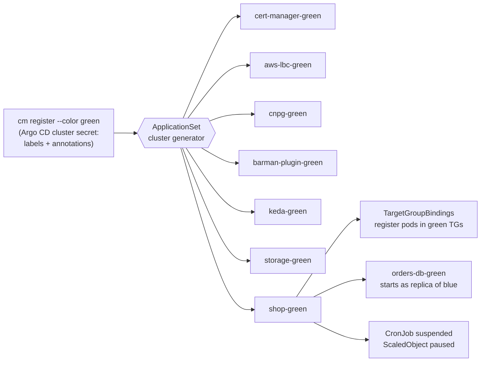

# 04 · GitOps (Argo CD): how a new cluster builds itself

The central trick of ClusterMotion is that **registering a cluster is the
only thing you do by hand**. `cm register --color green` creates one Argo CD
cluster secret on the management node. Every ApplicationSet selects clusters
by label, so Argo CD immediately generates and syncs all platform add-ons and
the shop onto the new cluster. What used to be weeks of "rebuild everything
on the new cluster" becomes a 10–15 minute wait.



## 4.1 Repository layout

```
gitops/
├── mgmt/                       # synced into the management cluster by the root app
│   ├── appsets/                # one ApplicationSet per add-on + the shop
│   └── workflows/              # Argo WorkflowTemplate + RBAC (chapter 05)
├── platform/
│   └── storage/gp3.yaml        # default StorageClass for EKS
└── charts/
    └── shop/                   # Helm chart for the whole application
```

> Replace `https://github.com/YOUR_GITHUB_USER/clustermotion.git` in
> `gitops/mgmt/appsets/*.yaml` and `infra/ansible/group_vars/all.yml` with
> your fork (`make set-repo REPO=https://github.com/<you>/clustermotion.git`).

## 4.2 Cluster secret: the contract between the engine and GitOps

`cm register` writes this (values shown for green):

```yaml
apiVersion: v1
kind: Secret
metadata:
  name: cluster-cm-green
  namespace: argocd
  labels:
    argocd.argoproj.io/secret-type: cluster
    clustermotion.io/workload: "true"     # selects every ApplicationSet below
    clustermotion.io/color: green
  annotations:
    clustermotion.io/cluster-name: cm-green
    clustermotion.io/db-primary: blue     # updated by `cm db switchover`
    clustermotion.io/tg-catalog: arn:aws:elasticloadbalancing:...:targetgroup/cm-catalog-green/...
    clustermotion.io/tg-orders:  arn:aws:elasticloadbalancing:...:targetgroup/cm-orders-green/...
    clustermotion.io/aws-region: us-east-1
    clustermotion.io/vpc-id: vpc-...
    # ...queue URL, WAL bucket, lease table, registry, ALB security group
stringData:
  name: cm-green
  server: https://XXXX.gr7.us-east-1.eks.amazonaws.com
  config: '{"awsAuthConfig":{"clusterName":"cm-green"},"tlsClientConfig":{"caData":"..."}}'
```

Argo CD authenticates to EKS with `awsAuthConfig`, using the management
node's instance role (granted cluster-admin by an EKS access entry in
Terraform). No kubeconfig or token is stored anywhere.

## 4.3 Platform ApplicationSets

Each add-on is one small ApplicationSet. Versions are pinned (checked in
September 2026). Sync retries with backoff handle ordering: the shop's
`TargetGroupBinding`, `ScaledObject` and CloudNativePG resources wait until
their CRDs exist.

**File:** `gitops/mgmt/appsets/platform-cert-manager.yaml`
```yaml
apiVersion: argoproj.io/v1alpha1
kind: ApplicationSet
metadata:
  name: cert-manager
  namespace: argocd
spec:
  goTemplate: true
  goTemplateOptions: ["missingkey=error"]
  generators:
    - clusters:
        selector:
          matchLabels:
            clustermotion.io/workload: "true"
  template:
    metadata:
      name: 'cert-manager-{{ index .metadata.labels "clustermotion.io/color" }}'
    spec:
      project: default
      source:
        repoURL: https://charts.jetstack.io
        chart: cert-manager
        targetRevision: v1.21.2
        helm:
          valuesObject:
            crds:
              enabled: true
      destination:
        server: '{{ .server }}'
        namespace: cert-manager
      syncPolicy:
        automated: {prune: true, selfHeal: true}
        syncOptions: [CreateNamespace=true, ServerSideApply=true]
        retry: {limit: 10, backoff: {duration: 15s, factor: 2, maxDuration: 5m}}
```

**File:** `gitops/mgmt/appsets/platform-aws-lbc.yaml`
```yaml
apiVersion: argoproj.io/v1alpha1
kind: ApplicationSet
metadata:
  name: aws-lbc
  namespace: argocd
spec:
  goTemplate: true
  goTemplateOptions: ["missingkey=error"]
  generators:
    - clusters:
        selector:
          matchLabels:
            clustermotion.io/workload: "true"
  template:
    metadata:
      name: 'aws-lbc-{{ index .metadata.labels "clustermotion.io/color" }}'
    spec:
      project: default
      source:
        repoURL: https://aws.github.io/eks-charts
        chart: aws-load-balancer-controller
        targetRevision: 3.5.0
        helm:
          valuesObject:
            clusterName: '{{ index .metadata.annotations "clustermotion.io/cluster-name" }}'
            region: '{{ index .metadata.annotations "clustermotion.io/aws-region" }}'
            vpcId: '{{ index .metadata.annotations "clustermotion.io/vpc-id" }}'
            serviceAccount:
              create: true
              name: aws-load-balancer-controller   # Pod Identity association (Terraform)
      destination:
        server: '{{ .server }}'
        namespace: kube-system
      syncPolicy:
        automated: {prune: true, selfHeal: true}
        syncOptions: [ServerSideApply=true]
        retry: {limit: 10, backoff: {duration: 15s, factor: 2, maxDuration: 5m}}
```

**File:** `gitops/mgmt/appsets/platform-cnpg.yaml`
```yaml
apiVersion: argoproj.io/v1alpha1
kind: ApplicationSet
metadata:
  name: cnpg
  namespace: argocd
spec:
  goTemplate: true
  goTemplateOptions: ["missingkey=error"]
  generators:
    - clusters:
        selector:
          matchLabels:
            clustermotion.io/workload: "true"
  template:
    metadata:
      name: 'cnpg-{{ index .metadata.labels "clustermotion.io/color" }}'
    spec:
      project: default
      source:
        repoURL: https://cloudnative-pg.github.io/charts
        chart: cloudnative-pg
        targetRevision: 0.29.0          # operator 1.30.0
      destination:
        server: '{{ .server }}'
        namespace: cnpg-system
      syncPolicy:
        automated: {prune: true, selfHeal: true}
        syncOptions: [CreateNamespace=true, ServerSideApply=true]
        retry: {limit: 10, backoff: {duration: 15s, factor: 2, maxDuration: 5m}}
```

**File:** `gitops/mgmt/appsets/platform-barman-plugin.yaml`
```yaml
# Barman Cloud plugin: WAL archiving + base backups to S3 for CloudNativePG.
# Must live in the operator's namespace and needs cert-manager.
apiVersion: argoproj.io/v1alpha1
kind: ApplicationSet
metadata:
  name: barman-plugin
  namespace: argocd
spec:
  goTemplate: true
  goTemplateOptions: ["missingkey=error"]
  generators:
    - clusters:
        selector:
          matchLabels:
            clustermotion.io/workload: "true"
  template:
    metadata:
      name: 'barman-plugin-{{ index .metadata.labels "clustermotion.io/color" }}'
    spec:
      project: default
      source:
        repoURL: https://cloudnative-pg.github.io/charts
        chart: plugin-barman-cloud
        targetRevision: 0.8.0           # plugin v0.15.0
      destination:
        server: '{{ .server }}'
        namespace: cnpg-system
      syncPolicy:
        automated: {prune: true, selfHeal: true}
        syncOptions: [CreateNamespace=true, ServerSideApply=true]
        retry: {limit: 10, backoff: {duration: 30s, factor: 2, maxDuration: 5m}}
```

**File:** `gitops/mgmt/appsets/platform-keda.yaml`
```yaml
apiVersion: argoproj.io/v1alpha1
kind: ApplicationSet
metadata:
  name: keda
  namespace: argocd
spec:
  goTemplate: true
  goTemplateOptions: ["missingkey=error"]
  generators:
    - clusters:
        selector:
          matchLabels:
            clustermotion.io/workload: "true"
  template:
    metadata:
      name: 'keda-{{ index .metadata.labels "clustermotion.io/color" }}'
    spec:
      project: default
      source:
        repoURL: https://kedacore.github.io/charts
        chart: keda
        targetRevision: 2.20.2
      destination:
        server: '{{ .server }}'
        namespace: keda
      syncPolicy:
        automated: {prune: true, selfHeal: true}
        syncOptions: [CreateNamespace=true, ServerSideApply=true]
        retry: {limit: 10, backoff: {duration: 15s, factor: 2, maxDuration: 5m}}
```

**File:** `gitops/mgmt/appsets/platform-storage.yaml`
```yaml
apiVersion: argoproj.io/v1alpha1
kind: ApplicationSet
metadata:
  name: storage
  namespace: argocd
spec:
  goTemplate: true
  goTemplateOptions: ["missingkey=error"]
  generators:
    - clusters:
        selector:
          matchLabels:
            clustermotion.io/workload: "true"
  template:
    metadata:
      name: 'storage-{{ index .metadata.labels "clustermotion.io/color" }}'
    spec:
      project: default
      source:
        repoURL: https://github.com/YOUR_GITHUB_USER/clustermotion.git
        targetRevision: main
        path: gitops/platform/storage
      destination:
        server: '{{ .server }}'
      syncPolicy:
        automated: {prune: true, selfHeal: true}
```

**File:** `gitops/platform/storage/gp3.yaml`
```yaml
# EKS clusters created on Kubernetes 1.30+ have no default StorageClass.
apiVersion: storage.k8s.io/v1
kind: StorageClass
metadata:
  name: gp3
  annotations:
    storageclass.kubernetes.io/is-default-class: "true"
provisioner: ebs.csi.aws.com
volumeBindingMode: WaitForFirstConsumer
allowVolumeExpansion: true
reclaimPolicy: Delete
parameters:
  type: gp3
  encrypted: "true"
```

## 4.4 The shop ApplicationSet

Two details make GitOps and the migration engine cooperate instead of
fighting:

1. **Values come from the cluster secret**: the colour, target group ARNs,
   queue URL, and which colour currently holds the database primary.
2. **`ignoreDifferences` + `RespectIgnoreDifferences=true`** for exactly the
   fields the engine owns at runtime:
   - `CronJob.spec.suspend` and the KEDA pause annotation (lease agent),
   - `Cluster.spec.replica` and `.spec.bootstrap` (database switchover).
   
   Without this, Argo CD self-heal would undo the migration within seconds.
   This is a great interview question: *"How do GitOps and runtime
   controllers share ownership of a resource?"*

**File:** `gitops/mgmt/appsets/shop.yaml`
```yaml
apiVersion: argoproj.io/v1alpha1
kind: ApplicationSet
metadata:
  name: shop
  namespace: argocd
spec:
  goTemplate: true
  goTemplateOptions: ["missingkey=error"]
  generators:
    - clusters:
        selector:
          matchLabels:
            clustermotion.io/workload: "true"
  template:
    metadata:
      name: 'shop-{{ index .metadata.labels "clustermotion.io/color" }}'
    spec:
      project: default
      source:
        repoURL: https://github.com/YOUR_GITHUB_USER/clustermotion.git
        targetRevision: main
        path: gitops/charts/shop
        helm:
          valueFiles:
            - values.yaml
            - 'values-{{ index .metadata.labels "clustermotion.io/color" }}.yaml'
          ignoreMissingValueFiles: true
          valuesObject:
            color: '{{ index .metadata.labels "clustermotion.io/color" }}'
            awsRegion: '{{ index .metadata.annotations "clustermotion.io/aws-region" }}'
            vpcCidr: '{{ index .metadata.annotations "clustermotion.io/vpc-cidr" }}'
            albSecurityGroupId: '{{ index .metadata.annotations "clustermotion.io/alb-sg" }}'
            queueUrl: '{{ index .metadata.annotations "clustermotion.io/queue-url" }}'
            leaseTable: '{{ index .metadata.annotations "clustermotion.io/lease-table" }}'
            image:
              registry: '{{ index .metadata.annotations "clustermotion.io/image-registry" }}'
            targetGroups:
              catalog: '{{ index .metadata.annotations "clustermotion.io/tg-catalog" }}'
              orders: '{{ index .metadata.annotations "clustermotion.io/tg-orders" }}'
            db:
              host: '{{ index .metadata.annotations "clustermotion.io/db-host" }}'
              primary: '{{ index .metadata.annotations "clustermotion.io/db-primary" }}'
              walBucket: '{{ index .metadata.annotations "clustermotion.io/wal-bucket" }}'
      destination:
        server: '{{ .server }}'
        namespace: shop
      ignoreDifferences:
        - group: batch
          kind: CronJob
          jsonPointers: [/spec/suspend]
        - group: keda.sh
          kind: ScaledObject
          jsonPointers: [/metadata/annotations/autoscaling.keda.sh~1paused-replicas]
        - group: postgresql.cnpg.io
          kind: Cluster
          jsonPointers: [/spec/replica, /spec/bootstrap]
      syncPolicy:
        automated: {prune: true, selfHeal: true}
        syncOptions:
          - CreateNamespace=true
          - RespectIgnoreDifferences=true
          - SkipDryRunOnMissingResource=true
        retry: {limit: 20, backoff: {duration: 20s, factor: 2, maxDuration: 5m}}
```

## 4.5 The shop Helm chart

**File:** `gitops/charts/shop/Chart.yaml`
```yaml
apiVersion: v2
name: shop
description: ClusterMotion demo workload - stateless, stateful, singleton and database
type: application
version: 0.1.0
appVersion: "0.1.0"
```

**File:** `gitops/charts/shop/values.yaml`
```yaml
# Values marked (injected) are set by the ApplicationSet from the cluster secret.
color: blue                     # (injected) blue | green
awsRegion: us-east-1            # (injected)
vpcCidr: 10.0.0.0/16            # (injected)
albSecurityGroupId: sg-REPLACE  # (injected)
queueUrl: https://sqs.us-east-1.amazonaws.com/111122223333/clustermotion-orders  # (injected)
leaseTable: clustermotion-leases  # (injected)

targetGroups:                   # (injected)
  catalog: arn:aws:elasticloadbalancing:REPLACE
  orders: arn:aws:elasticloadbalancing:REPLACE

image:
  registry: 111122223333.dkr.ecr.us-east-1.amazonaws.com  # (injected)
  tag: latest                   # bumped by CI to the git SHA
  pullPolicy: IfNotPresent

db:
  host: db.clustermotion.internal  # (injected) stable name, flipped at switchover
  name: shop
  primary: blue                 # (injected) colour holding the primary
  instances: 2
  storageSize: 5Gi
  walBucket: clustermotion-wal-REPLACE  # (injected)

catalog:
  replicas: 2
orders:
  replicas: 2
fulfillment:
  minReplicas: 1
  maxReplicas: 3
  queueLength: "20"
sweeper:
  schedule: "*/2 * * * *"

# Fault injection for the failure tests (set in values-<colour>.yaml)
faults:
  catalogErrorRate: "0"
  catalogPriceBug: "false"
```

**File:** `gitops/charts/shop/values-blue.yaml`
```yaml
# Per-colour overrides for blue. Empty on purpose.
{}
```

**File:** `gitops/charts/shop/values-green.yaml`
```yaml
# Per-colour overrides for green. The failure tests (docs/07-testing.md)
# temporarily uncomment one of these, push, and watch ClusterMotion react.
faults:
  catalogErrorRate: "0"        # test F1: "0.2" -> the SLO gate must roll back
  catalogPriceBug: "false"     # test F2: "true" -> shadow replay must block
```

**File:** `gitops/charts/shop/templates/_helpers.tpl`
```yaml
{{- define "shop.labels" -}}
app.kubernetes.io/part-of: shop
app.kubernetes.io/managed-by: {{ .Release.Service }}
clustermotion.io/color: {{ .Values.color }}
{{- end }}

{{- define "shop.image" -}}
{{ .root.Values.image.registry }}/clustermotion/{{ .name }}:{{ .root.Values.image.tag }}
{{- end }}

{{- define "shop.otherColor" -}}
{{- if eq .Values.color "blue" }}green{{ else }}blue{{ end -}}
{{- end }}

{{- define "shop.awsEnv" -}}
- name: AWS_REGION
  value: {{ .Values.awsRegion | quote }}
- name: CLUSTER_NAME
  value: {{ .Values.color | quote }}
{{- end }}

{{- define "shop.dbEnv" -}}
- name: DB_HOST
  value: {{ .Values.db.host | quote }}
- name: DB_NAME
  value: {{ .Values.db.name | quote }}
- name: DB_USER
  valueFrom:
    secretKeyRef: {name: orders-db-credentials, key: username}
- name: DB_PASSWORD
  valueFrom:
    secretKeyRef: {name: orders-db-credentials, key: password}
{{- end }}
```

**File:** `gitops/charts/shop/templates/serviceaccounts.yaml`
```yaml
# Names must match the Pod Identity associations in infra/terraform/cluster/pod_identity.tf
{{- range $sa := list "orders" "order-sweeper" "fulfillment-worker" "lease-agent" }}
apiVersion: v1
kind: ServiceAccount
metadata:
  name: {{ $sa }}
  labels:
    {{- include "shop.labels" $ | nindent 4 }}
---
{{- end }}
```

**File:** `gitops/charts/shop/templates/catalog.yaml`
```yaml
apiVersion: apps/v1
kind: Deployment
metadata:
  name: catalog
  labels:
    {{- include "shop.labels" . | nindent 4 }}
spec:
  replicas: {{ .Values.catalog.replicas }}
  selector:
    matchLabels: {app: catalog}
  template:
    metadata:
      labels:
        app: catalog
        {{- include "shop.labels" . | nindent 8 }}
    spec:
      containers:
        - name: catalog
          image: {{ include "shop.image" (dict "root" . "name" "catalog") }}
          imagePullPolicy: {{ .Values.image.pullPolicy }}
          ports: [{containerPort: 8000, name: http}]
          env:
            {{- include "shop.awsEnv" . | nindent 12 }}
            - {name: FAULT_ERROR_RATE, value: {{ .Values.faults.catalogErrorRate | quote }}}
            - {name: FAULT_PRICE_BUG, value: {{ .Values.faults.catalogPriceBug | quote }}}
          readinessProbe:
            httpGet: {path: /api/catalog/healthz, port: http}
            periodSeconds: 5
          livenessProbe:
            httpGet: {path: /api/catalog/healthz, port: http}
            periodSeconds: 10
          resources:
            requests: {cpu: 50m, memory: 96Mi}
            limits: {memory: 256Mi}
---
apiVersion: v1
kind: Service
metadata:
  name: catalog
  labels:
    {{- include "shop.labels" . | nindent 4 }}
spec:
  selector: {app: catalog}
  ports: [{port: 80, targetPort: http, name: http}]
---
apiVersion: elbv2.k8s.aws/v1beta1
kind: TargetGroupBinding
metadata:
  name: catalog
  labels:
    {{- include "shop.labels" . | nindent 4 }}
spec:
  serviceRef: {name: catalog, port: 80}
  targetGroupARN: {{ .Values.targetGroups.catalog }}
  targetType: ip
  networking:
    ingress:
      - from:
          - securityGroup: {groupID: {{ .Values.albSecurityGroupId }}}
        ports:
          - {port: 8000, protocol: TCP}
---
apiVersion: policy/v1
kind: PodDisruptionBudget
metadata:
  name: catalog
spec:
  minAvailable: 1
  selector:
    matchLabels: {app: catalog}
```

**File:** `gitops/charts/shop/templates/orders.yaml`
```yaml
apiVersion: apps/v1
kind: Deployment
metadata:
  name: orders
  labels:
    {{- include "shop.labels" . | nindent 4 }}
spec:
  replicas: {{ .Values.orders.replicas }}
  selector:
    matchLabels: {app: orders}
  template:
    metadata:
      labels:
        app: orders
        {{- include "shop.labels" . | nindent 8 }}
    spec:
      serviceAccountName: orders
      containers:
        - name: orders
          image: {{ include "shop.image" (dict "root" . "name" "orders") }}
          imagePullPolicy: {{ .Values.image.pullPolicy }}
          ports: [{containerPort: 8000, name: http}]
          env:
            {{- include "shop.awsEnv" . | nindent 12 }}
            {{- include "shop.dbEnv" . | nindent 12 }}
            - {name: QUEUE_URL, value: {{ .Values.queueUrl | quote }}}
          readinessProbe:
            httpGet: {path: /api/orders/healthz, port: http}
            periodSeconds: 5
          livenessProbe:
            httpGet: {path: /api/orders/healthz, port: http}
            periodSeconds: 10
          resources:
            requests: {cpu: 100m, memory: 128Mi}
            limits: {memory: 384Mi}
---
apiVersion: v1
kind: Service
metadata:
  name: orders
  labels:
    {{- include "shop.labels" . | nindent 4 }}
spec:
  selector: {app: orders}
  ports: [{port: 80, targetPort: http, name: http}]
---
apiVersion: elbv2.k8s.aws/v1beta1
kind: TargetGroupBinding
metadata:
  name: orders
  labels:
    {{- include "shop.labels" . | nindent 4 }}
spec:
  serviceRef: {name: orders, port: 80}
  targetGroupARN: {{ .Values.targetGroups.orders }}
  targetType: ip
  networking:
    ingress:
      - from:
          - securityGroup: {groupID: {{ .Values.albSecurityGroupId }}}
        ports:
          - {port: 8000, protocol: TCP}
---
apiVersion: policy/v1
kind: PodDisruptionBudget
metadata:
  name: orders
spec:
  minAvailable: 1
  selector:
    matchLabels: {app: orders}
```

**File:** `gitops/charts/shop/templates/fulfillment.yaml`
```yaml
# Singleton consumer. Created PAUSED at 0 replicas in every cluster;
# the lease agent un-pauses it only in the cluster holding the lease.
apiVersion: apps/v1
kind: Deployment
metadata:
  name: fulfillment-worker
  labels:
    {{- include "shop.labels" . | nindent 4 }}
spec:
  selector:
    matchLabels: {app: fulfillment-worker}
  template:
    metadata:
      labels:
        app: fulfillment-worker
        {{- include "shop.labels" . | nindent 8 }}
    spec:
      serviceAccountName: fulfillment-worker
      terminationGracePeriodSeconds: 60   # finish in-flight messages on SIGTERM
      containers:
        - name: worker
          image: {{ include "shop.image" (dict "root" . "name" "fulfillment") }}
          imagePullPolicy: {{ .Values.image.pullPolicy }}
          env:
            {{- include "shop.awsEnv" . | nindent 12 }}
            {{- include "shop.dbEnv" . | nindent 12 }}
            - {name: QUEUE_URL, value: {{ .Values.queueUrl | quote }}}
            - {name: LEASE_TABLE, value: {{ .Values.leaseTable | quote }}}
          resources:
            requests: {cpu: 50m, memory: 96Mi}
            limits: {memory: 256Mi}
---
apiVersion: keda.sh/v1alpha1
kind: TriggerAuthentication
metadata:
  name: keda-aws
spec:
  podIdentity:
    provider: aws          # KEDA operator's own Pod Identity (keda/keda-operator)
---
apiVersion: keda.sh/v1alpha1
kind: ScaledObject
metadata:
  name: fulfillment-worker
  labels:
    clustermotion.io/class: singleton
    {{- include "shop.labels" . | nindent 4 }}
  annotations:
    autoscaling.keda.sh/paused-replicas: "0"
spec:
  scaleTargetRef:
    name: fulfillment-worker
  minReplicaCount: {{ .Values.fulfillment.minReplicas }}
  maxReplicaCount: {{ .Values.fulfillment.maxReplicas }}
  cooldownPeriod: 60
  triggers:
    - type: aws-sqs-queue
      authenticationRef: {name: keda-aws}
      metadata:
        queueURL: {{ .Values.queueUrl | quote }}
        queueLength: {{ .Values.fulfillment.queueLength | quote }}
        awsRegion: {{ .Values.awsRegion | quote }}
```

**File:** `gitops/charts/shop/templates/sweeper.yaml`
```yaml
# Singleton CronJob. Created SUSPENDED in every cluster; the lease agent
# un-suspends it only in the cluster holding the lease.
apiVersion: batch/v1
kind: CronJob
metadata:
  name: order-sweeper
  labels:
    clustermotion.io/class: singleton
    {{- include "shop.labels" . | nindent 4 }}
spec:
  schedule: {{ .Values.sweeper.schedule | quote }}
  suspend: true
  concurrencyPolicy: Forbid
  startingDeadlineSeconds: 90       # a slot missed during handoff still runs (idempotent claim)
  successfulJobsHistoryLimit: 3
  failedJobsHistoryLimit: 3
  jobTemplate:
    metadata:
      labels:
        clustermotion.io/class: singleton
        app: order-sweeper
    spec:
      backoffLimit: 1
      activeDeadlineSeconds: 100
      template:
        metadata:
          labels: {app: order-sweeper}
        spec:
          serviceAccountName: order-sweeper
          restartPolicy: Never
          containers:
            - name: sweeper
              image: {{ include "shop.image" (dict "root" . "name" "orders") }}
              imagePullPolicy: {{ .Values.image.pullPolicy }}
              command: [python, -m, app.sweeper]
              env:
                {{- include "shop.awsEnv" . | nindent 16 }}
                {{- include "shop.dbEnv" . | nindent 16 }}
                - {name: QUEUE_URL, value: {{ .Values.queueUrl | quote }}}
                - {name: LEASE_TABLE, value: {{ .Values.leaseTable | quote }}}
              resources:
                requests: {cpu: 20m, memory: 64Mi}
                limits: {memory: 192Mi}
```

**File:** `gitops/charts/shop/templates/lease-agent.yaml`
```yaml
# One agent per cluster. Recreate strategy: never two agents in one cluster.
apiVersion: apps/v1
kind: Deployment
metadata:
  name: lease-agent
  labels:
    app.kubernetes.io/part-of: clustermotion
    clustermotion.io/color: {{ .Values.color }}
spec:
  replicas: 1
  strategy: {type: Recreate}
  selector:
    matchLabels: {app: lease-agent}
  template:
    metadata:
      labels:
        app: lease-agent
        app.kubernetes.io/part-of: clustermotion
    spec:
      serviceAccountName: lease-agent
      containers:
        - name: agent
          image: {{ include "shop.image" (dict "root" . "name" "engine") }}
          imagePullPolicy: {{ .Values.image.pullPolicy }}
          args: [lease, agent]
          env:
            {{- include "shop.awsEnv" . | nindent 12 }}
            - {name: LEASE_TABLE, value: {{ .Values.leaseTable | quote }}}
            - {name: WATCH_NAMESPACE, value: {{ .Release.Namespace | quote }}}
          resources:
            requests: {cpu: 20m, memory: 96Mi}
            limits: {memory: 256Mi}
---
apiVersion: rbac.authorization.k8s.io/v1
kind: Role
metadata:
  name: lease-agent
rules:
  - apiGroups: [batch]
    resources: [cronjobs]
    verbs: [get, list, patch]
  - apiGroups: [batch]
    resources: [jobs]
    verbs: [get, list]
  - apiGroups: [keda.sh]
    resources: [scaledobjects]
    verbs: [get, list, patch]
  - apiGroups: [apps]
    resources: [deployments]
    verbs: [get]
  - apiGroups: [""]
    resources: [pods]
    verbs: [list]
---
apiVersion: rbac.authorization.k8s.io/v1
kind: RoleBinding
metadata:
  name: lease-agent
roleRef: {apiGroup: rbac.authorization.k8s.io, kind: Role, name: lease-agent}
subjects: [{kind: ServiceAccount, name: lease-agent}]
```

### The database: CloudNativePG in a distributed topology

The same template renders **both** roles:

| | cluster that is the primary (`color == db.primary`) | the other cluster |
|---|---|---|
| `bootstrap` | `initdb` (new, empty database) | `recovery` from the primary's base backup in S3 |
| `replica.primary` | itself | the primary |
| `replica.source` | the other colour (used after a switchback) | the primary |
| WAL archive | `s3://<wal-bucket>/orders-db-<colour>/` | same layout, its own folder |
| `ScheduledBackup` | yes (immediate + daily) | no |

**File:** `gitops/charts/shop/templates/database.yaml`
```yaml
{{- $self := printf "orders-db-%s" .Values.color }}
{{- $primary := printf "orders-db-%s" .Values.db.primary }}
{{- $other := printf "orders-db-%s" (include "shop.otherColor" .) }}
{{- $isPrimary := eq .Values.color .Values.db.primary }}
apiVersion: barmancloud.cnpg.io/v1
kind: ObjectStore
metadata:
  name: wal-store
spec:
  retentionPolicy: "7d"
  configuration:
    destinationPath: s3://{{ .Values.db.walBucket }}/
    s3Credentials:
      inheritFromIAMRole: true      # Pod Identity on service account {{ $self }}
    wal:
      compression: gzip
    data:
      compression: gzip
---
apiVersion: postgresql.cnpg.io/v1
kind: Cluster
metadata:
  name: {{ $self }}
  labels:
    {{- include "shop.labels" . | nindent 4 }}
spec:
  instances: {{ .Values.db.instances }}
  storage:
    size: {{ .Values.db.storageSize }}
    storageClass: gp3
  postgresql:
    parameters:
      archive_timeout: "60s"        # bounds replica lag when writes are idle
  bootstrap:
  {{- if $isPrimary }}
    initdb:
      database: {{ .Values.db.name }}
      owner: shop
      secret: {name: orders-db-credentials}
  {{- else }}
    recovery:
      source: {{ $primary }}
  {{- end }}
  replica:
    primary: {{ $primary }}
    source: {{ if $isPrimary }}{{ $other }}{{ else }}{{ $primary }}{{ end }}
  plugins:
    - name: barman-cloud.cloudnative-pg.io
      isWALArchiver: true
      parameters:
        barmanObjectName: wal-store
        serverName: {{ $self }}
  externalClusters:
  {{- range $c := list "blue" "green" }}
    - name: orders-db-{{ $c }}
      plugin:
        name: barman-cloud.cloudnative-pg.io
        parameters:
          barmanObjectName: wal-store
          serverName: orders-db-{{ $c }}
  {{- end }}
  managed:
    services:
      additional:
        - selectorType: rw
          serviceTemplate:
            metadata:
              name: orders-db-lb
              annotations:
                service.beta.kubernetes.io/aws-load-balancer-type: external
                service.beta.kubernetes.io/aws-load-balancer-nlb-target-type: ip
                service.beta.kubernetes.io/aws-load-balancer-scheme: internal
            spec:
              type: LoadBalancer
              loadBalancerSourceRanges: [{{ .Values.vpcCidr | quote }}]
{{- if $isPrimary }}
---
apiVersion: postgresql.cnpg.io/v1
kind: ScheduledBackup
metadata:
  name: {{ $self }}-daily
spec:
  schedule: "0 0 3 * * *"           # six fields: CloudNativePG cron includes seconds
  immediate: true                   # first base backup right away: green bootstraps from it
  backupOwnerReference: self
  cluster:
    name: {{ $self }}
  method: plugin
  pluginConfiguration:
    name: barman-cloud.cloudnative-pg.io
{{- end }}
```

## 4.6 Render and check the chart locally

```bash
helm lint gitops/charts/shop
helm template shop gitops/charts/shop -n shop --set color=green --set db.primary=blue \
  > /tmp/shop-green.yaml
cm plan --manifests /tmp/shop-green.yaml     # the planner works on rendered manifests too
```

Next: [05 · Migration engine](05-migration-engine.md)
