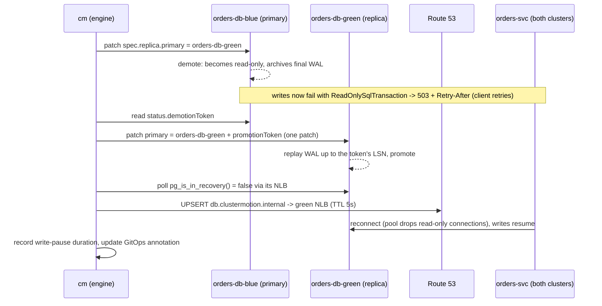
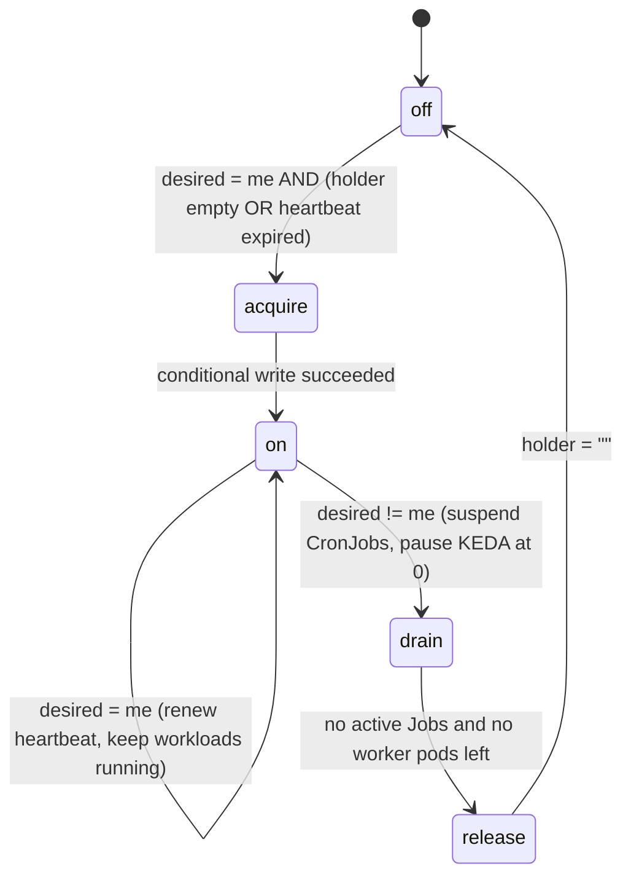

# 05 · The migration engine (`cm`)

The engine is a Python CLI named `cm`. It holds **all** migration logic.
Argo Workflows (section 5.12) only calls `cm` sub-commands in order, so every
step can also be run by hand from the management node while you learn,
debug or demo.

```
cm plan        classify every workload into a migration strategy
cm register    add a cluster to Argo CD (+ namespace and DB credentials)
cm wait-synced wait until Argo CD reports every app of a cluster Synced/Healthy
cm preflight   verify the starting state is safe to migrate
cm smoke       call a cluster directly (header routing) before it gets traffic
cm shadow      replay real GET traffic from ALB logs, diff blue vs green
cm traffic     status | set | shift   (progressive, SLO-gated, auto-rollback)
cm db          status | point | switchover   (zero-data-loss primary move)
cm lease       status | init | handoff | agent   (singleton ownership)
cm verify      reconciliation: lost / duplicated / double-processed work
cm report      render the run timeline as Markdown
cm migrate     run every step above in order (manual mode)
```

## 5.1 Package layout

```
engine/
├── pyproject.toml
├── Dockerfile
├── config.example.json
├── clustermotion/
│   ├── __init__.py
│   ├── config.py      # engine configuration (from Terraform output)
│   ├── kube.py        # Kubernetes clients for blue/green (EKS) and mgmt (k3s)
│   ├── events.py      # run timeline (DynamoDB) + Markdown report
│   ├── planner.py     # workload classification
│   ├── checks.py      # register, wait-synced, preflight, smoke
│   ├── shadow.py      # ALB-log replay + Diffy-style comparison
│   ├── traffic.py     # ALB weighted target groups + CloudWatch SLO gates
│   ├── database.py    # CloudNativePG switchover + Route 53 flip
│   ├── lease.py       # lease table, decision function, in-cluster agent
│   ├── verify.py      # reconciliation queries
│   └── cli.py         # argparse entrypoint
└── tests/             # pure-function unit tests (no AWS needed)
```

**File:** `engine/pyproject.toml`
```toml
[build-system]
requires = ["setuptools>=69"]
build-backend = "setuptools.build_meta"

[project]
name = "clustermotion"
version = "0.1.0"
description = "Live migration of stateful Kubernetes platforms between EKS clusters"
requires-python = ">=3.11"
dependencies = [
  "boto3>=1.34",
  "kubernetes>=30",
  "PyYAML>=6",
  "psycopg[binary]>=3.2",
  "requests>=2.31",
]

[project.optional-dependencies]
test = ["pytest>=8"]

[project.scripts]
cm = "clustermotion.cli:main"

[tool.setuptools.packages.find]
include = ["clustermotion*"]

[tool.pytest.ini_options]
testpaths = ["tests"]
```

**File:** `engine/Dockerfile`
```dockerfile
FROM python:3.13-slim
ENV PYTHONDONTWRITEBYTECODE=1 PYTHONUNBUFFERED=1
WORKDIR /opt/engine
COPY pyproject.toml ./
COPY clustermotion ./clustermotion
RUN pip install --no-cache-dir . && useradd --uid 10001 --no-create-home cm
USER 10001
ENTRYPOINT ["cm"]
```

## 5.2 Configuration

Terraform produces the configuration (`terraform output -json engine_config`,
see chapter 03). Nothing in the engine is hard-coded to an account.

**File:** `engine/config.example.json`
```json
{
  "project": "clustermotion",
  "region": "us-east-1",
  "clusters": { "blue": "cm-blue", "green": "cm-green" },
  "workload_namespace": "shop",
  "alb": {
    "dns_name": "clustermotion-123456789.us-east-1.elb.amazonaws.com",
    "arn_suffix": "app/clustermotion/0123456789abcdef",
    "logs_bucket": "clustermotion-alb-logs-111122223333",
    "logs_prefix": "alb",
    "security_group_id": "sg-0123456789abcdef0"
  },
  "services": {
    "catalog": {
      "rule_arn": "arn:aws:elasticloadbalancing:us-east-1:111122223333:listener-rule/app/clustermotion/0123/4567/89ab",
      "health_path": "/api/catalog/healthz",
      "smoke_paths": ["/api/catalog/products", "/api/catalog/products/sku-100"],
      "shadow_prefixes": ["/api/catalog/"],
      "target_groups": {
        "blue":  { "arn": "arn:aws:elasticloadbalancing:us-east-1:111122223333:targetgroup/cm-catalog-blue/aaaa",  "arn_suffix": "targetgroup/cm-catalog-blue/aaaa" },
        "green": { "arn": "arn:aws:elasticloadbalancing:us-east-1:111122223333:targetgroup/cm-catalog-green/bbbb", "arn_suffix": "targetgroup/cm-catalog-green/bbbb" }
      }
    },
    "orders": {
      "rule_arn": "arn:aws:elasticloadbalancing:us-east-1:111122223333:listener-rule/app/clustermotion/0123/4567/cdef",
      "health_path": "/api/orders/healthz",
      "smoke_paths": ["/api/orders/readyz"],
      "shadow_prefixes": ["/api/orders/"],
      "target_groups": {
        "blue":  { "arn": "arn:aws:elasticloadbalancing:us-east-1:111122223333:targetgroup/cm-orders-blue/cccc",  "arn_suffix": "targetgroup/cm-orders-blue/cccc" },
        "green": { "arn": "arn:aws:elasticloadbalancing:us-east-1:111122223333:targetgroup/cm-orders-green/dddd", "arn_suffix": "targetgroup/cm-orders-green/dddd" }
      }
    }
  },
  "shift_order": ["catalog", "orders"],
  "lease": { "table": "clustermotion-leases", "lease_id": "singletons", "ttl_seconds": 30 },
  "runs_table": "clustermotion-runs",
  "artifacts_bucket": "clustermotion-artifacts-111122223333",
  "db": {
    "zone_id": "Z0123456789ABCDEFGHIJ",
    "record": "db.clustermotion.internal",
    "namespace": "shop",
    "cluster_prefix": "orders-db",
    "lb_service": "orders-db-lb",
    "secret_id": "clustermotion/orders-db",
    "name": "shop"
  },
  "gitops": {
    "argocd_namespace": "argocd",
    "cluster_annotations": {
      "clustermotion.io/aws-region": "us-east-1",
      "clustermotion.io/vpc-id": "vpc-0123456789abcdef0",
      "clustermotion.io/vpc-cidr": "10.0.0.0/16",
      "clustermotion.io/image-registry": "111122223333.dkr.ecr.us-east-1.amazonaws.com",
      "clustermotion.io/queue-url": "https://sqs.us-east-1.amazonaws.com/111122223333/clustermotion-orders",
      "clustermotion.io/wal-bucket": "clustermotion-wal-111122223333",
      "clustermotion.io/lease-table": "clustermotion-leases",
      "clustermotion.io/db-host": "db.clustermotion.internal",
      "clustermotion.io/alb-sg": "sg-0123456789abcdef0"
    }
  },
  "slo": { "max_5xx_ratio": 0.01, "max_p95_ratio": 1.5, "min_p95_seconds": 0.3, "min_requests": 20 }
}
```

**File:** `engine/clustermotion/__init__.py`
```python
"""ClusterMotion: live migration of stateful Kubernetes platforms between clusters."""
__version__ = "0.1.0"
```

**File:** `engine/clustermotion/config.py`
```python
"""Engine configuration. Produced by `terraform output -json engine_config`."""
from __future__ import annotations

import json
import os
from pathlib import Path

COLORS = ("blue", "green")


def other(color: str) -> str:
    if color not in COLORS:
        raise ValueError(f"unknown colour {color!r}; expected one of {COLORS}")
    return "green" if color == "blue" else "blue"


def load(path: str | None = None) -> dict:
    path = path or os.getenv("CM_CONFIG", "/etc/clustermotion/config.json")
    try:
        return json.loads(Path(path).read_text())
    except FileNotFoundError:
        raise SystemExit(f"config not found at {path}; run `make engine-config` or set CM_CONFIG")
```

## 5.3 Kubernetes access

The engine talks to three clusters: the two EKS workload clusters and the
k3s management cluster (where Argo CD lives). EKS tokens are generated the
same way `aws eks get-token` does it (a pre-signed STS URL). They expire after
15 minutes, so clients are rebuilt every 10 minutes during long steps.

**File:** `engine/clustermotion/kube.py`
```python
"""Kubernetes API clients for blue/green (EKS) and the management cluster."""
from __future__ import annotations

import base64
import os
import tempfile
import time

import boto3
from botocore.signers import RequestSigner
from kubernetes import client
from kubernetes import config as kconfig


def eks_token(cluster_name: str, region: str) -> str:
    session = boto3.session.Session(region_name=region)
    sts = session.client("sts")
    signer = RequestSigner(
        sts.meta.service_model.service_id, region, "sts", "v4",
        session.get_credentials(), session.events,
    )
    url = signer.generate_presigned_url(
        {
            "method": "GET",
            "url": f"https://sts.{region}.amazonaws.com/?Action=GetCallerIdentity&Version=2011-06-15",
            "body": {},
            "headers": {"x-k8s-aws-id": cluster_name},
            "context": {},
        },
        region_name=region, expires_in=60, operation_name="",
    )
    return "k8s-aws-v1." + base64.urlsafe_b64encode(url.encode()).decode().rstrip("=")


def eks_api_client(cluster_name: str, region: str) -> client.ApiClient:
    info = boto3.client("eks", region_name=region).describe_cluster(name=cluster_name)["cluster"]
    ca = tempfile.NamedTemporaryFile(delete=False, suffix=".crt")
    ca.write(base64.b64decode(info["certificateAuthority"]["data"]))
    ca.close()
    cfg = client.Configuration()
    cfg.host = info["endpoint"]
    cfg.ssl_ca_cert = ca.name
    cfg.api_key = {"authorization": "Bearer " + eks_token(cluster_name, region)}
    return client.ApiClient(cfg)


def mgmt_api_client() -> client.ApiClient:
    """In an Argo Workflows pod: in-cluster config. On the mgmt host: kubeconfig."""
    if os.getenv("KUBERNETES_SERVICE_HOST") and not os.getenv("CM_MGMT_CONTEXT"):
        kconfig.load_incluster_config()
        return client.ApiClient()
    return kconfig.new_client_from_config(context=os.getenv("CM_MGMT_CONTEXT", "cm-mgmt"))


class KubeClients:
    """Per-colour API clients with token refresh."""

    TTL_SECONDS = 600

    def __init__(self, cfg: dict):
        self.cfg = cfg
        self._cache: dict[str, tuple[float, client.ApiClient]] = {}

    def api(self, color: str) -> client.ApiClient:
        cached = self._cache.get(color)
        if cached and time.time() - cached[0] < self.TTL_SECONDS:
            return cached[1]
        api = mgmt_api_client() if color == "mgmt" else eks_api_client(
            self.cfg["clusters"][color], self.cfg["region"])
        self._cache[color] = (time.time(), api)
        return api

    def core(self, color: str) -> client.CoreV1Api:
        return client.CoreV1Api(self.api(color))

    def apps(self, color: str) -> client.AppsV1Api:
        return client.AppsV1Api(self.api(color))

    def batch(self, color: str) -> client.BatchV1Api:
        return client.BatchV1Api(self.api(color))

    def custom(self, color: str) -> client.CustomObjectsApi:
        return client.CustomObjectsApi(self.api(color))

    def version(self, color: str) -> str:
        return client.VersionApi(self.api(color)).get_code().git_version


def wait_for(predicate, timeout: float, interval: float = 5.0, desc: str = "condition"):
    """Poll predicate() until it returns a truthy value; return that value."""
    deadline = time.time() + timeout
    while True:
        value = predicate()
        if value:
            return value
        if time.time() > deadline:
            raise TimeoutError(f"timed out after {timeout:.0f}s waiting for {desc}")
        time.sleep(interval)
```

## 5.4 Run timeline and report

Every step emits structured events. They go to stdout (visible in the Argo UI)
and to a DynamoDB table, so `cm report` can build one timeline from many
workflow pods.

**File:** `engine/clustermotion/events.py`
```python
"""Run timeline: structured events + Markdown report."""
from __future__ import annotations

import datetime as dt
import json
import os
import time

import boto3


class Recorder:
    def __init__(self, cfg: dict, run_id: str | None = None):
        self.run_id = run_id or os.getenv("CM_RUN_ID") or time.strftime("manual-%Y%m%d-%H%M%S")
        self.table = cfg.get("runs_table")
        self._ddb = boto3.client("dynamodb", region_name=cfg["region"]) if self.table else None

    def emit(self, step: str, status: str, **data) -> None:
        ts = time.time()
        print(json.dumps({"run_id": self.run_id, "ts": round(ts, 3), "step": step,
                          "status": status, **data}, default=str), flush=True)
        if not self._ddb:
            return
        try:
            self._ddb.put_item(TableName=self.table, Item={
                "run_id": {"S": self.run_id},
                "ts": {"N": f"{ts:.6f}"},
                "step": {"S": step},
                "status": {"S": status},
                "data": {"S": json.dumps(data, default=str)},
            })
        except Exception as exc:  # never fail a migration because of telemetry
            print(f"warning: could not record event: {exc}", flush=True)

    def events(self) -> list[dict]:
        if not self._ddb:
            return []
        out, kwargs = [], {
            "TableName": self.table,
            "KeyConditionExpression": "run_id = :r",
            "ExpressionAttributeValues": {":r": {"S": self.run_id}},
        }
        while True:
            page = self._ddb.query(**kwargs)
            for item in page["Items"]:
                out.append({
                    "ts": float(item["ts"]["N"]),
                    "step": item["step"]["S"],
                    "status": item["status"]["S"],
                    "data": json.loads(item["data"]["S"]),
                })
            if "LastEvaluatedKey" not in page:
                return sorted(out, key=lambda e: e["ts"])
            kwargs["ExclusiveStartKey"] = page["LastEvaluatedKey"]


def render_markdown(run_id: str, events: list[dict], final_status: str = "") -> str:
    if not events:
        return f"# ClusterMotion run `{run_id}`\n\nNo events recorded.\n"
    start = events[0]["ts"]
    lines = [
        f"# ClusterMotion run `{run_id}`",
        "",
        f"- Started: {dt.datetime.fromtimestamp(start, dt.timezone.utc):%Y-%m-%d %H:%M:%S} UTC",
        f"- Duration: {(events[-1]['ts'] - start) / 60:.1f} min",
        f"- Final status: **{final_status or events[-1]['status']}**",
        "",
        "| t+ (s) | step | status | details |",
        "|---:|---|---|---|",
    ]
    for e in events:
        details = ", ".join(f"{k}={v}" for k, v in e["data"].items())
        lines.append(f"| {e['ts'] - start:.0f} | {e['step']} | {e['status']} | {details[:160]} |")
    return "\n".join(lines) + "\n"
```

## 5.5 The planner

The planner answers AWS's "no magic formula" problem for stateful workloads:
it inspects every object and **decides how it must move**. It reads either the
live cluster or rendered manifests (`helm template ...`), so you can run it in
CI too.

| Strategy | Chosen when | Downtime |
|---|---|---|
| `platform` | CRDs / controllers (installed by GitOps first) | none |
| `redeploy` | Stateless Deployment without inbound traffic | none |
| `traffic-shift` | Deployment behind a ClusterMotion `TargetGroupBinding` | none |
| `db-switchover` | CloudNativePG `Cluster` | seconds of write pause (measured) |
| `lease-handoff` | CronJobs, and anything labelled `clustermotion.io/class=singleton` | none (work is delayed by the drain time) |
| `snapshot-restore` | Anything with a PVC and no replication story | estimated, **needs approval** |
| `skip` | ClusterMotion's own components | n/a |

**File:** `engine/clustermotion/planner.py`
```python
"""Migration planner: classify every workload into a migration strategy."""
from __future__ import annotations

import json
import re
from dataclasses import asdict, dataclass
from pathlib import Path

import yaml

SINGLETON = ("clustermotion.io/class", "singleton")
PART_OF = ("app.kubernetes.io/part-of", "clustermotion")
ORDER = {"platform": 0, "redeploy": 1, "traffic-shift": 2, "db-switchover": 3,
         "lease-handoff": 4, "snapshot-restore": 5, "skip": 9}
PLATFORM_NAMESPACES = {"kube-system", "cert-manager", "cnpg-system", "keda"}
CUSTOM_KINDS = [  # (group, version, plural, kind)
    ("elbv2.k8s.aws", "v1beta1", "targetgroupbindings", "TargetGroupBinding"),
    ("keda.sh", "v1alpha1", "scaledobjects", "ScaledObject"),
    ("postgresql.cnpg.io", "v1", "clusters", "Cluster"),
]


@dataclass
class PlanItem:
    kind: str
    namespace: str
    name: str
    strategy: str
    reason: str
    est_downtime_s: int = 0
    needs_approval: bool = False


def _labels(obj: dict) -> dict:
    return obj.get("metadata", {}).get("labels") or {}


def _has(labels: dict, pair: tuple[str, str]) -> bool:
    return labels.get(pair[0]) == pair[1]


def _gib(quantity: str | None) -> float:
    if not quantity:
        return 10.0  # unknown size: assume 10 GiB
    m = re.fullmatch(r"(\d+(?:\.\d+)?)(Ki|Mi|Gi|Ti)?", str(quantity))
    if not m:
        return 10.0
    factor = {"Ki": 1 / 1024**2, "Mi": 1 / 1024, "Gi": 1, "Ti": 1024, None: 1 / 1024**3}[m.group(2)]
    return float(m.group(1)) * factor


def _selector_matches(selector: dict, labels: dict) -> bool:
    return bool(selector) and all(labels.get(k) == v for k, v in selector.items())


def classify(objects: list[dict]) -> list[PlanItem]:
    def key(o):
        return o.get("metadata", {}).get("namespace", "default"), o["metadata"]["name"]

    services = {key(o): o for o in objects if o.get("kind") == "Service"}
    pvcs = {key(o): o for o in objects if o.get("kind") == "PersistentVolumeClaim"}
    bound_services = {(key(o)[0], o["spec"]["serviceRef"]["name"])
                      for o in objects if o.get("kind") == "TargetGroupBinding"}
    scaled = {(key(o)[0], o["spec"]["scaleTargetRef"]["name"]): o
              for o in objects if o.get("kind") == "ScaledObject"}

    items: list[PlanItem] = []
    for obj in objects:
        kind = obj.get("kind", "")
        ns, name = key(obj) if "metadata" in obj else ("", "")
        labels = _labels(obj)
        api = obj.get("apiVersion", "")

        if _has(labels, PART_OF):
            items.append(PlanItem(kind, ns, name, "skip", "ClusterMotion component"))
        elif kind == "CustomResourceDefinition" or (ns in PLATFORM_NAMESPACES and kind in ("Deployment", "DaemonSet")):
            items.append(PlanItem(kind, ns, name, "platform", "installed on the target by GitOps"))
        elif kind == "Cluster" and api.startswith("postgresql.cnpg.io"):
            items.append(PlanItem(kind, ns, name, "db-switchover",
                                  "CloudNativePG replica catches up, then demote/promote with token",
                                  est_downtime_s=30))
        elif kind == "CronJob":
            labelled = _has(labels, SINGLETON)
            items.append(PlanItem(
                kind, ns, name, "lease-handoff",
                "CronJobs fire once per cluster; must run in exactly one" +
                ("" if labelled else " (add label clustermotion.io/class=singleton)"),
                needs_approval=not labelled))
        elif kind in ("Deployment", "StatefulSet"):
            items.append(_classify_pod_owner(obj, ns, name, labels, services, pvcs, bound_services, scaled))
    return sorted(items, key=lambda i: (ORDER[i.strategy], i.namespace, i.name))


def _classify_pod_owner(obj, ns, name, labels, services, pvcs, bound_services, scaled) -> PlanItem:
    kind = obj["kind"]
    spec = obj.get("spec", {})
    pod_labels = spec.get("template", {}).get("metadata", {}).get("labels") or {}
    volumes = spec.get("template", {}).get("spec", {}).get("volumes") or []
    claim_names = [v["persistentVolumeClaim"]["claimName"] for v in volumes if v.get("persistentVolumeClaim")]
    sizes = [_gib(pvcs.get((ns, c), {}).get("spec", {}).get("resources", {}).get("requests", {}).get("storage"))
             for c in claim_names]
    sizes += [_gib(t.get("spec", {}).get("resources", {}).get("requests", {}).get("storage"))
              for t in spec.get("volumeClaimTemplates") or []]

    scaled_object = scaled.get((ns, name))
    if _has(labels, SINGLETON) or (scaled_object and _has(_labels(scaled_object), SINGLETON)):
        return PlanItem(kind, ns, name, "lease-handoff", "singleton consumer; paused outside the lease holder")
    if sizes:
        gib = sum(sizes)
        return PlanItem(kind, ns, name, "snapshot-restore",
                        f"{gib:.0f} GiB on PVCs without replication; volume must be copied",
                        est_downtime_s=int(60 + 20 * gib), needs_approval=True)
    exposing = [svc_name for (svc_ns, svc_name), svc in services.items()
                if svc_ns == ns and _selector_matches(svc.get("spec", {}).get("selector") or {}, pod_labels)]
    if any((ns, s) in bound_services for s in exposing):
        return PlanItem(kind, ns, name, "traffic-shift", "behind ALB TargetGroupBinding; weights move blue->green")
    if exposing:
        return PlanItem(kind, ns, name, "traffic-shift",
                        f"has Service {exposing[0]} but no TargetGroupBinding; add one to shift traffic",
                        needs_approval=True)
    return PlanItem(kind, ns, name, "redeploy", "stateless, no inbound traffic")


def objects_from_manifests(path: str) -> list[dict]:
    files = [Path(path)] if Path(path).is_file() else sorted(Path(path).rglob("*.y*ml"))
    return [doc for f in files for doc in yaml.safe_load_all(f.read_text()) if isinstance(doc, dict) and doc.get("kind")]


def objects_from_cluster(clients, color: str, namespaces: list[str]) -> list[dict]:
    from kubernetes.client.exceptions import ApiException

    api = clients.api(color)
    apps, batch, core, custom = clients.apps(color), clients.batch(color), clients.core(color), clients.custom(color)
    listers = [
        ("apps/v1", "Deployment", apps.list_namespaced_deployment),
        ("apps/v1", "StatefulSet", apps.list_namespaced_stateful_set),
        ("batch/v1", "CronJob", batch.list_namespaced_cron_job),
        ("v1", "Service", core.list_namespaced_service),
        ("v1", "PersistentVolumeClaim", core.list_namespaced_persistent_volume_claim),
    ]
    out: list[dict] = []
    for ns in namespaces:
        for api_version, kind, lister in listers:
            for item in lister(ns).items:
                d = api.sanitize_for_serialization(item)
                d.update(apiVersion=api_version, kind=kind)
                out.append(d)
        for group, version, plural, kind in CUSTOM_KINDS:
            try:
                resp = custom.list_namespaced_custom_object(group, version, ns, plural)
            except ApiException as exc:
                if exc.status == 404:  # CRD not installed in this cluster
                    continue
                raise
            for item in resp.get("items", []):
                item.update(apiVersion=f"{group}/{version}", kind=kind)
                out.append(item)
    return out


def render(items: list[PlanItem], as_json: bool = False) -> str:
    if as_json:
        return json.dumps([asdict(i) for i in items], indent=2)
    rows = [("#", "KIND", "NAMESPACE/NAME", "STRATEGY", "EST.DOWNTIME", "APPROVAL", "REASON")]
    for n, i in enumerate(items, 1):
        rows.append((str(n), i.kind, f"{i.namespace}/{i.name}", i.strategy,
                     f"{i.est_downtime_s}s" if i.est_downtime_s else "-",
                     "REQUIRED" if i.needs_approval else "-", i.reason))
    widths = [max(len(r[c]) for r in rows) for c in range(len(rows[0]) - 1)]
    lines = ["  ".join(r[c].ljust(widths[c]) for c in range(len(widths))) + "  " + r[-1] for r in rows]
    counts: dict[str, int] = {}
    for i in items:
        counts[i.strategy] = counts.get(i.strategy, 0) + 1
    summary = ", ".join(f"{v} {k}" for k, v in sorted(counts.items(), key=lambda kv: ORDER[kv[0]]))
    approvals = sum(i.needs_approval for i in items)
    lines += ["", f"Plan: {len(items)} workloads -> {summary}; {approvals} need approval"]
    return "\n".join(lines)
```

## 5.6 Checks: register, wait-synced, preflight, smoke

`cm register` is how a new cluster joins the platform. It creates the Argo CD
cluster secret on the management node. The **labels** select which
ApplicationSets deploy to it, and the **annotations** carry the values the
Helm charts need (target group ARNs, queue URL, and so on). This is what makes
the green cluster build itself.

**File:** `engine/clustermotion/checks.py`
```python
"""Cluster registration, readiness checks, preflight and smoke tests."""
from __future__ import annotations

import base64
import json
import time

import boto3
import requests
from kubernetes import client
from kubernetes.client.exceptions import ApiException

from .config import COLORS, other
from .kube import KubeClients, wait_for

TARGET_HEADER = "X-CM-Target"


def db_credentials(cfg: dict) -> dict:
    sm = boto3.client("secretsmanager", region_name=cfg["region"])
    return json.loads(sm.get_secret_value(SecretId=cfg["db"]["secret_id"])["SecretString"])


def _apply_secret(core: client.CoreV1Api, namespace: str, secret: client.V1Secret) -> None:
    try:
        core.create_namespaced_secret(namespace, secret)
    except ApiException as exc:
        if exc.status != 409:
            raise
        core.replace_namespaced_secret(secret.metadata.name, namespace, secret)


def register(cfg: dict, clients: KubeClients, color: str, db_primary: str) -> None:
    """Add a workload cluster to Argo CD and seed its namespace + DB credentials."""
    name = cfg["clusters"][color]
    info = boto3.client("eks", region_name=cfg["region"]).describe_cluster(name=name)["cluster"]
    labels = {
        "argocd.argoproj.io/secret-type": "cluster",
        "clustermotion.io/workload": "true",
        "clustermotion.io/color": color,
    }
    annotations = dict(cfg["gitops"]["cluster_annotations"])
    annotations.update({
        "clustermotion.io/cluster-name": name,
        "clustermotion.io/db-primary": db_primary,
        "clustermotion.io/tg-catalog": cfg["services"]["catalog"]["target_groups"][color]["arn"],
        "clustermotion.io/tg-orders": cfg["services"]["orders"]["target_groups"][color]["arn"],
    })
    argocd_config = {
        "awsAuthConfig": {"clusterName": name},
        "tlsClientConfig": {"insecure": False, "caData": info["certificateAuthority"]["data"]},
    }
    secret = client.V1Secret(
        metadata=client.V1ObjectMeta(name=f"cluster-{name}", labels=labels, annotations=annotations),
        type="Opaque",
        string_data={"name": name, "server": info["endpoint"], "config": json.dumps(argocd_config)},
    )
    _apply_secret(clients.core("mgmt"), cfg["gitops"]["argocd_namespace"], secret)
    print(f"registered {name} in Argo CD (colour={color}, db-primary={db_primary})")

    # Namespace + DB credentials: the only secret not managed by GitOps.
    core, ns = clients.core(color), cfg["workload_namespace"]
    try:
        core.create_namespace(client.V1Namespace(metadata=client.V1ObjectMeta(name=ns)))
    except ApiException as exc:
        if exc.status != 409:
            raise
    creds = db_credentials(cfg)
    _apply_secret(core, ns, client.V1Secret(
        metadata=client.V1ObjectMeta(name="orders-db-credentials"),
        type="kubernetes.io/basic-auth",
        string_data={"username": creds["username"], "password": creds["password"]},
    ))
    print(f"seeded namespace {ns} and orders-db-credentials in {name}")


def set_db_primary_annotation(cfg: dict, clients: KubeClients, primary: str) -> None:
    """Keep GitOps truthful after a switchover: charts render the new primary."""
    core = clients.core("mgmt")
    for color in COLORS:
        name = f"cluster-{cfg['clusters'][color]}"
        try:
            core.patch_namespaced_secret(name, cfg["gitops"]["argocd_namespace"],
                                         {"metadata": {"annotations": {"clustermotion.io/db-primary": primary}}})
        except ApiException as exc:
            if exc.status != 404:  # the other cluster may already be decommissioned
                raise


def argo_apps(cfg: dict, clients: KubeClients, color: str) -> list[dict]:
    apps = clients.custom("mgmt").list_namespaced_custom_object(
        "argoproj.io", "v1alpha1", cfg["gitops"]["argocd_namespace"], "applications")["items"]
    return [a for a in apps if a["metadata"]["name"].endswith(f"-{color}")]


def wait_synced(cfg: dict, clients: KubeClients, color: str, timeout: int = 1800) -> None:
    def all_green():
        apps = argo_apps(cfg, clients, color)
        pending = [a["metadata"]["name"] for a in apps
                   if a.get("status", {}).get("sync", {}).get("status") != "Synced"
                   or a.get("status", {}).get("health", {}).get("status") != "Healthy"]
        print(f"{len(apps) - len(pending)}/{len(apps)} apps Synced+Healthy; waiting for: {pending}", flush=True)
        return bool(apps) and not pending

    wait_for(all_green, timeout, interval=15, desc=f"Argo CD apps of {color}")


def http(cfg: dict, color: str, path: str, timeout: float = 5.0, **headers) -> requests.Response:
    url = f"http://{cfg['alb']['dns_name']}{path}"
    return requests.get(url, headers={TARGET_HEADER: color, **headers}, timeout=timeout)


def smoke(cfg: dict, color: str) -> list[tuple[str, bool, str]]:
    results = []
    for name, svc in cfg["services"].items():
        for path in [svc["health_path"], *svc.get("smoke_paths", [])]:
            try:
                resp = http(cfg, color, path)
                ok = resp.status_code == 200 and resp.headers.get("X-Served-By") == color
                detail = f"{resp.status_code} served-by={resp.headers.get('X-Served-By')}"
            except requests.RequestException as exc:
                ok, detail = False, type(exc).__name__
            results.append((f"{name} {path}", ok, detail))
    return results


def preflight(cfg: dict, clients: KubeClients, frm: str, to: str) -> list[tuple[str, bool, str]]:
    """Every check returns (ok, detail). A check that raises counts as failed."""
    from .database import status as db_status
    from .lease import LeaseTable
    from .traffic import current_weights

    elbv2 = boto3.client("elbv2", region_name=cfg["region"])

    def api_reachable(color):
        return True, clients.version(color)

    def target_apps_healthy():
        apps = argo_apps(cfg, clients, to)
        healthy = [a for a in apps if a.get("status", {}).get("health", {}).get("status") == "Healthy"]
        return bool(apps) and len(healthy) == len(apps), f"{len(healthy)}/{len(apps)} healthy"

    def targets_healthy(service):
        tg = cfg["services"][service]["target_groups"][to]["arn"]
        states = [d["TargetHealth"]["State"]
                  for d in elbv2.describe_target_health(TargetGroupArn=tg)["TargetHealthDescriptions"]]
        return states.count("healthy") > 0, f"{states.count('healthy')} healthy of {len(states)}"

    def weights_on_source(service):
        weights = current_weights(cfg, service)
        return weights[frm] == 100, weights

    def database_roles():
        s = db_status(cfg, clients)
        ok = s[frm]["role"] == "primary" and s[to]["role"] == "replica" and s[to]["healthy"]
        return ok, {c: s[c]["role"] for c in (frm, to)}

    def lease_on_source():
        holder = (LeaseTable.from_cfg(cfg).read() or {}).get("holder")
        return holder == frm, holder

    plan = [(f"{c} API reachable", api_reachable, (c,)) for c in (frm, to)]
    plan.append((f"{to} Argo CD apps healthy", target_apps_healthy, ()))
    for service in cfg["services"]:
        plan.append((f"{service}: {to} targets healthy", targets_healthy, (service,)))
        plan.append((f"{service}: weights {frm}=100", weights_on_source, (service,)))
    plan.append(("database roles", database_roles, ()))
    plan.append((f"lease held by {frm}", lease_on_source, ()))

    checks: list[tuple[str, bool, str]] = []
    for name, fn, fn_args in plan:
        try:
            ok, detail = fn(*fn_args)
        except Exception as exc:
            ok, detail = False, f"{type(exc).__name__}: {exc}"
        checks.append((name, bool(ok), str(detail)))
    return checks


def print_checks(title: str, checks: list[tuple[str, bool, str]]) -> bool:
    print(f"\n{title}")
    for name, ok, detail in checks:
        print(f"  [{'PASS' if ok else 'FAIL'}] {name:40s} {detail}")
    passed = all(ok for _, ok, _ in checks)
    print(f"=> {'all checks passed' if passed else 'FAILED'}\n")
    return passed
```

## 5.7 Shadow replay (real traffic, before any user reaches green)

**How it works**

1. ALB access logs (already on, no sidecars, no change to the request path)
   contain every real request. The engine reads the last *N* minutes of logs
   from S3.
2. It keeps real `GET` requests to the configured prefixes, and drops its own
   replays (identified by the `clustermotion-shadow/1.0` user agent).
3. Each request is sent **twice to the source cluster** and **once to the
   target cluster**, using the `X-CM-Target` header that routes directly to
   one colour's target group.
4. It uses the [Diffy](https://github.com/opendiffy/diffy) technique: a field
   that differs between the two *source* responses is **noise** (timestamps,
   generated IDs) and is ignored. A difference that remains between source
   and target is a real **regression**.
5. Gate: fail the migration if the mismatch ratio exceeds the threshold
   (default 1%) or the sample is too small to judge.

> Why only `GET`? Replaying writes would create real orders. Reads are enough
> to catch behaviour changes. The write path is exercised safely by the SLO
> gates during the traffic shift.

**File:** `engine/clustermotion/shadow.py`
```python
"""Shadow replay: real GET requests from ALB access logs, compared Diffy-style."""
from __future__ import annotations

import datetime as dt
import gzip
import json
import random
import shlex
import urllib.parse
from dataclasses import dataclass, field

import boto3
import requests

from .checks import TARGET_HEADER

SHADOW_UA = "clustermotion-shadow/1.0"


def parse_alb_log_line(line: str) -> dict | None:
    """Parse one ALB access-log line; return method/path/status/user_agent."""
    try:
        parts = shlex.split(line)
    except ValueError:
        return None
    if len(parts) < 14:
        return None
    request = parts[12].split(" ")
    if len(request) != 3:
        return None
    method, url, _proto = request
    split = urllib.parse.urlsplit(url)
    path = split.path + (f"?{split.query}" if split.query else "")
    return {"time": parts[1], "method": method, "path": path,
            "elb_status": parts[8], "user_agent": parts[13]}


def select_requests(entries: list[dict], prefixes: list[str], limit: int, seed: int = 7) -> list[str]:
    paths = [e["path"] for e in entries
             if e and e["method"] == "GET" and e["user_agent"] != SHADOW_UA
             and e["elb_status"] in ("200", "404")
             and any(e["path"].startswith(p) for p in prefixes)
             and not e["path"].endswith(("/healthz", "/readyz"))]
    random.Random(seed).shuffle(paths)
    return paths[:limit]


def read_alb_logs(cfg: dict, minutes: int) -> list[dict]:
    s3 = boto3.client("s3", region_name=cfg["region"])
    account = boto3.client("sts", region_name=cfg["region"]).get_caller_identity()["Account"]
    now = dt.datetime.now(dt.timezone.utc)
    since = now - dt.timedelta(minutes=minutes)
    entries: list[dict] = []
    for day in {since.date(), now.date()}:
        prefix = (f"{cfg['alb']['logs_prefix']}/AWSLogs/{account}/elasticloadbalancing/"
                  f"{cfg['region']}/{day:%Y/%m/%d}/")
        for page in s3.get_paginator("list_objects_v2").paginate(Bucket=cfg["alb"]["logs_bucket"], Prefix=prefix):
            for obj in page.get("Contents", []):
                if obj["LastModified"] < since:
                    continue
                body = s3.get_object(Bucket=cfg["alb"]["logs_bucket"], Key=obj["Key"])["Body"].read()
                for line in gzip.decompress(body).decode().splitlines():
                    entries.append(parse_alb_log_line(line))
    return [e for e in entries if e]


def flatten(value, prefix: str = "") -> dict:
    if isinstance(value, dict):
        out = {}
        for k, v in value.items():
            out.update(flatten(v, f"{prefix}.{k}" if prefix else str(k)))
        return out
    if isinstance(value, list):
        out = {f"{prefix}.#len": len(value)}
        for i, v in enumerate(value):
            out.update(flatten(v, f"{prefix}[{i}]"))
        return out
    return {prefix: value}


@dataclass
class Response:
    status: int
    body: object


@dataclass
class Verdict:
    outcome: str                       # match | mismatch | noisy
    fields: list[str] = field(default_factory=list)


def compare(primary: Response, secondary: Response, candidate: Response) -> Verdict:
    if primary.status != secondary.status:
        return Verdict("noisy", ["status"])
    if candidate.status != primary.status:
        return Verdict("mismatch", [f"status {primary.status}!={candidate.status}"])
    fp, fs, fc = flatten(primary.body), flatten(secondary.body), flatten(candidate.body)
    noise = {k for k in fp.keys() | fs.keys() if fp.get(k) != fs.get(k)}
    diffs = sorted(k for k in (fp.keys() | fc.keys()) - noise if fp.get(k) != fc.get(k))
    return Verdict("mismatch", diffs[:5]) if diffs else Verdict("match")


def _fetch(cfg: dict, color: str, path: str) -> Response:
    resp = requests.get(f"http://{cfg['alb']['dns_name']}{path}", timeout=5,
                        headers={TARGET_HEADER: color, "User-Agent": SHADOW_UA})
    try:
        body = resp.json()
    except json.JSONDecodeError:
        body = resp.text
    return Response(resp.status_code, body)


def run(cfg: dict, frm: str, to: str, minutes: int, max_requests: int,
        paths: list[str] | None = None) -> dict:
    if paths is None:
        prefixes = [p for svc in cfg["services"].values() for p in svc.get("shadow_prefixes", [])]
        paths = select_requests(read_alb_logs(cfg, minutes), prefixes, max_requests)
    counts = {"match": 0, "mismatch": 0, "noisy": 0, "error": 0}
    examples: list[dict] = []
    for path in paths[:max_requests]:
        try:
            verdict = compare(_fetch(cfg, frm, path), _fetch(cfg, frm, path), _fetch(cfg, to, path))
        except requests.RequestException:
            counts["error"] += 1
            continue
        counts[verdict.outcome] += 1
        if verdict.outcome == "mismatch" and len(examples) < 10:
            examples.append({"path": path, "fields": verdict.fields})
    judged = counts["match"] + counts["mismatch"]
    return {"requests": len(paths), **counts,
            "mismatch_ratio": round(counts["mismatch"] / judged, 4) if judged else None,
            "examples": examples}
```

## 5.8 Traffic shifting with SLO gates

The ALB rule for each service forwards to **two target groups** (blue and
green) with weights. Pods from each cluster register into their colour's
target group through a `TargetGroupBinding`. Changing a weight takes effect
on the next request: there is **no DNS TTL**, so rollback is instant.

For every step (e.g. 5% → 25% → 50% → 100%) the engine:

1. sets the weights,
2. waits, polling CloudWatch every 30 seconds for the **target** target
   group: 5xx ratio and p95 latency, compared with the **source**,
3. on breach: sets the weights back to 100% source, records the reason and
   exits non-zero (the workflow stops).

**File:** `engine/clustermotion/traffic.py`
```python
"""Progressive, SLO-gated traffic shifting with ALB weighted target groups."""
from __future__ import annotations

import datetime as dt
import time

import boto3

from .config import COLORS, other


def _elbv2(cfg):
    return boto3.client("elbv2", region_name=cfg["region"])


def current_weights(cfg: dict, service: str) -> dict:
    svc = cfg["services"][service]
    rule = _elbv2(cfg).describe_rules(RuleArns=[svc["rule_arn"]])["Rules"][0]
    forward = next(a for a in rule["Actions"] if a["Type"] == "forward")
    by_arn = {tg["TargetGroupArn"]: tg.get("Weight", 0) for tg in forward["ForwardConfig"]["TargetGroups"]}
    return {c: by_arn.get(svc["target_groups"][c]["arn"], 0) for c in COLORS}


def set_weights(cfg: dict, service: str, weights: dict) -> None:
    svc = cfg["services"][service]
    if sum(weights.values()) != 100:
        raise ValueError(f"weights must add up to 100: {weights}")
    _elbv2(cfg).modify_rule(RuleArn=svc["rule_arn"], Actions=[{
        "Type": "forward",
        "ForwardConfig": {
            "TargetGroups": [{"TargetGroupArn": svc["target_groups"][c]["arn"], "Weight": weights[c]}
                             for c in COLORS],
            "TargetGroupStickinessConfig": {"Enabled": False},
        },
    }])


def tg_stats(cfg: dict, service: str, color: str, start: dt.datetime, end: dt.datetime) -> dict:
    tg = cfg["services"][service]["target_groups"][color]["arn_suffix"]
    dims = [{"Name": "LoadBalancer", "Value": cfg["alb"]["arn_suffix"]},
            {"Name": "TargetGroup", "Value": tg}]

    def query(qid, metric, stat):
        return {"Id": qid, "MetricStat": {"Metric": {"Namespace": "AWS/ApplicationELB",
                                                     "MetricName": metric, "Dimensions": dims},
                                          "Period": 60, "Stat": stat}}

    resp = boto3.client("cloudwatch", region_name=cfg["region"]).get_metric_data(
        MetricDataQueries=[query("req", "RequestCount", "Sum"),
                           query("err", "HTTPCode_Target_5XX_Count", "Sum"),
                           query("p95", "TargetResponseTime", "p95")],
        StartTime=start, EndTime=end)
    values = {r["Id"]: r["Values"] for r in resp["MetricDataResults"]}
    return {"requests": sum(values.get("req", [])), "errors": sum(values.get("err", [])),
            "p95": max(values.get("p95", []), default=0.0)}


def evaluate(target: dict, source: dict, slo: dict) -> tuple[str, str]:
    """Return (verdict, reason); verdict is pass | fail | inconclusive."""
    if target["requests"] < slo["min_requests"]:
        return "inconclusive", f"only {target['requests']:.0f} requests observed"
    ratio = target["errors"] / target["requests"]
    if ratio > slo["max_5xx_ratio"]:
        return "fail", f"5xx ratio {ratio:.2%} > {slo['max_5xx_ratio']:.2%}"
    limit = max(slo["min_p95_seconds"], source["p95"] * slo["max_p95_ratio"])
    if target["p95"] > limit:
        return "fail", f"p95 {target['p95'] * 1000:.0f}ms > {limit * 1000:.0f}ms"
    return "pass", f"5xx {ratio:.2%}, p95 {target['p95'] * 1000:.0f}ms"


def shift(cfg: dict, service: str, to: str, steps: list[int], hold: int, rec,
          poll: int = 30, sleep=time.sleep) -> bool:
    frm = other(to)
    slo = cfg["slo"]
    for pct in steps:
        weights = {to: pct, frm: 100 - pct}
        set_weights(cfg, service, weights)
        rec.emit("shift", "step", service=service, weights=weights)
        step_start = dt.datetime.now(dt.timezone.utc)
        waited, verdict, reason = 0, "inconclusive", "no data yet"
        while waited < hold:
            sleep(min(poll, hold - waited))
            waited += min(poll, hold - waited)
            now = dt.datetime.now(dt.timezone.utc)
            window_start = step_start - dt.timedelta(minutes=1)  # CloudWatch has 1-minute buckets
            verdict, reason = evaluate(tg_stats(cfg, service, to, window_start, now),
                                       tg_stats(cfg, service, frm, window_start, now), slo)
            if verdict == "fail":
                set_weights(cfg, service, {frm: 100, to: 0})
                rec.emit("shift", "rolled-back", service=service, at_percent=pct, reason=reason)
                print(f"SLO breach on {service} at {pct}%: {reason}. Rolled back to {frm}=100.")
                return False
        rec.emit("shift", "step-passed", service=service, percent=pct, verdict=verdict, reason=reason)
        print(f"{service}: {to}={pct}% held {hold}s -> {verdict} ({reason})")
    rec.emit("shift", "completed", service=service, to=to)
    return True
```

## 5.9 Database switchover (zero data loss)

**Topology.** Both clusters run a CloudNativePG `Cluster` in a *distributed
topology*. Each one archives WAL to the same S3 bucket under its own
`serverName`. The target cluster starts as a **replica cluster**: it
bootstraps from the source's base backup and then replays WAL continuously.
The applications in **both** clusters always connect through the stable name
`db.clustermotion.internal` (Route 53 private zone). That name points at the
internal NLB of whichever cluster holds the primary.

**Switchover sequence** (CloudNativePG's documented demotion/promotion flow):



The **write pause** is the time between demotion and the DNS flip. It is
measured, reported and verified independently by the k6 client (chapter 07).
Rollback is the same command in the other direction (`cm db switchover --to
blue`); CloudNativePG calls it a *switchback*.

**File:** `engine/clustermotion/database.py`
```python
"""Zero-data-loss PostgreSQL switchover between clusters (CloudNativePG)."""
from __future__ import annotations

import time

import boto3
import psycopg
from kubernetes.client.exceptions import ApiException
from psycopg.conninfo import make_conninfo

from .checks import db_credentials, set_db_primary_annotation
from .config import COLORS, other
from .kube import KubeClients, wait_for

GROUP, VERSION, PLURAL = "postgresql.cnpg.io", "v1", "clusters"


def cnpg_name(cfg: dict, color: str) -> str:
    return f"{cfg['db']['cluster_prefix']}-{color}"


def get_cluster(cfg: dict, clients: KubeClients, color: str) -> dict:
    return clients.custom(color).get_namespaced_custom_object(
        GROUP, VERSION, cfg["db"]["namespace"], PLURAL, cnpg_name(cfg, color))


def patch_cluster(cfg: dict, clients: KubeClients, color: str, replica: dict) -> None:
    clients.custom(color).patch_namespaced_custom_object(
        GROUP, VERSION, cfg["db"]["namespace"], PLURAL, cnpg_name(cfg, color),
        {"spec": {"replica": replica}}, _content_type="application/merge-patch+json")


def lb_hostname(cfg: dict, clients: KubeClients, color: str) -> str:
    svc = clients.core(color).read_namespaced_service(cfg["db"]["lb_service"], cfg["db"]["namespace"])
    ingress = (svc.status.load_balancer.ingress or []) if svc.status.load_balancer else []
    if not ingress or not ingress[0].hostname:
        raise RuntimeError(f"{color}: {cfg['db']['lb_service']} has no load balancer hostname yet")
    return ingress[0].hostname


def in_recovery(cfg: dict, host: str) -> bool:
    creds = db_credentials(cfg)
    dsn = make_conninfo(host=host, dbname=cfg["db"]["name"], user=creds["username"],
                        password=creds["password"], connect_timeout=3)
    with psycopg.connect(dsn) as conn:
        return conn.execute("SELECT pg_is_in_recovery()").fetchone()[0]


def dns_target(cfg: dict) -> str:
    r53 = boto3.client("route53")
    records = r53.list_resource_record_sets(HostedZoneId=cfg["db"]["zone_id"],
                                            StartRecordName=cfg["db"]["record"], StartRecordType="CNAME",
                                            MaxItems="1")["ResourceRecordSets"]
    if records and records[0]["Name"].rstrip(".") == cfg["db"]["record"]:
        return records[0]["ResourceRecords"][0]["Value"]
    return ""


def point_dns(cfg: dict, host: str) -> None:
    boto3.client("route53").change_resource_record_sets(
        HostedZoneId=cfg["db"]["zone_id"],
        ChangeBatch={"Comment": "clustermotion db switch", "Changes": [{
            "Action": "UPSERT",
            "ResourceRecordSet": {"Name": cfg["db"]["record"], "Type": "CNAME", "TTL": 5,
                                  "ResourceRecords": [{"Value": host}]},
        }]})


def status(cfg: dict, clients: KubeClients) -> dict:
    out = {"dns": dns_target(cfg)}
    for color in COLORS:
        try:
            obj = get_cluster(cfg, clients, color)
        except Exception as exc:
            out[color] = {"role": "absent", "healthy": False, "detail": type(exc).__name__}
            continue
        replica = obj["spec"].get("replica", {})
        st = obj.get("status", {})
        role = "primary" if replica.get("primary") == cnpg_name(cfg, color) else "replica"
        out[color] = {
            "role": role,
            "healthy": st.get("readyInstances") == obj["spec"].get("instances"),
            "phase": st.get("phase"),
            "primary_pod": st.get("currentPrimary"),
        }
    return out


def switchover(cfg: dict, clients: KubeClients, to: str, rec, timeout: int = 900) -> float:
    frm = other(to)
    src, dst = cnpg_name(cfg, frm), cnpg_name(cfg, to)
    state = status(cfg, clients)
    if state[frm]["role"] != "primary" or state[to]["role"] != "replica":
        raise RuntimeError(f"unexpected roles: {frm}={state[frm]['role']} {to}={state[to]['role']}")
    if not state[to]["healthy"]:
        raise RuntimeError(f"{dst} is not healthy: {state[to]}")
    target_host = lb_hostname(cfg, clients, to)
    rec.emit("db-switchover", "start", source=src, target=dst)

    t0 = time.time()
    patch_cluster(cfg, clients, frm, {"primary": dst})
    token = wait_for(lambda: get_cluster(cfg, clients, frm).get("status", {}).get("demotionToken"),
                     timeout, interval=2, desc=f"demotion token on {src}")
    rec.emit("db-switchover", "demoted", source=src, seconds=round(time.time() - t0, 1))

    patch_cluster(cfg, clients, to, {"primary": dst, "promotionToken": token})

    def promoted():
        try:
            return not in_recovery(cfg, target_host)
        except psycopg.OperationalError:
            return False

    wait_for(promoted, timeout, interval=2, desc=f"{dst} to accept writes")
    rec.emit("db-switchover", "promoted", target=dst, seconds=round(time.time() - t0, 1))

    point_dns(cfg, target_host)
    pause = round(time.time() - t0, 1)
    rec.emit("db-switchover", "completed", target=dst, write_pause_s=pause, dns=target_host)
    try:
        set_db_primary_annotation(cfg, clients, to)
    except ApiException as exc:
        print(f"warning: could not update GitOps annotation: {exc.reason}")
    return pause
```

## 5.10 Singleton lease and the in-cluster agent

**Lease record** (DynamoDB, one item):

| attribute | meaning |
|---|---|
| `lease_id` | `singletons` |
| `holder` | cluster currently running singleton workloads (`""` = nobody) |
| `desired` | cluster that *should* hold it; set by `cm lease handoff` |
| `renewed_at` | heartbeat from the holder's agent (epoch seconds) |

**Agent state machine.** Each cluster runs one agent. Every 5 seconds it
reads the lease and applies a single pure decision function:



"On" means: CronJobs labelled `clustermotion.io/class=singleton` have
`suspend: false`, and matching ScaledObjects have no pause annotation. "Off"
means `suspend: true` and `autoscaling.keda.sh/paused-replicas: "0"`.

Argo CD is told to ignore exactly these two fields (chapter 04), otherwise
self-heal would fight the agent.

**File:** `engine/clustermotion/lease.py`
```python
"""Singleton lease: exactly one cluster runs CronJobs and queue consumers."""
from __future__ import annotations

import logging
import os
import signal
import time

import boto3
from kubernetes import client
from kubernetes import config as kconfig

log = logging.getLogger("lease")

SELECTOR = "clustermotion.io/class=singleton"
PAUSE = "autoscaling.keda.sh/paused-replicas"
KEDA = ("keda.sh", "v1alpha1", "scaledobjects")


def decide(state: dict | None, me: str, now: float, ttl: float, drained: bool) -> str:
    """Pure decision function: on | off | drain | release | acquire."""
    if not state:
        return "off"
    holder, desired = state.get("holder", ""), state.get("desired", "")
    if holder == me:
        if desired == me:
            return "on"
        return "release" if drained else "drain"
    expired = now - float(state.get("renewed_at", 0)) > ttl
    if desired == me and (holder == "" or expired):
        return "acquire"
    return "off"


class LeaseTable:
    def __init__(self, table: str, lease_id: str, region: str | None = None, client_=None):
        self.table, self.lease_id = table, lease_id
        self.ddb = client_ or boto3.client("dynamodb", region_name=region)

    @classmethod
    def from_cfg(cls, cfg: dict) -> "LeaseTable":
        return cls(cfg["lease"]["table"], cfg["lease"]["lease_id"], cfg["region"])

    @property
    def key(self):
        return {"lease_id": {"S": self.lease_id}}

    def read(self) -> dict | None:
        item = self.ddb.get_item(TableName=self.table, Key=self.key, ConsistentRead=True).get("Item")
        if not item:
            return None
        return {"holder": item.get("holder", {}).get("S", ""),
                "desired": item.get("desired", {}).get("S", ""),
                "renewed_at": float(item.get("renewed_at", {}).get("N", "0"))}

    def init(self, holder: str) -> None:
        self.ddb.put_item(TableName=self.table, Item={
            **self.key, "holder": {"S": holder}, "desired": {"S": holder},
            "renewed_at": {"N": str(int(time.time()))}})

    def set_desired(self, color: str) -> None:
        self.ddb.update_item(TableName=self.table, Key=self.key,
                             UpdateExpression="SET desired = :d",
                             ExpressionAttributeValues={":d": {"S": color}})

    def _conditional(self, update: str, condition: str, values: dict) -> bool:
        try:
            self.ddb.update_item(TableName=self.table, Key=self.key, UpdateExpression=update,
                                 ConditionExpression=condition, ExpressionAttributeValues=values)
            return True
        except self.ddb.exceptions.ConditionalCheckFailedException:
            return False

    def renew(self, me: str) -> bool:
        return self._conditional("SET renewed_at = :now", "holder = :me",
                                 {":now": {"N": str(int(time.time()))}, ":me": {"S": me}})

    def release(self, me: str) -> bool:
        return self._conditional("SET holder = :empty", "holder = :me",
                                 {":empty": {"S": ""}, ":me": {"S": me}})

    def acquire(self, me: str, seen: dict) -> bool:
        """Optimistic: succeed only if nobody changed the lease since we read it."""
        return self._conditional(
            "SET holder = :me, renewed_at = :now",
            "holder = :seen_holder AND renewed_at = :seen_renewed",
            {":me": {"S": me}, ":now": {"N": str(int(time.time()))},
             ":seen_holder": {"S": seen["holder"]}, ":seen_renewed": {"N": str(int(seen["renewed_at"]))}})


class Agent:
    """Runs inside each workload cluster; switches singleton workloads on/off."""

    def __init__(self, table: LeaseTable, me: str, namespace: str, ttl: float = 30, interval: float = 5):
        self.table, self.me, self.ns, self.ttl, self.interval = table, me, namespace, ttl, interval
        self.batch = client.BatchV1Api()
        self.core = client.CoreV1Api()
        self.apps = client.AppsV1Api()
        self.custom = client.CustomObjectsApi()
        self._stop = False

    def ensure(self, on: bool) -> None:
        for cj in self.batch.list_namespaced_cron_job(self.ns, label_selector=SELECTOR).items:
            if bool(cj.spec.suspend) == on:  # needs a change
                self.batch.patch_namespaced_cron_job(cj.metadata.name, self.ns, {"spec": {"suspend": not on}})
                log.info("cronjob %s suspend=%s", cj.metadata.name, not on)
        for so in self.custom.list_namespaced_custom_object(*KEDA[:2], self.ns, KEDA[2],
                                                           label_selector=SELECTOR)["items"]:
            paused = PAUSE in (so["metadata"].get("annotations") or {})
            if paused == on:  # needs a change
                self.custom.patch_namespaced_custom_object(
                    *KEDA[:2], self.ns, KEDA[2], so["metadata"]["name"],
                    {"metadata": {"annotations": {PAUSE: None if on else "0"}}},
                    _content_type="application/merge-patch+json")
                log.info("scaledobject %s paused=%s", so["metadata"]["name"], not on)

    def drained(self) -> bool:
        jobs = self.batch.list_namespaced_job(self.ns, label_selector=SELECTOR).items
        if any((j.status.active or 0) > 0 for j in jobs):
            return False
        for so in self.custom.list_namespaced_custom_object(*KEDA[:2], self.ns, KEDA[2],
                                                           label_selector=SELECTOR)["items"]:
            target = so["spec"]["scaleTargetRef"]["name"]
            dep = self.apps.read_namespaced_deployment(target, self.ns)
            selector = ",".join(f"{k}={v}" for k, v in dep.spec.selector.match_labels.items())
            if self.core.list_namespaced_pod(self.ns, label_selector=selector).items:
                return False  # includes pods still terminating gracefully
        return True

    def tick(self) -> str:
        state = self.table.read()
        holder_is_me = bool(state) and state.get("holder") == self.me
        action = decide(state, self.me, time.time(), self.ttl,
                        drained=holder_is_me and state.get("desired") != self.me and self._drain())
        if action == "on":
            if self.table.renew(self.me):
                self.ensure(True)
            else:
                self.ensure(False)
        elif action == "release":
            if self.table.release(self.me):
                log.info("released lease (desired=%s)", state.get("desired"))
        elif action == "acquire":
            self.ensure(False)
            if self.table.acquire(self.me, state):
                log.info("acquired lease from %r", state.get("holder"))
        elif action in ("off", "drain"):
            self.ensure(False)
        return action

    def _drain(self) -> bool:
        self.ensure(False)
        return self.drained()

    def run(self) -> None:
        signal.signal(signal.SIGTERM, lambda *_: setattr(self, "_stop", True))
        last = None
        while not self._stop:
            try:
                action = self.tick()
                if action != last:
                    log.info("lease action: %s", action)
                    last = action
            except Exception as exc:
                log.exception("tick failed: %s", exc)
            time.sleep(self.interval)


def run_agent() -> None:
    logging.basicConfig(level=logging.INFO, format="%(asctime)s %(levelname)s %(name)s %(message)s")
    kconfig.load_incluster_config()
    table = LeaseTable(os.environ["LEASE_TABLE"], os.getenv("LEASE_ID", "singletons"))
    Agent(table, os.environ["CLUSTER_NAME"], os.environ["WATCH_NAMESPACE"],
          ttl=float(os.getenv("LEASE_TTL_SECONDS", "30"))).run()


def handoff(cfg: dict, to: str, rec, timeout: int = 900) -> float:
    table = LeaseTable.from_cfg(cfg)
    t0 = time.time()
    table.set_desired(to)
    rec.emit("lease-handoff", "requested", to=to)
    deadline = t0 + timeout
    while time.time() < deadline:
        state = table.read() or {}
        if state.get("holder") == to:
            took = round(time.time() - t0, 1)
            rec.emit("lease-handoff", "completed", holder=to, seconds=took)
            return took
        time.sleep(3)
    raise TimeoutError(f"lease not acquired by {to} within {timeout}s (state={table.read()})")
```

## 5.11 Reconciliation (the proof)

The load generator (chapter 07) writes one JSON line for every order the API
**confirmed** (HTTP 201/200). After the migration, `cm verify` compares the
client's view with the database:

| Check | Query idea | Must be |
|---|---|---|
| Lost writes | confirmed order IDs not in `orders` | 0 |
| Duplicate orders | idempotency keys with >1 row, or confirmed ID ≠ stored ID | 0 |
| Double fulfilment | orders with more than one `applied = true` log row | 0 |
| Unfulfilled | confirmed orders not `FULFILLED` after settle time | 0 |
| Consumer overlap | time both clusters were fulfilling orders at once | 0 s |
| Missed sweeper slots | schedule slots in the window with no `ran` row | 0 |
| Duplicate sweeper runs | slots with >1 `ran` row (impossible by index) | 0 |
| Write pause | longest gap between two confirmed writes (client-side) | reported |

**File:** `engine/clustermotion/verify.py`
```python
"""Reconciliation: prove nothing was lost, duplicated or processed twice."""
from __future__ import annotations

import datetime as dt
import json
from pathlib import Path

import psycopg
from psycopg.conninfo import make_conninfo

from .checks import db_credentials


def load_confirmed(path: str) -> list[dict]:
    rows = []
    for line in Path(path).read_text().splitlines():
        line = line.strip()
        if line.startswith("{"):
            rec = json.loads(line)
            if rec.get("event") == "confirmed":
                rows.append(rec)
    return rows


def max_gap(timestamps_ms: list[int]) -> tuple[float, int | None]:
    """Longest interval (seconds) between consecutive confirmed writes, and when it started."""
    ts = sorted(timestamps_ms)
    best, at = 0.0, None
    for a, b in zip(ts, ts[1:]):
        if (b - a) / 1000 > best:
            best, at = (b - a) / 1000, a
    return best, at


QUERIES = {
    "lost_writes": "SELECT count(*) FROM confirmed c LEFT JOIN orders o ON o.id = c.order_id WHERE o.id IS NULL",
    "id_mismatch": """SELECT count(*) FROM confirmed c JOIN orders o ON o.idempotency_key = c.idem_key
                      WHERE o.id <> c.order_id""",
    "duplicate_keys": """SELECT count(*) FROM (SELECT idempotency_key FROM orders
                         GROUP BY 1 HAVING count(*) > 1) d""",
    "double_fulfilled": """SELECT count(*) FROM (SELECT order_id FROM fulfillment_log WHERE applied
                           GROUP BY 1 HAVING count(*) > 1) d""",
    "unfulfilled": """SELECT count(*) FROM confirmed c JOIN orders o ON o.id = c.order_id
                      WHERE o.status <> 'FULFILLED'""",
    "missed_slots": """SELECT count(*) FROM generate_series(
                           date_bin('%(slot)s seconds', %%(since)s::timestamptz, 'epoch'),
                           date_bin('%(slot)s seconds', %%(until)s::timestamptz, 'epoch'),
                           make_interval(secs => %(slot)s)) s(slot)
                       WHERE NOT EXISTS (SELECT 1 FROM sweeper_runs r
                                         WHERE r.slot = s.slot AND r.outcome = 'ran')""",
    "duplicate_slot_runs": """SELECT count(*) FROM (SELECT slot FROM sweeper_runs WHERE outcome = 'ran'
                              AND slot >= %(since)s GROUP BY 1 HAVING count(*) > 1) d""",
}

INFO_QUERIES = {
    "created_by": "SELECT o.created_by, count(*) FROM confirmed c JOIN orders o ON o.id = c.order_id GROUP BY 1",
    "fulfilled_by": "SELECT o.fulfilled_by, count(*) FROM confirmed c JOIN orders o ON o.id = c.order_id GROUP BY 1",
    "sweeper_outcomes": """SELECT cluster || ':' || outcome, count(*) FROM sweeper_runs
                           WHERE slot >= %(since)s GROUP BY 1""",
    "consumer_windows": """SELECT cluster, min(processed_at), max(processed_at) FROM fulfillment_log
                           WHERE processed_at >= %(since)s AND applied GROUP BY 1""",
}


def overlap_seconds(windows: list[tuple]) -> float:
    if len(windows) < 2:
        return 0.0
    (_, s1, e1), (_, s2, e2) = windows[:2]
    return max(0.0, (min(e1, e2) - max(s1, s2)).total_seconds())


def reconcile(cfg: dict, confirmed_path: str, host: str | None = None,
              slot_seconds: int = 120, grace_slots: int = 1) -> dict:
    confirmed = load_confirmed(confirmed_path)
    if not confirmed:
        raise SystemExit(f"no confirmed writes found in {confirmed_path}")
    since = dt.datetime.fromtimestamp(min(r["t"] for r in confirmed) / 1000, dt.timezone.utc)
    until = dt.datetime.fromtimestamp(max(r["t"] for r in confirmed) / 1000, dt.timezone.utc)
    # Ignore the first and last slot: the load test may start/stop mid-slot.
    since_slots = since + dt.timedelta(seconds=slot_seconds * grace_slots)
    until_slots = until - dt.timedelta(seconds=slot_seconds * grace_slots)
    creds = db_credentials(cfg)
    dsn = make_conninfo(host=host or cfg["db"]["record"], dbname=cfg["db"]["name"],
                        user=creds["username"], password=creds["password"], connect_timeout=5)
    params = {"since": since_slots, "until": until_slots}
    result: dict = {"confirmed_writes": len(confirmed), "window": [since.isoformat(), until.isoformat()]}
    with psycopg.connect(dsn) as conn:
        conn.execute("CREATE TEMP TABLE confirmed (order_id uuid, idem_key text) ON COMMIT DROP")
        with conn.cursor().copy("COPY confirmed (order_id, idem_key) FROM STDIN") as copy:
            for r in confirmed:
                copy.write_row((r["order_id"], r["key"]))
        for name, sql in QUERIES.items():
            sql = sql % {"slot": slot_seconds} if "%(slot)s" in sql else sql
            result[name] = conn.execute(sql, params if "%(" in sql else None).fetchone()[0]
        for name, sql in INFO_QUERIES.items():
            rows = conn.execute(sql, params if "%(" in sql else None).fetchall()
            if name == "consumer_windows":
                result["consumer_overlap_s"] = overlap_seconds(rows)
                result[name] = {r[0]: [r[1].isoformat(), r[2].isoformat()] for r in rows}
            else:
                result[name] = {str(k): v for k, v in rows}
    gap, gap_at = max_gap([r["t"] for r in confirmed])
    result["max_write_gap_s"] = gap
    result["max_write_gap_at"] = (dt.datetime.fromtimestamp(gap_at / 1000, dt.timezone.utc).isoformat()
                                  if gap_at else None)
    must_be_zero = ["lost_writes", "id_mismatch", "duplicate_keys", "double_fulfilled",
                    "unfulfilled", "missed_slots", "duplicate_slot_runs"]
    result["passed"] = all(result[k] == 0 for k in must_be_zero) and result["consumer_overlap_s"] == 0
    return result


def render(result: dict) -> str:
    lines = ["## Reconciliation", "", "| check | value | expected |", "|---|---:|---:|"]
    for key in ["confirmed_writes", "lost_writes", "id_mismatch", "duplicate_keys", "double_fulfilled",
                "unfulfilled", "missed_slots", "duplicate_slot_runs", "consumer_overlap_s", "max_write_gap_s"]:
        expected = "-" if key in ("confirmed_writes", "max_write_gap_s") else "0"
        lines.append(f"| {key} | {result[key]} | {expected} |")
    lines += ["", f"- Orders created by: `{result['created_by']}`",
              f"- Orders fulfilled by: `{result['fulfilled_by']}`",
              f"- Sweeper attempts: `{result['sweeper_outcomes']}`",
              f"- Consumer windows: `{result['consumer_windows']}`",
              "", f"**Result: {'PASSED' if result['passed'] else 'FAILED'}**", ""]
    return "\n".join(lines)
```

## 5.12 The CLI

**File:** `engine/clustermotion/cli.py`
```python
"""`cm`: the ClusterMotion command-line interface."""
from __future__ import annotations

import argparse
import json
import sys

from . import config as config_mod
from .config import other


def _ctx(args):
    from .events import Recorder
    from .kube import KubeClients
    cfg = config_mod.load(args.config)
    return cfg, KubeClients(cfg), Recorder(cfg, args.run_id)


def cmd_plan(args):
    from . import planner
    if args.manifests:
        objects = planner.objects_from_manifests(args.manifests)
    else:
        cfg, clients, _ = _ctx(args)
        objects = planner.objects_from_cluster(clients, args.from_cluster, args.namespace)
    items = planner.classify(objects)
    print(planner.render(items, as_json=args.json))
    return 0


def cmd_register(args):
    from .checks import register
    cfg, clients, _ = _ctx(args)
    register(cfg, clients, args.color, args.db_primary)
    return 0


def cmd_wait_synced(args):
    from .checks import wait_synced
    cfg, clients, rec = _ctx(args)
    wait_synced(cfg, clients, args.color, args.timeout)
    rec.emit("wait-synced", "completed", color=args.color)
    return 0


def cmd_preflight(args):
    from .checks import preflight, print_checks
    cfg, clients, rec = _ctx(args)
    ok = print_checks(f"Preflight {args.frm} -> {args.to}", preflight(cfg, clients, args.frm, args.to))
    rec.emit("preflight", "passed" if ok else "failed")
    return 0 if ok else 1


def cmd_smoke(args):
    from .checks import print_checks, smoke
    cfg, _, rec = _ctx(args)
    ok = print_checks(f"Smoke tests against {args.color} (header routing)", smoke(cfg, args.color))
    rec.emit("smoke", "passed" if ok else "failed", color=args.color)
    return 0 if ok else 1


def cmd_shadow(args):
    from . import shadow
    cfg, _, rec = _ctx(args)
    paths = None
    if args.paths_file:
        paths = [p.strip() for p in open(args.paths_file) if p.strip()]
    result = shadow.run(cfg, args.frm, args.to, args.minutes, args.max_requests, paths)
    print(json.dumps(result, indent=2))
    judged = result["match"] + result["mismatch"]
    if judged < args.min_samples:
        verdict, reason = "failed", f"only {judged} comparable requests (need {args.min_samples})"
    elif result["mismatch_ratio"] > args.max_mismatch:
        verdict, reason = "failed", f"mismatch ratio {result['mismatch_ratio']:.2%} > {args.max_mismatch:.2%}"
    else:
        verdict, reason = "passed", f"mismatch ratio {result['mismatch_ratio']:.2%}"
    rec.emit("shadow", verdict, reason=reason, **{k: result[k] for k in ("requests", "match", "mismatch", "noisy")})
    print(f"shadow gate {verdict}: {reason}")
    return 0 if verdict == "passed" else 1


def cmd_traffic(args):
    from . import traffic
    cfg, _, rec = _ctx(args)
    services = [args.service] if getattr(args, "service", None) else cfg["shift_order"]
    if args.action == "status":
        for s in cfg["shift_order"]:
            print(f"{s:10s} {traffic.current_weights(cfg, s)}")
        return 0
    if args.action == "set":
        for s in services:
            traffic.set_weights(cfg, s, {"blue": args.blue, "green": args.green})
            rec.emit("traffic-set", "done", service=s, blue=args.blue, green=args.green)
        return 0
    steps = [int(x) for x in args.steps.split(",")]
    for s in services:
        if not traffic.shift(cfg, s, args.to, steps, args.hold, rec):
            return 1
    return 0


def cmd_db(args):
    from . import database
    cfg, clients, rec = _ctx(args)
    if args.action == "status":
        print(json.dumps(database.status(cfg, clients), indent=2))
        return 0
    if args.action == "point":
        host = database.lb_hostname(cfg, clients, args.to)
        database.point_dns(cfg, host)
        print(f"{cfg['db']['record']} -> {host}")
        return 0
    pause = database.switchover(cfg, clients, args.to, rec, args.timeout)
    print(f"switchover to {args.to} complete; primary unavailable for writes for ~{pause}s")
    return 0


def cmd_lease(args):
    from . import lease
    if args.action == "agent":
        lease.run_agent()
        return 0
    cfg, _, rec = _ctx(args)
    table = lease.LeaseTable.from_cfg(cfg)
    if args.action == "status":
        print(json.dumps(table.read(), indent=2))
    elif args.action == "init":
        table.init(args.holder)
        print(f"lease initialised, holder={args.holder}")
    elif args.action == "handoff":
        took = lease.handoff(cfg, args.to, rec, args.timeout)
        print(f"lease now held by {args.to} (handoff took {took}s)")
    return 0


def cmd_verify(args):
    from . import verify
    cfg, _, rec = _ctx(args)
    result = verify.reconcile(cfg, args.confirmed, host=args.db_host)
    print(verify.render(result))
    if args.json_out:
        with open(args.json_out, "w") as fh:
            json.dump(result, fh, indent=2, default=str)
    rec.emit("verify", "passed" if result["passed"] else "failed",
             **{k: result[k] for k in ("confirmed_writes", "lost_writes", "double_fulfilled",
                                       "missed_slots", "max_write_gap_s")})
    return 0 if result["passed"] else 1


def cmd_report(args):
    import boto3

    from .events import render_markdown
    cfg, _, rec = _ctx(args)
    text = render_markdown(rec.run_id, rec.events(), args.status)
    print(text)
    if cfg.get("artifacts_bucket"):
        key = f"runs/{rec.run_id}/report.md"
        boto3.client("s3", region_name=cfg["region"]).put_object(
            Bucket=cfg["artifacts_bucket"], Key=key, Body=text.encode(), ContentType="text/markdown")
        print(f"report uploaded to s3://{cfg['artifacts_bucket']}/{key}")
    return 0


def cmd_migrate(args):
    """Manual end-to-end run (what the Argo workflow does, step by step)."""
    import time

    frm, to = args.frm, other(args.frm)
    run_id = args.run_id or time.strftime("manual-%Y%m%d-%H%M%S")
    base = (["--config", args.config] if args.config else []) + ["--run-id", run_id]
    steps = [
        ["preflight", "--from", frm, "--to", to],
        ["plan", "--from-cluster", frm],
        ["smoke", "--color", to],
        ["shadow", "--from", frm, "--to", to],
        ["traffic", "shift", "--to", to, "--steps", args.steps, "--hold", str(args.hold)],
        ["db", "switchover", "--to", to],
        ["lease", "handoff", "--to", to],
        ["smoke", "--color", to],
    ]
    if args.skip_shadow:
        steps = [s for s in steps if s[0] != "shadow"]
    status = "Succeeded"
    for step in steps:
        if step[0] == "db" and not args.yes:
            if input(f"\nTraffic is on {to}. Switch the database primary to {to}? [y/N] ").lower() != "y":
                print("stopped before the database switchover; move traffic back with "
                      f"`cm traffic set --{frm} 100 --{to} 0`")
                status = "Stopped"
                break
        print(f"\n=== cm {' '.join(step)}")
        if main(base + step):
            print(f"step failed: cm {' '.join(step)}")
            status = "Failed"
            break
    main(base + ["report", "--status", status])
    return 0 if status == "Succeeded" else 1


def build_parser() -> argparse.ArgumentParser:
    p = argparse.ArgumentParser(prog="cm", description="ClusterMotion migration engine")
    p.add_argument("--config", help="path to config.json (default $CM_CONFIG)")
    p.add_argument("--run-id", help="run identifier (default $CM_RUN_ID or a timestamp)")
    sub = p.add_subparsers(dest="command", required=True)

    s = sub.add_parser("plan", help="classify workloads into migration strategies")
    src = s.add_mutually_exclusive_group(required=True)
    src.add_argument("--from-cluster", choices=config_mod.COLORS)
    src.add_argument("--manifests", help="YAML file or directory (e.g. helm template output)")
    s.add_argument("--namespace", action="append", default=None)
    s.add_argument("--json", action="store_true")
    s.set_defaults(func=cmd_plan)

    s = sub.add_parser("register", help="add a cluster to Argo CD and seed secrets")
    s.add_argument("--color", required=True, choices=config_mod.COLORS)
    s.add_argument("--db-primary", required=True, choices=config_mod.COLORS)
    s.set_defaults(func=cmd_register)

    s = sub.add_parser("wait-synced", help="wait for Argo CD apps of a cluster")
    s.add_argument("--color", required=True, choices=config_mod.COLORS)
    s.add_argument("--timeout", type=int, default=1800)
    s.set_defaults(func=cmd_wait_synced)

    s = sub.add_parser("preflight", help="verify the starting state")
    s.add_argument("--from", dest="frm", required=True, choices=config_mod.COLORS)
    s.add_argument("--to", required=True, choices=config_mod.COLORS)
    s.set_defaults(func=cmd_preflight)

    s = sub.add_parser("smoke", help="call a cluster directly through header routing")
    s.add_argument("--color", required=True, choices=config_mod.COLORS)
    s.set_defaults(func=cmd_smoke)

    s = sub.add_parser("shadow", help="replay real GET traffic and diff responses")
    s.add_argument("--from", dest="frm", required=True, choices=config_mod.COLORS)
    s.add_argument("--to", required=True, choices=config_mod.COLORS)
    s.add_argument("--minutes", type=int, default=15)
    s.add_argument("--max-requests", type=int, default=300)
    s.add_argument("--min-samples", type=int, default=50)
    s.add_argument("--max-mismatch", type=float, default=0.01)
    s.add_argument("--paths-file", help="replay these paths instead of reading ALB logs")
    s.set_defaults(func=cmd_shadow)

    s = sub.add_parser("traffic", help="ALB weights: status | set | shift")
    tsub = s.add_subparsers(dest="action", required=True)
    tsub.add_parser("status")
    t = tsub.add_parser("set")
    t.add_argument("--service")
    t.add_argument("--blue", type=int, required=True)
    t.add_argument("--green", type=int, required=True)
    t = tsub.add_parser("shift")
    t.add_argument("--service", help="default: every service in shift_order")
    t.add_argument("--to", required=True, choices=config_mod.COLORS)
    t.add_argument("--steps", default="5,25,50,100")
    t.add_argument("--hold", type=int, default=120, help="seconds to observe each step")
    s.set_defaults(func=cmd_traffic)

    s = sub.add_parser("db", help="database: status | point | switchover")
    dsub = s.add_subparsers(dest="action", required=True)
    dsub.add_parser("status")
    d = dsub.add_parser("point", help="point db DNS at a cluster (bootstrap only)")
    d.add_argument("--to", required=True, choices=config_mod.COLORS)
    d = dsub.add_parser("switchover", help="zero-data-loss primary move")
    d.add_argument("--to", required=True, choices=config_mod.COLORS)
    d.add_argument("--timeout", type=int, default=900)
    s.set_defaults(func=cmd_db)

    s = sub.add_parser("lease", help="singleton lease: status | init | handoff | agent")
    lsub = s.add_subparsers(dest="action", required=True)
    lsub.add_parser("status")
    lsub.add_parser("agent", help="run the in-cluster lease agent")
    l_ = lsub.add_parser("init")
    l_.add_argument("--holder", required=True, choices=config_mod.COLORS)
    l_ = lsub.add_parser("handoff")
    l_.add_argument("--to", required=True, choices=config_mod.COLORS)
    l_.add_argument("--timeout", type=int, default=900)
    s.set_defaults(func=cmd_lease)

    s = sub.add_parser("verify", help="reconcile client-confirmed writes with the database")
    s.add_argument("--confirmed", required=True, help="k6 confirmed-writes JSONL file")
    s.add_argument("--db-host", help="override database host (default: the db DNS record)")
    s.add_argument("--json-out")
    s.set_defaults(func=cmd_verify)

    s = sub.add_parser("report", help="render the run timeline")
    s.add_argument("--status", default="")
    s.set_defaults(func=cmd_report)

    s = sub.add_parser("migrate", help="run all steps in order (manual mode)")
    s.add_argument("--from", dest="frm", required=True, choices=config_mod.COLORS)
    s.add_argument("--steps", default="5,25,50,100")
    s.add_argument("--hold", type=int, default=120)
    s.add_argument("--yes", action="store_true", help="do not ask before the database switchover")
    s.add_argument("--skip-shadow", action="store_true", help="skip shadow replay (no ALB logs yet)")
    s.set_defaults(func=cmd_migrate)
    return p


def main(argv: list[str] | None = None) -> int:
    args = build_parser().parse_args(argv)
    if getattr(args, "command", None) == "plan" and not args.namespace:
        args.namespace = ["shop"]
    return args.func(args)


if __name__ == "__main__":
    sys.exit(main())
```

## 5.13 Automating the run with Argo Workflows

The workflow is a thin sequence of `cm` calls. It runs on the management
node, so it keeps working even while the source cluster is being drained.
It **pauses for human approval before the database switchover**. That is
the one step you would not want a machine to do unattended in production.

**File:** `gitops/mgmt/workflows/migrate.yaml`
```yaml
apiVersion: argoproj.io/v1alpha1
kind: WorkflowTemplate
metadata:
  name: clustermotion-migrate
  namespace: argo
spec:
  serviceAccountName: clustermotion-engine
  entrypoint: migrate
  onExit: finalize
  arguments:
    parameters:
      - name: from
        value: blue
      - name: to
        value: green
      - name: image
        value: REPLACE_WITH_ECR_REGISTRY/clustermotion/engine:latest
      - name: steps
        value: "5,25,50,100"
      - name: hold
        value: "120"
      - name: approve_db
        value: manual   # manual | auto
  volumes:
    - name: config
      configMap:
        name: clustermotion-config
  templates:
    - name: migrate
      steps:
        - - name: preflight
            template: cm
            arguments: {parameters: [{name: args, value: "preflight --from {{workflow.parameters.from}} --to {{workflow.parameters.to}}"}]}
        - - name: plan
            template: cm
            arguments: {parameters: [{name: args, value: "plan --from-cluster {{workflow.parameters.from}}"}]}
        - - name: smoke-target
            template: cm
            arguments: {parameters: [{name: args, value: "smoke --color {{workflow.parameters.to}}"}]}
        - - name: shadow-replay
            template: cm
            arguments: {parameters: [{name: args, value: "shadow --from {{workflow.parameters.from}} --to {{workflow.parameters.to}}"}]}
        - - name: shift-catalog
            template: cm
            arguments: {parameters: [{name: args, value: "traffic shift --service catalog --to {{workflow.parameters.to}} --steps {{workflow.parameters.steps}} --hold {{workflow.parameters.hold}}"}]}
        - - name: shift-orders
            template: cm
            arguments: {parameters: [{name: args, value: "traffic shift --service orders --to {{workflow.parameters.to}} --steps {{workflow.parameters.steps}} --hold {{workflow.parameters.hold}}"}]}
        - - name: approve-db-switchover
            template: approval
            when: "'{{workflow.parameters.approve_db}}' == 'manual'"
        - - name: db-switchover
            template: cm
            arguments: {parameters: [{name: args, value: "db switchover --to {{workflow.parameters.to}}"}]}
        - - name: lease-handoff
            template: cm
            arguments: {parameters: [{name: args, value: "lease handoff --to {{workflow.parameters.to}}"}]}
        - - name: post-checks
            template: cm
            arguments: {parameters: [{name: args, value: "smoke --color {{workflow.parameters.to}}"}]}

    - name: cm
      inputs:
        parameters:
          - name: args
      container:
        image: "{{workflow.parameters.image}}"
        command: [sh, -c]
        args: ["cm {{inputs.parameters.args}}"]
        env:
          - {name: CM_CONFIG, value: /etc/clustermotion/config.json}
          - {name: CM_RUN_ID, value: "{{workflow.name}}"}
        volumeMounts:
          - {name: config, mountPath: /etc/clustermotion}

    - name: approval
      suspend: {}

    - name: finalize
      steps:
        - - name: report
            template: cm
            arguments: {parameters: [{name: args, value: "report --status {{workflow.status}}"}]}
```

**File:** `gitops/mgmt/workflows/rbac.yaml`
```yaml
# Identity for workflow pods. AWS permissions come from the management
# node's instance profile (IMDS hop limit 2), Kubernetes permissions below.
apiVersion: v1
kind: ServiceAccount
metadata:
  name: clustermotion-engine
  namespace: argo
---
apiVersion: rbac.authorization.k8s.io/v1
kind: Role
metadata:
  name: clustermotion-engine-executor
  namespace: argo
rules:
  - apiGroups: [argoproj.io]
    resources: [workflowtaskresults]
    verbs: [create, patch]
---
apiVersion: rbac.authorization.k8s.io/v1
kind: RoleBinding
metadata:
  name: clustermotion-engine-executor
  namespace: argo
roleRef: {apiGroup: rbac.authorization.k8s.io, kind: Role, name: clustermotion-engine-executor}
subjects: [{kind: ServiceAccount, name: clustermotion-engine, namespace: argo}]
---
apiVersion: rbac.authorization.k8s.io/v1
kind: Role
metadata:
  name: clustermotion-engine
  namespace: argocd
rules:
  - apiGroups: [argoproj.io]
    resources: [applications]
    verbs: [get, list]
  - apiGroups: [""]
    resources: [secrets]
    verbs: [get, list, create, update, patch]
---
apiVersion: rbac.authorization.k8s.io/v1
kind: RoleBinding
metadata:
  name: clustermotion-engine
  namespace: argocd
roleRef: {apiGroup: rbac.authorization.k8s.io, kind: Role, name: clustermotion-engine}
subjects: [{kind: ServiceAccount, name: clustermotion-engine, namespace: argo}]
```

## 5.14 Engine unit tests

These tests cover every decision the engine makes (classification, diffing,
SLO verdicts, lease transitions, reconciliation maths) without touching AWS.

**File:** `engine/tests/fixtures/shop-rendered.yaml`
```yaml
# Trimmed `helm template` output of the shop chart plus one "legacy" workload.
apiVersion: v1
kind: Service
metadata: {name: catalog, namespace: shop}
spec: {selector: {app: catalog}, ports: [{port: 80, targetPort: 8000}]}
---
apiVersion: apps/v1
kind: Deployment
metadata: {name: catalog, namespace: shop}
spec:
  selector: {matchLabels: {app: catalog}}
  template: {metadata: {labels: {app: catalog}}, spec: {containers: [{name: catalog, image: x}]}}
---
apiVersion: elbv2.k8s.aws/v1beta1
kind: TargetGroupBinding
metadata: {name: catalog, namespace: shop}
spec: {serviceRef: {name: catalog, port: 80}, targetGroupARN: arn:x, targetType: ip}
---
apiVersion: apps/v1
kind: Deployment
metadata: {name: fulfillment-worker, namespace: shop}
spec:
  selector: {matchLabels: {app: fulfillment-worker}}
  template: {metadata: {labels: {app: fulfillment-worker}}, spec: {containers: [{name: w, image: x}]}}
---
apiVersion: keda.sh/v1alpha1
kind: ScaledObject
metadata: {name: fulfillment-worker, namespace: shop, labels: {clustermotion.io/class: singleton}}
spec: {scaleTargetRef: {name: fulfillment-worker}}
---
apiVersion: batch/v1
kind: CronJob
metadata: {name: order-sweeper, namespace: shop, labels: {clustermotion.io/class: singleton}}
spec: {schedule: "*/2 * * * *", jobTemplate: {spec: {template: {spec: {containers: []}}}}}
---
apiVersion: postgresql.cnpg.io/v1
kind: Cluster
metadata: {name: orders-db-blue, namespace: shop}
spec: {instances: 1}
---
apiVersion: apps/v1
kind: Deployment
metadata: {name: lease-agent, namespace: shop, labels: {app.kubernetes.io/part-of: clustermotion}}
spec:
  selector: {matchLabels: {app: lease-agent}}
  template: {metadata: {labels: {app: lease-agent}}, spec: {containers: []}}
---
apiVersion: apps/v1
kind: StatefulSet
metadata: {name: legacy-redis, namespace: shop}
spec:
  selector: {matchLabels: {app: legacy-redis}}
  template: {metadata: {labels: {app: legacy-redis}}, spec: {containers: []}}
  volumeClaimTemplates:
    - metadata: {name: data}
      spec: {resources: {requests: {storage: 8Gi}}}
---
apiVersion: batch/v1
kind: CronJob
metadata: {name: unlabelled-report, namespace: shop}
spec: {schedule: "0 * * * *", jobTemplate: {spec: {template: {spec: {containers: []}}}}}
```

**File:** `engine/tests/test_planner.py`
```python
from pathlib import Path

from clustermotion import planner

FIXTURE = Path(__file__).parent / "fixtures" / "shop-rendered.yaml"


def plan():
    return {i.name: i for i in planner.classify(planner.objects_from_manifests(str(FIXTURE)))}


def test_strategies():
    items = plan()
    assert items["catalog"].strategy == "traffic-shift"
    assert items["fulfillment-worker"].strategy == "lease-handoff"
    assert items["order-sweeper"].strategy == "lease-handoff"
    assert items["orders-db-blue"].strategy == "db-switchover"
    assert items["lease-agent"].strategy == "skip"


def test_pvc_workload_needs_approval_with_estimate():
    legacy = plan()["legacy-redis"]
    assert legacy.strategy == "snapshot-restore"
    assert legacy.needs_approval
    assert legacy.est_downtime_s == 60 + 20 * 8


def test_unlabelled_cronjob_flagged():
    assert plan()["unlabelled-report"].needs_approval


def test_order_is_safe():
    strategies = [i.strategy for i in planner.classify(planner.objects_from_manifests(str(FIXTURE)))]
    assert strategies.index("traffic-shift") < strategies.index("db-switchover") < strategies.index("lease-handoff")


def test_render_summary():
    text = planner.render(planner.classify(planner.objects_from_manifests(str(FIXTURE))))
    assert "Plan: 7 workloads" in text and "2 need approval" in text


def test_quantities():
    assert planner._gib("512Mi") == 0.5
    assert planner._gib("2Ti") == 2048
    assert planner._gib(None) == 10.0
```

**File:** `engine/tests/test_shadow.py`
```python
from clustermotion.shadow import (SHADOW_UA, Response, compare, flatten, parse_alb_log_line,
                                  select_requests)

LINE = ('http 2026-09-23T10:00:00.123456Z app/clustermotion/50dc6c495c0c9188 10.0.1.10:45678 '
        '10.0.11.23:8000 0.000 0.012 0.000 200 200 120 945 '
        '"GET http://clustermotion-1.us-east-1.elb.amazonaws.com:80/api/catalog/products?page=1 HTTP/1.1" '
        '"shop-loadgen/1.0" - - arn:aws:elasticloadbalancing:us-east-1:111122223333:targetgroup/cm-catalog-blue/73e2 '
        '"Root=1-58337262-36d228ad5d99923122bbe354" "-" "-" 100 2026-09-23T10:00:00.111000Z '
        '"forward" "-" "-" "10.0.11.23:8000" "200" "-" "-" TID_1')


def test_parse_alb_line():
    entry = parse_alb_log_line(LINE)
    assert entry["method"] == "GET"
    assert entry["path"] == "/api/catalog/products?page=1"
    assert entry["user_agent"] == "shop-loadgen/1.0"
    assert entry["elb_status"] == "200"


def test_garbage_line_is_ignored():
    assert parse_alb_log_line("not a log line") is None


def test_select_drops_own_replays_and_health():
    entries = [
        {"method": "GET", "path": "/api/catalog/products", "user_agent": "x", "elb_status": "200"},
        {"method": "GET", "path": "/api/catalog/products", "user_agent": SHADOW_UA, "elb_status": "200"},
        {"method": "GET", "path": "/api/catalog/healthz", "user_agent": "x", "elb_status": "200"},
        {"method": "POST", "path": "/api/orders", "user_agent": "x", "elb_status": "201"},
        {"method": "GET", "path": "/api/orders/abc", "user_agent": "x", "elb_status": "503"},
    ]
    assert select_requests(entries, ["/api/"], 10) == ["/api/catalog/products"]


def test_noise_fields_are_ignored():
    p = Response(200, {"generated_at": "t1", "items": [{"price_cents": 100}]})
    s = Response(200, {"generated_at": "t2", "items": [{"price_cents": 100}]})
    c = Response(200, {"generated_at": "t3", "items": [{"price_cents": 100}]})
    assert compare(p, s, c).outcome == "match"


def test_real_regression_is_detected():
    p = Response(200, {"generated_at": "t1", "items": [{"price_cents": 100}]})
    s = Response(200, {"generated_at": "t2", "items": [{"price_cents": 100}]})
    c = Response(200, {"generated_at": "t3", "items": [{"price_cents": 101}]})
    verdict = compare(p, s, c)
    assert verdict.outcome == "mismatch" and verdict.fields == ["items[0].price_cents"]


def test_status_mismatch_and_noisy_status():
    assert compare(Response(200, {}), Response(200, {}), Response(500, {})).outcome == "mismatch"
    assert compare(Response(200, {}), Response(503, {}), Response(200, {})).outcome == "noisy"


def test_flatten_lists():
    assert flatten({"a": [1, {"b": 2}]}) == {"a.#len": 2, "a[0]": 1, "a[1].b": 2}
```

**File:** `engine/tests/test_traffic.py`
```python
from clustermotion import traffic

SLO = {"max_5xx_ratio": 0.01, "max_p95_ratio": 1.5, "min_p95_seconds": 0.3, "min_requests": 20}
SOURCE = {"requests": 1000, "errors": 0, "p95": 0.4}


def test_pass():
    assert traffic.evaluate({"requests": 100, "errors": 0, "p95": 0.45}, SOURCE, SLO)[0] == "pass"


def test_error_ratio_fails():
    verdict, reason = traffic.evaluate({"requests": 100, "errors": 5, "p95": 0.1}, SOURCE, SLO)
    assert verdict == "fail" and "5xx" in reason


def test_latency_regression_fails():
    assert traffic.evaluate({"requests": 100, "errors": 0, "p95": 0.9}, SOURCE, SLO)[0] == "fail"


def test_latency_floor_avoids_false_alarm_on_fast_services():
    fast_source = {"requests": 1000, "errors": 0, "p95": 0.01}
    assert traffic.evaluate({"requests": 100, "errors": 0, "p95": 0.05}, fast_source, SLO)[0] == "pass"


def test_insufficient_traffic_is_inconclusive():
    assert traffic.evaluate({"requests": 3, "errors": 3, "p95": 9}, SOURCE, SLO)[0] == "inconclusive"


class FakeRec:
    def __init__(self):
        self.events = []

    def emit(self, step, status, **data):
        self.events.append((step, status, data))


def test_shift_rolls_back_on_breach(monkeypatch):
    calls = []
    monkeypatch.setattr(traffic, "set_weights", lambda cfg, s, w: calls.append(dict(w)))
    stats = {"green": {"requests": 100, "errors": 50, "p95": 0.1}, "blue": SOURCE}
    monkeypatch.setattr(traffic, "tg_stats", lambda cfg, s, color, a, b: stats[color])
    rec = FakeRec()
    ok = traffic.shift({"slo": SLO}, "catalog", "green", [5, 25], hold=60, rec=rec, sleep=lambda s: None)
    assert ok is False
    assert calls == [{"green": 5, "blue": 95}, {"blue": 100, "green": 0}]
    assert rec.events[-1][1] == "rolled-back"


def test_shift_completes(monkeypatch):
    calls = []
    monkeypatch.setattr(traffic, "set_weights", lambda cfg, s, w: calls.append(dict(w)))
    monkeypatch.setattr(traffic, "tg_stats", lambda cfg, s, color, a, b: {"requests": 100, "errors": 0, "p95": 0.2})
    rec = FakeRec()
    assert traffic.shift({"slo": SLO}, "orders", "green", [50, 100], hold=30, rec=rec, sleep=lambda s: None)
    assert calls[-1] == {"green": 100, "blue": 0}
```

**File:** `engine/tests/test_lease.py`
```python
import pytest

from clustermotion.lease import decide

NOW = 1_000_000.0


@pytest.mark.parametrize("state,me,drained,expected", [
    (None, "blue", False, "off"),
    ({"holder": "blue", "desired": "blue", "renewed_at": NOW}, "blue", False, "on"),
    ({"holder": "blue", "desired": "blue", "renewed_at": NOW}, "green", False, "off"),
    ({"holder": "blue", "desired": "green", "renewed_at": NOW}, "blue", False, "drain"),
    ({"holder": "blue", "desired": "green", "renewed_at": NOW}, "blue", True, "release"),
    ({"holder": "blue", "desired": "green", "renewed_at": NOW}, "green", False, "off"),
    ({"holder": "", "desired": "green", "renewed_at": NOW}, "green", False, "acquire"),
    ({"holder": "blue", "desired": "green", "renewed_at": NOW - 120}, "green", False, "acquire"),
    ({"holder": "", "desired": "blue", "renewed_at": NOW}, "green", False, "off"),
])
def test_decide(state, me, drained, expected):
    assert decide(state, me, NOW, ttl=30, drained=drained) == expected
```

**File:** `engine/tests/test_verify.py`
```python
import datetime as dt

from clustermotion.verify import load_confirmed, max_gap, overlap_seconds


def test_max_gap():
    assert max_gap([1000, 1100, 1200, 9200, 9300]) == (8.0, 1200)
    assert max_gap([5]) == (0.0, None)


def test_load_confirmed_skips_noise(tmp_path):
    f = tmp_path / "confirmed.jsonl"
    f.write_text('{"event":"confirmed","t":1,"key":"k1","order_id":"a"}\n'
                 'some k6 banner line\n'
                 '{"event":"retry","t":2}\n')
    assert [r["key"] for r in load_confirmed(str(f))] == ["k1"]


def test_overlap():
    t = lambda s: dt.datetime(2026, 1, 1, tzinfo=dt.timezone.utc) + dt.timedelta(seconds=s)
    assert overlap_seconds([("blue", t(0), t(100)), ("green", t(101), t(200))]) == 0.0
    assert overlap_seconds([("blue", t(0), t(100)), ("green", t(90), t(200))]) == 10.0
```

Run them:

```bash
cd engine && pip install -e '.[test]' && pytest -q
```

Next: [06 · Runbook](06-runbook.md)
